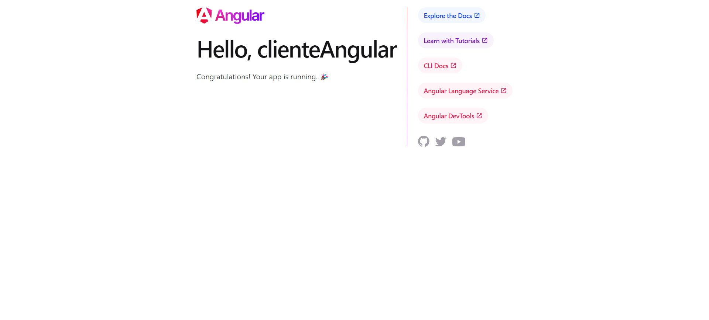
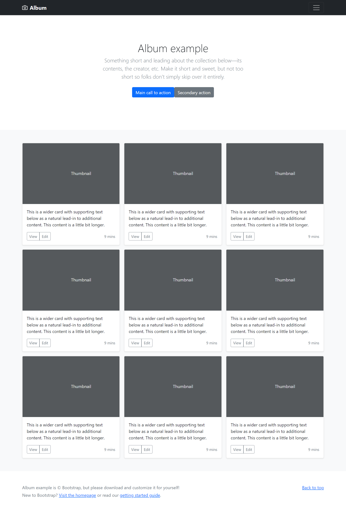

[Regresar](/DAWM/)

Angular - Bootstrap
===================


Bootstrap sirve como herramienta para construir la interfaz visual para de nuestras páginas html.

Proyecto en Angular
===================

* * *

Utiliza el proyecto que desarrollaste con los tutoriales de [Angular - Local](https://dawfiec.github.io/DAWM/tutoriales/angular_local.html).

* Ya sea desde tu repositorio personal
* O, clonando el proyecto con las [aplicaciones del curso](https://github.com/DAWFIEC/DAWM-apps) para la aplicación **album/clienteAngular**
    - Para el hito: **`hito1-album`**


Instalación de Bootstrap (y dependencias)
=========================================

* * *

Desde la línea de comandos, en la carpeta del proyecto sobre Angular.

* De ser necesario, detenga el servidor de Angular.
* Instale bootstrap, con: 
  ```
  npm install bootstrap
  ```

    + En el archivo _package.json_ se agrega automáticamente módulo **bootstrap** (última versión).
    + En el archivo _angular.json_, en la clave **architect > build > options > styles** agregue la referencia a la _hoja de estilo_ de Bootstrap.

      ```
        "styles": [  
            "node_modules/bootstrap/dist/css/bootstrap.min.css", 
            "src/styles.css" 
            ]
      ```

    + En el archivo _angular.json_, en la clave **architect > build > options > scripts** con la referencia a _javascript_ de Bootstrap.

      ```
        "scripts": [
          "node_modules/bootstrap/dist/js/bootstrap.min.js"
          ]
      ```

* Instale popperjs, con: 
  ```
  npm install @popperjs/core
  ```

    + En el archivo _package.json_ se agrega automáticamente módulo **@popperjs/core** (última versión).
    + En el archivo _angular.json_,en la clave **architect > build > options > scripts** con la referencia a _javascript_ de Popperjs/core.

      ```
        "scripts": [
          "node_modules/@popperjs/core/dist/umd/popper.min.js",
          "node_modules/bootstrap/dist/js/bootstrap.min.js"
        ]
      ```

*   (Re)Inicie el servidor de Angular: 
    ```
    ng serve -o
    ```
    
*   Notarás que el estilo por defecto del sitio ha cambiado.




Plantilla de Bootstrap
======================

* * *

Ahora es momento de incorporar una plantilla de Bootstrap dentro de tu proyecto de Angular:

* Descargue los ejemplos de [Bootstrap](https://getbootstrap.com/docs/5.2/examples/).
* Descomprima el archivo que descargaste y selecciona un ejemplo.
* En este caso, utilizaremos el ejemplo **album**: **"bootstrap-x.y.z-examples\\album"**.
    + Abra el archivo **"bootstrap-x.y.z-examples\\album\\index.html"** en el navegador. El archivo luce así en el navegador.



* Del archivo **"bootstrap-x.y.z-examples\\album\\index.html"**, copie las etiquetas _header_, _main_ y _footer_.
* En el proyecto de Angular, **reemplace TODO** el contenido del archivo "**src/app/app.component.html"** por las etiquetas copiadas (_header_, _main_ y _footer_).
* Identifique si el servidor de Angular se encuentra ejecutándose o no. De ser necesario inicia el servidor, con: `ng serve`.
* El sitio de Angular luce así en el navegador.


Referencias
=======

* * *

* bootstrap. (2021). Retrieved 13 July 2021, from https://www.npmjs.com/package/bootstrap#quick-start
* How to add Bootstrap 5 to your Angular 11 project. (2019). Retrieved 13 July 2021, from https://dev.to/myolisi/how-to-add-bootstrap-5-to-your-angular-11-project-1am2
* Angular & Bootstrap 3. (2020). Retrieved 9 July 2022, from https://medium.com/@d.bengati/angular-bootstrap-3-d383ee300ba1
* How To Checkout/Clone From A Specific Git Commit Id (SHA). (2021). Retrieved 25 November 2022, from https://devopscube.com/checkout-clone-specific-git-commit-id-sha/