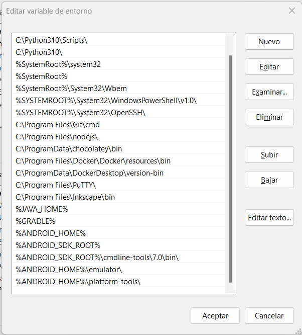

[Regresar](/DAWM/)

Angular - Cordova
=================

<p align="center">
  
</p>

[Apache Cordova](https://www.npmjs.com/package/cordova) permite construir aplicaciones móviles nativas usando HTML, CSS y JavaScript. Esta herramienta ayuda con la administración de aplicaciones Cordova multiplataforma, así como con la integración del complemento Cordova.

## Detalle de configuración

Este tutorial funciona bajo esta configuración:

* OS: win32 x64
* Angular CLI: 14.0.6
* Node: 16.13.0
* Package Manager: npm 8.7.0
* Java JDK 1.8.0_331 
* Android SDK 26.1.1
* Gradle 7.3.3

Proyecto en Angular
===================

* * *

Utiliza un proyecto con Angular.


Requerimientos de instalación
=============================

* * *

De los siguientes enlaces, descargue e instale:

* **Android Studio SDK - Command line tools only** del [sitio oficial](https://developer.android.com/studio#command-line-tools-only) 
  + Acepte las condiciones y descargue el archivo
  + Descomprima el archivo y copie el contenido de la carpeta `cmdline-tools` 
  + Cree el directorio `C:\Android\cmdline-tools\7.0`
  + Pegue el contenido copiado dentro la ruta  `C:\Android\cmdline-tools\7.0`

  <p align="center">
    
  </p>

* **JDK**, del [sitio oficial](https://www.oracle.com/java/technologies/downloads/#java8) o [Filehorse](https://www.filehorse.com/es/buscar?q=java)

* **Gradle**, del [sitio oficial](https://gradle.org/install/#manually)
  + Descargue, descomprima y ubique la carpeta en `C:\Gradle`

  <p align="center">
    
  </p>


## Variables de entorno

Cree/verifique las variables de entorno para:

* **JAVA\_HOME.** Usualmente, la ruta es: **`C:\Program Files\Java\jdk<version>`**
* **GRADLE**. La ruta es: **`C:\Gradle\bin`**
* **ANDROID\_HOME.** La ruta es: **`C:\Android`**
* **ANDROID\_SDK\_ROOT.** La ruta es: **`C:\Android`**    

Agregue todas las variables de entorno anteriores al **PATH**.

* Además, agregue al **PATH** las rutas
  + **%ANDROID\_SDK\_ROOT%\\cmdline-tools\\7.0\\bin\\**
  + **%ANDROID\_HOME%\\emulator\\** 
  + **%ANDROID\_HOME%\\platform-tools\\** 

<p align="center">
  
</p>

* Desde la línea de comandos, verifique que existen las variables de entorno
  + **`echo %JAVA_HOME%`**
  + **`echo %ANDROID_HOME%`**
  + **`echo %ANDROID_SDK_ROOT%`**
  + **`gradle --version`**
  <p align="center">
    
  </p>

## Paquetes del Android SDK

Desde la línea de comandos:

* Instale el **Android Debug Bridge y Fastboost**, con: **`sdkmanager "platform-tools"`**
  + Acepte la licencia. 

  <p align="center">
    
  </p>

* Instale el **Android 10 (API level 30)**, con: **`sdkmanager "platforms;android-30"`**
* Instale las **imágenes del sistema**, con: **`sdkmanager "system-images;android-30;google_apis;x86_64"`**
* Instale el **build tools**, con: **`sdkmanager "build-tools;30.0.3"`**
  
  <p align="center">
    
  </p>

* La carpeta `C:\Android` contendrá los archivos descargados
  
  <p align="center">
    
  </p>


Apache Cordova
==============

* * *

<p align="center">
  
</p>


[Apache Cordova](https://www.npmjs.com/package/cordova) permite crear aplicaciones móviles nativas utilizando HTML, CSS y JavaScript. Esta herramienta ayuda con la gestión de aplicaciones multiplataforma de Cordova, así como con la integración de complementos de Cordova.

* Instale Cordova como módulo global, con: **`npm install -g cordova`**

### Proyecto plantilla de Apache Cordova

Desde una nueva la línea de comandos, en una ubicación diferente a la carpeta del proyecto de Angular:

* Cree un proyecto, con: **`cordova create plantilla com.plantilla PlantillaApp`**
* Ingrese a la carpeta del proyecto plantilla, con: **`cd plantilla`**
* Añada Android como plataforma del proyecto, con: **`cordova platform add android`**

<p align="center">
  
</p>

Angular + Apache Cordova
========================

* * *

Para terminar la configuración del proyecto con Angular:

* Del **proyecto de Cordova** copie el directorio `platforms` y el archivo `config`.
* Pegue los archivo en la raíz del directorio del **proyecto de Angular**

* Del **proyecto de Angular**, modifique los archivos:

  + **package.json.**  Copie o modifique los pares claves-valor del archivo package.json (del proyecto en Angular) tomando como referencia los datos del package.json (del proyecto en Cordova).  
    
    ```
    name
    displayName  
    version  
    description  
    main  
    author  
    license  
    cordova
    ```

    El archivo **package.json (del proyecto en Angular)** deberá contener los pares clave-valor adecuados:

    ```
    {
      "name": "com.mobile",
      "displayName": "MobileApp",
      "version": "1.0.0",
      "description": "A sample Apache Cordova application that responds to the deviceready event.",
      "main": "index.js",
      "author": "Apache Cordova Team",
      "license": "Apache-2.0",
      "cordova": {
        "platforms": [
          "android"
        ]
      },
    ...
    ```
          
          
    Para las claves devDependencies y dependencies, agregue la clave **"cordova-android"** con su respectivo valor, por ejemplo:

    ```
    ...
    "dependencies": {
      ...
      "cordova-android": "^10.1.2"
      ...
    },
    ...
    "devDependencies": {
      ...
      "cordova-android": "^10.1.2"
      ...
    },
    ```

    *   **angular.json**, del proyecto de Angular, modifique la clave "outputPath" con el valor **"www"**.
    *   **src/index.html**, del proyecto en Angular, modifique `<base href="/">` por **`<base href="./">`**

APK
===

* * *

**Generar el APK**


Desde la línea de comandos, en la carpeta del proyecto sobre Angular.

* Instale los paquetes, con: **`npm install`**
* Compile el proyecto, con: **`ng build --configuration=production --aot`**
* Genere el archivo de instalación, con: **`cordova build android`**
    *   **Nota:** De producirse un error al generar el apk, ejecute las siguientes instrucciones  
          
        **`cordova platform remove android`**  
        **`cordova platform add android`**  
        **`cordova build android`**  
* En caso de éxito, se generará el archivo el **app-debug.apk** dentro de la ruta `platforms/android/app/build/outputs/apk/debug`     

<p align="center">
  
</p> 

<p align="center">
  
</p> 


**Instalar el APK**

* Asegúrese de colocar su dispositivo en **[modo desarrollador](https://es.digitaltrends.com/celular/opciones-de-desarrollador-en-android/)**.
* Instale el archivo **app-debug.apk** en su dispositivo
  + Deberá aprobar la instalación, sin importar la fuente.

<p align="center">
  
</p>

* Pueden descargar el [**app-debug.apk**](archivos/app-debug.apk) que generé.

Emulador
========

* * *

Desde la línea de comandos:

* **Instale** el emulador, con: **`sdkmanager --channel=3 emulator`**
* **Cree** el emulador, con el nombre **em30**, con: **`avdmanager create avd -n em30 -k "system-images;android-30;google_apis;x86_64" -g "google_apis"`**
* Para ver los emuladores existentes, **liste** los nombres, con: **`emulator -list-avds`**
  + Debe aparece el emulador: **`em30`**
* **Ejecute** el emulador, con: **`emulator -avd em30`**

<p align="center">
  
</p>

Desde OTRA la línea de comandos:

* **Instale** el app-debug.apk en el emulador, con: **`adb install <ruta-absoluta-al-app-debug.apk>/app-debug.apk`**

<p align="center">
  
</p>

**La aplicación desde el emulador** 

* Desde el extremo inferior del emulador, deslice hacia arriba para ver las aplicaciones instaladas. 
* De doble clic sobre la aplicación para ejecutar.

<p align="center">
  
  
</p>

Referencias
===========

* * *

* Introducción. (2021). Retrieved 20 July 2021, from [https://ajgallego.gitbook.io/cordova/chapter1](https://ajgallego.gitbook.io/cordova/chapter1)

* Convert Angular Webapp to Android APK in 10 steps. (2020). Retrieved 20 July 2021, from [https://medium.com/@christof.thalmann/convert-angular-project-to-android-apk-in-10-steps-c49e2fddd29](https://medium.com/@christof.thalmann/convert-angular-project-to-android-apk-in-10-steps-c49e2fddd29)

* sdkmanager Android Developers. (2022). Retrieved 6 January 2022, from [https://developer.android.com/studio/command-line/sdkmanager](https://developer.android.com/studio/command-line/sdkmanager)

* Creating your first Cordova app - Apache Cordova . (2022). Retrieved 6 January 2022, from [https://cordova.apache.org/docs/en/10.x/guide/cli/](https://cordova.apache.org/docs/en/10.x/guide/cli/)

* How to install Android SDK and build Android App without Android Studio. (2021). Retrieved 6 January 2022, from [https://dev.to/shivams136/how-to-install-android-sdk-without-android-studio-ff2](https://dev.to/shivams136/how-to-install-android-sdk-without-android-studio-ff2)

* Set up the Android 12 SDK Android Developers. (2022). Retrieved 6 January 2022, from [https://developer.android.com/about/versions/12/setup-sdk#groovy](https://developer.android.com/about/versions/12/setup-sdk#groovy)

* work), H., Rhummy, D., Rhummy, D., Nair, P., & p, A. (2014). How enable physical keyboard on Emulator in Android Studio? (Used to work). Retrieved 7 January 2022, from [https://stackoverflow.com/questions/27136585/how-enable-physical-keyboard-on-emulator-in-android-studio-used-to-work](https://stackoverflow.com/questions/27136585/how-enable-physical-keyboard-on-emulator-in-android-studio-used-to-work)

* emulator?, H. (2010). How do you install an APK file in the Android emulator?. Retrieved 7 January 2022, from [https://stackoverflow.com/questions/3480201/how-do-you-install-an-apk-file-in-the-android-emulator](https://stackoverflow.com/questions/3480201/how-do-you-install-an-apk-file-in-the-android-emulator)

* cordova. (2021). Retrieved 27 July 2022, from https://www.npmjs.com/package/cordova