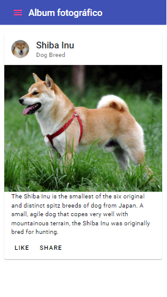

[Regresar](/DAWM/)

Angular - Material 
==================

<p align="center">
  
</p>


[Angular Material IO](https://material.angular.io/) es una librería de componente de UI. Los componentes de Angular Material ayudan a construir páginas web y aplicaciones web atractivas, consistentes y funcionales mientras se adhieren a los principios del diseño web moderno como la portabilidad del navegador, la independencia del dispositivo y la degradación elegante. Ayuda a crear sitios web más rápidos, hermosos y receptivos. Está inspirado en el diseño de materiales de Google.

Proyecto en Angular
===================

* * *

Crea un nuevo proyecto, según [Angular - Local](https://dawfiec.github.io/DAWM/tutoriales/angular_local.html), y agregue Bootstrap, según [Angular - Boostrap](https://dawfiec.github.io/DAWM/tutoriales/angular_bootstrap.html).

* O, Clone el proyecto con las [aplicaciones del curso](https://github.com/DAWFIEC/DAWM-apps) para la aplicación **hibrida/clienteAngular**
    - Para el hito: **`hito1-hibrida`**

Instalación de Angular Material
===============================

* * *

Desde la línea de comando, del proyecto de Angular:

* Instale Angular Material, con: `ng add @angular/material`
  + Seleccione el tema prediseñado: `Indigo/Pink `
  + Acepte el estilo de tipografía.
  + Acepte que se incluya el módulo de animación para acciones en el navegador (browser animations).

* Identifique los cambios en los archivos en

<p align="center">
  
</p>

* Actualice el navegador o (re)inicie el servidor
* **Nota:** En adelante, utilice la vista para **dispositivo móvil** en Chrome.

Diseño de la interfaz
=====================

* * *

Para el diseño de la interfaz, vamos a colocar algunos componentes, como: [Toolbar](https://material.angular.io/components/toolbar/api), [Button](https://material.angular.io/components/button/overview) + [Icon](https://material.angular.io/components/icon/api), [Card](https://material.angular.io/components/card/api) y [Sidenav](https://material.angular.io/components/sidenav/overview).

<p align="center">
  
</p>

Componentes
===========

**Toolbar** 
-------------------------------------------

* En el **src/app/app.module.ts**
  + Importe el módulo **MatToolbarModule** (`'@angular/material/toolbar'`), y 
  + Agregue el módulo en la lista de módulos compartidos de la aplicación.
 
  <pre><code>
  ...  
  import { BrowserAnimationsModule } from '@angular/platform-browser/animations';  
  <b style="color: red">import { MatToolbarModule } from '@angular/material/toolbar';</b>
  ...  
  imports: [  
    BrowserModule,  
    AppRoutingModule,  
    BrowserAnimationsModule,  
    <b style="color: red">MatToolbarModule,</b>
  ],  
  ...
  </code></pre>

* En **src/app/app.component.html** reemplace el contenido anterior por:

  ```
    <mat-toolbar color="primary">
      <span>Album fotográfico</span>
    </mat-toolbar>
  ```  

* Actualice el navegador o (re)inicie el servidor

**Button + Icon** 
-------------------------------------------------

* En el **src/app/app.module.ts**
  + Importe los módulos **MatIconModule** y **MatButtonModule** (`'@angular/material/icon'` y `'@angular/material/button'`), y 
  + Agregue los módulos en la lista de módulos compartidos de la aplicación.

  <pre><code>
  import { MatToolbarModule } from '@angular/material/toolbar';  
  <b style="color: red">import {MatIconModule} from '@angular/material/icon';  
  import {MatButtonModule} from '@angular/material/button';</b>

  ...  
  imports: [  
    BrowserModule,  
    AppRoutingModule,  
    BrowserAnimationsModule,  
    MatToolbarModule,  
    <b style="color: red">MatIconModule,  
    MatButtonModule</b>
  ],  
  ...
  </code></pre>

* Modifique **src/app/app.component.html**

  ```
    <mat-toolbar color="primary">  
      <button mat-icon-button color="accent" aria-label="menu">  
         <mat-icon>menu</mat-icon>  
      </button>  
      <span>Album fotográfico</span>  
    </mat-toolbar>
  ```

* Actualice el navegador o (re)inicie el servidor


**Card** 
-------------------------------------------------

* En el **src/app/app.module.ts**
  + Importe el módulo **MatCardModule** (`'@angular/material/card'`), y 
  + Agregue el módulo en la lista de módulos compartidos de la aplicación.

  <pre><code>
  import { MatToolbarModule } from '@angular/material/toolbar';
  import {MatIconModule} from '@angular/material/icon';  
  import {MatButtonModule} from '@angular/material/button';
  <b style="color: red">import {MatCardModule} from '@angular/material/card';</b>

  ...  
  imports: [  
    BrowserModule,  
    AppRoutingModule,  
    BrowserAnimationsModule,  
    MatToolbarModule,
    MatIconModule,  
    MatButtonModule,  
    <b style="color: red">MatCardModule</b>
  ],  
  ...
  </code></pre>

* Modifique **src/app/app.component.html**

  ```
  <mat-toolbar color="primary">
    <button mat-icon-button color="accent" aria-label="menu">  
       <mat-icon>menu</mat-icon>  
    </button>  
    <span>Album fotográfico</span>
  </mat-toolbar>
  <mat-card class="example-card">
    <mat-card-header>
      <div mat-card-avatar class="example-header-image"></div>
      <mat-card-title>Shiba Inu</mat-card-title>
      <mat-card-subtitle>Dog Breed</mat-card-subtitle>
    </mat-card-header>
    
    <mat-card-content>
      <p>
        The Shiba Inu is the smallest of the six original and distinct spitz breeds of dog from Japan.
        A small, agile dog that copes very well with mountainous terrain, the Shiba Inu was originally
        bred for hunting.
      </p>
    </mat-card-content>
    <mat-card-actions>
      <button mat-button>LIKE</button>
      <button mat-button>SHARE</button>
    </mat-card-actions>
  </mat-card>
  ```

* Modifique **src/app/app.component.css**
  ```
  .example-card {
    max-width: 95%;
    margin: 5% auto;
  }

  .example-header-image {
    background-image: url('https://material.angular.io/assets/img/examples/shiba1.jpg');
    background-size: cover;
  }
  ```

* Actualice el navegador o (re)inicie el servidor
  + El resultado debe lucir similar a

  <p align="center">
    
  </p>

**Sidenav** 
-------------------------------------------------

* En el **src/app/app.module.ts**
  + Importe el módulo **MatSidenavModule** (`'@angular/material/sidenav'`), y 
  + Agregue el módulo en la lista de módulos compartidos de la aplicación.

* En el **src/app/app.component.html**
  
  + Agregue las etiquetas del componente **Sidenav** 

  ```
  <mat-drawer-container class="example-container" autosize>

    <mat-drawer #enlaces class="example-sidenav" mode="over">
      <p> Enlaces </p>
    </mat-drawer>

    <!-- Coloque aquí las etiquetas <mat-toolbar> y <mat-card> -->
    
  </mat-drawer-container>
  ```
  + Mueva las etiquetas `<mat-toolbar>` y `<mat-card>` (con toda sus etiquetas internas) en lugar del texto  `<!-- Coloque aquí las etiquetas <mat-toolbar> y <mat-card> -->`

  ```
  <mat-toolbar color="primary">
  ...
  </mat-toolbar>
  <mat-card class="example-card">
  ...
  </mat-card>
  ```

* En el **src/app/app.component.css**

  + Agregue la propiedad CSS
  ```
  .example-container {
    height: 100vh;
  }
  ```

  
  
Variables de plantilla y Eventos
==================================

En las etiquetas del **Sidenav** se encuentra la [variable de plantilla](https://angular.io/guide/template-reference-variables) `#enlaces`. Esta variable sirve como referencia [reaccionar al evento](https://angular.io/guide/event-binding) __click__ del botón.

  + Agregue el callback `menu` en el `src/app/app.component.ts`

  ```
  menu(enlaces: any) {
    enlaces.toggle()
  }
  ```

  + Identifique la etiqueta `<button>` en la barra superior

  ```
  ...
    <button mat-icon-button color="accent" aria-label="menu">  
       <mat-icon>menu</mat-icon>  
    </button>  
  ...
  ```

  + Agregue la referencia al callback `menu`

  ```
  ...
    <button mat-icon-button color="accent" aria-label="menu" (click)="menu(enlaces)">  
       <mat-icon>menu</mat-icon>  
    </button>  
  ...
  ```

* Actualice el navegador o (re)inicie el servidor
  + El resultado debe lucir similar a

  <p align="center">
    
  </p>

Referencias 
===========

* * *

* Angular Material Tutorial. (2022). Retrieved 20 July 2022, from https://www.tutorialspoint.com/angular_material/index.htm
* Team, A. (2022). Angular Material. Retrieved 2 December 2022, from https://material.angular.io/
* Angular. (2022). Retrieved 2 December 2022, from https://angular.io/guide/template-reference-variables