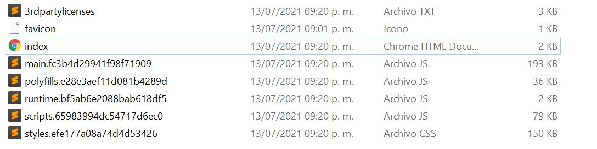
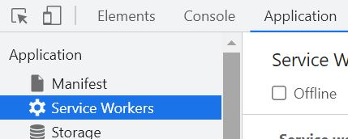
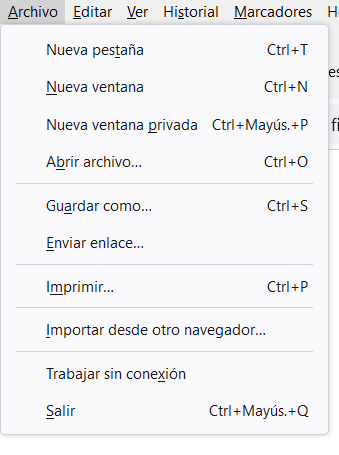
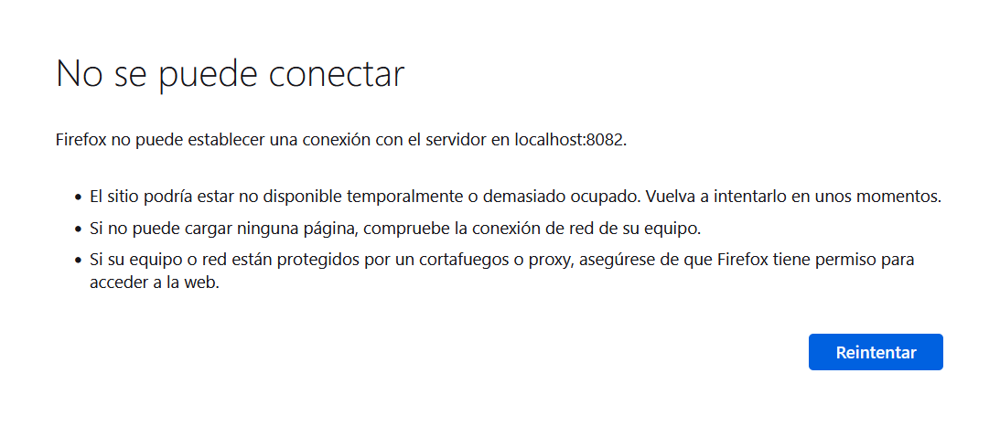
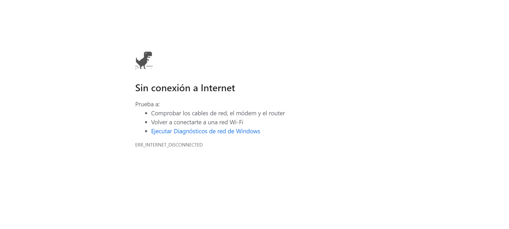
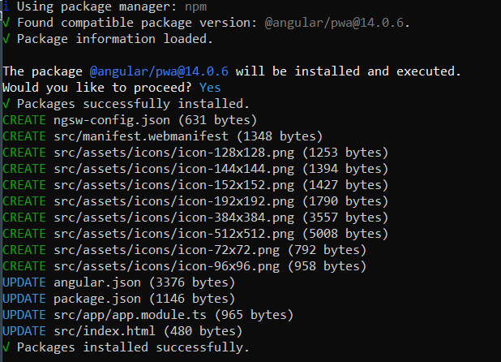
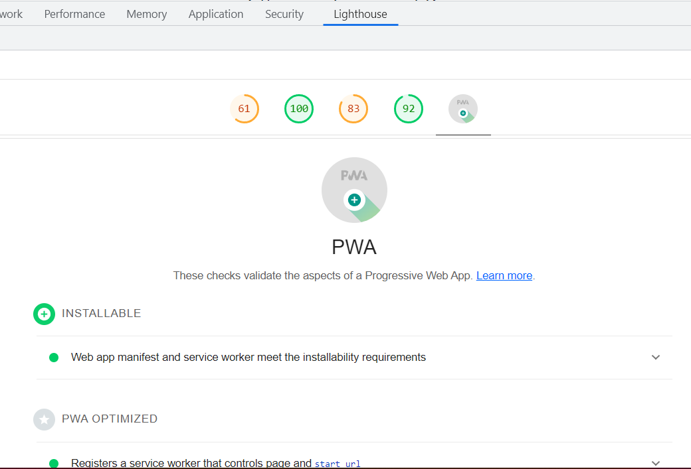
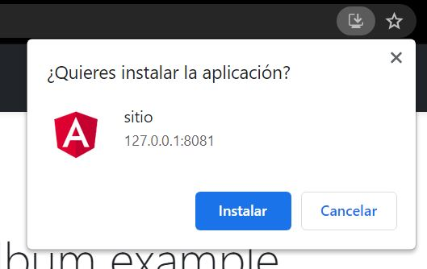
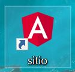

[Regresar](/DAWM/)

Angular - PWA
=============

  

Angular nos permite implementar el modelo **Progressive Web Application (PWA)** en nuestra aplicación para hacerla parecerse a una **app nativa** para teléfonos móviles y tabletas. 

Las PWA deben ser detectables, instalables, enlazables, independientes de la red, progresivas, reconectables, responsivas y seguras. 

Proyecto en Angular
===================

* * *

Utiliza el proyecto que desarrollaste con los tutoriales de [Angular - Local](https://dawfiec.github.io/DAWM/tutoriales/angular_local.html), [Angular - Boostrap](https://dawfiec.github.io/DAWM/tutoriales/angular_bootstrap.html) y [Angular - Componentes, Comunicación y Directivas](https://dawfiec.github.io/DAWM/tutoriales/angular_bases.html).

* Desde tu repositorio personal
* Clone el proyecto con las [aplicaciones del curso](https://github.com/DAWFIEC/DAWM-apps) para la aplicación **album/clienteAngular**
    - Para el hito: **`hito3-album`**

Proyecto en modo de producción
==============================

* * *

* En la raíz de la carpeta del proyecto con Angular, desde la línea de comandos
* Compila el proyecto con: `ng build`
  + El comando [**ng build**](https://www.tutorialspoint.com/angular_cli/angular_cli_ng_build.htm) compila una aplicación/biblioteca angular en un directorio de salida llamado **dist** del proyecto con Angular. 
  

    
  

* Levante un servidor HTTP con Python o con Nodejs
  + Con [Python](https://dawfiec.github.io/DAWM/tutoriales/python.html) especificando la ruta del punto de inicio: 
    - Levante el servidor, con: `python -m http.server --directory dist/<nombre-del-proyecto> 8081`
  + o, Con [Nodejs](https://dawfiec.github.io/DAWM/tutoriales/nodejs.html) especificando la ruta del punto de inicio: 
  	- Instale (solo una vez) el módulo globalmente, con: `npm install -g http-server`
  	- Levante el servidor, con: `http-server -p 8082 -c-1 dist/<nombre-del-proyecto>`

* Desde el navegador acceda a la URL para el **localhost**
  

    
  

Proyecto offline
================

* * *

Comprueba la vista del sitio en modo fuera de línea (sin conexión al internet) del **sitio en producción**. Esto es posible de dos posibles formas: deteniendo el servidor o simulando la conexión fuera de línea desde el navegador.

* Desde la línea de comandos
  + Detenga el proceso del servidor. 

* o, Desde el navegador 
  + En Chrome 
    - Inspecciona el sitio
    - Habilita la opción `Offline`, que se encuentra en **Application > Service Workers**

    

      
    

  + En Mozilla firefox 
    - Presiona `Alt`
    - Habilita la opción `Trabajar sin conexión`, que se encuentra en el menu **Archivo**

    

      
    

* Recarga el sitio en el navegador. Cada navegador ofrece una la vista por defecto para un sitio sin conexión a internet.

  

    
    
  

PWA
===

* * *

Desde la línea de comandos, en la carpeta del proyecto sobre Angular.

* Agregue el esquema de PWA, con: `ng add @angular/pwa`
  

      
  

* Acepte la configuración por defecto.
* Automáticamente se añadirán una serie de archivos nuevos y otros parámetros de configuración a nuestro proyecto con Angular.
  + En el archivo **angular.json**:
    - En la clave de **assets** se añadió la ruta al manifest: _src/manifest.webmanifest_
    - Se añadió la bandera: _serviceWorker: true_
    - En la clave **ngswConfigPath** se añadió la ruta al archivo de configuración para el service worker: _ngsw-config.json_
  + En el archivo **package.json** se añadió dependencia a _@angular/service-worker_
  + El archivo **ngsw-config.json** contiene la configuración y estrategias de cacheo para el service worker que crea angular.
  + En el archivo **src/index.html:**
    - Se añadió la etiqueta `<link>` al _manifest.webmanifest_
    - Se añadió la etiqueta `<meta>` con el atributo _theme-color_ y un valor hexadecimal en el atributo _content_. Estos valores son leídos cuando se "instale" la aplicación en algún dispositivo.
    - Se añadió la etiqueta `<noscript>` html tag. Esta etiqueta se muestra cuando está deshabilitada la ejecución de javascript en el navegador.
  + Se creó el archivo **src/manifest.webmanifest** con configuración de la aplicación para cuando se "instale" en el dispositivo
  + Se modificó el archivo **src/app/app.module.ts** con el registro del service worker _ngsw-worker.js_ (auto generado por angular basado en _ngsw-config.json_)
  + Se creó la carpeta **src/assets/icons** con los íconos en diferentes tamaños para usarse como ícono de aplicación cuando se instale en algún dispositivo

Comprobar PWA
=============

* * *

Desde la línea de comandos, en la carpeta del proyecto sobre Angular.

* Compila el proyecto, con: `ng build`
* Levanta un servidor HTTP con Python o con Nodejs
* Verifica cómo funciona el sitio en modo offline (simulando desde el navegador o deteniendo el servidor)
  - El sitio debe lucir como si continuara online
  

    
  

Lighthouse
==========

* Agregue la extensión [Lighthouse](https://chrome.google.com/webstore/detail/lighthouse/blipmdconlkpinefehnmjammfjpmpbjk?hl=es) para Chrome.
* Audite la página para identificar si cumple o no con las validaciones necesarias para ser PWA.

  

Instalación de la aplicación (solo para Chromium)
================================================

* * *

Con PWA/Angular es más fácil hacer que nuestra aplicación web sea descargable e instalable, al igual que una aplicación móvil nativa.

* En la barra de navegación de **Chrome** encontrarás las opción de instalar la aplicación en tu máquina local.
  

    
  

* En el escritorio encontrarás el ícono de la aplicación con la que podrás acceder en cualquier momento.

  

    
  

Referencias 
===========

* * *

* Aplicaciones Web Progresivas MDN. (2022). Retrieved 17 July 2022, from https://developer.mozilla.org/es/docs/Web/Progressive_web_apps
* PWA: guía del manifest file. (2020). Retrieved 17 July 2022, from https://medium.com/samsung-internet-dev/pwa-gu%C3%ADa-del-manifest-file-92c7cdac25ad
* Create Progressive Web Apps with Angular and other free tools!. (2019). Retrieved 26 November 2022, from https://dev.to/paco_ita/create-progressive-web-apps-with-angular-workbox-pwa-builder-step-4-27d#angular
* Angular CLI - ng build Command. (2022). Retrieved 17 July 2022, from https://www.tutorialspoint.com/angular_cli/angular_cli_ng_build.htm
* Convierte tu aplicación Angular en una PWA. (2022). Retrieved 29 November 2022, from https://pwaexperts.io/tutoriales/convierte-aplicacion-angular-en-pwa