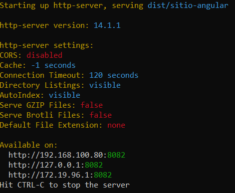

[Regresar](/DAWM-2022/)

Angular - PWA
=============

  

Angular nos permite implementar el modelo **Progressive Web Application (PWA)** en nuestra aplicación para hacerla parecerse a una **app nativa** para teléfonos móviles y tabletas. 

Proyecto en Angular
===================

* * *

Utiliza el proyecto que desarrollaste con los tutoriales de [Angular - Local](https://dawfiec.github.io/DAWM-2022/tutoriales/angular_local.html), [Angular - Boostrap](https://dawfiec.github.io/DAWM-2022/tutoriales/angular_bootstrap.html) y [Angular - Componentes, Comunicación y Directivas](https://dawfiec.github.io/DAWM-2022/tutoriales/angular_bases.html).

* Instala las dependencias, con: `npm install`
* Verifica que funcione correctamente al levantar los servicios: `ng serve -o`

Proyecto en producción
======================

* * *

* En la raíz de la carpeta del proyecto con Angular, desde la línea de comandos
* Compila el proyecto con: `ng build`
  + El comando [**ng build**](https://www.tutorialspoint.com/angular_cli/angular_cli_ng_build.htm) compila una aplicación/biblioteca angular en un directorio de salida llamado **dist** del proyecto con Angular. 
  

    
  

* Levante un servidor HTTP con Python o con Nodejs
  + Con Python: `python -m http.server --directory dist/<nombre-del-proyecto> 8081`
  + Con Nodejs: 
  	- Instale el módulo globalmente, con: `npm install -g http-server`
  	- Levante el servidor, con: `http-server -p 8082 -c-1 dist/<nombre-del-proyecto>`

  

    
  

* Desde el navegador acceda a alguna de las URLs disponibles
  

    
  

Referencias 
===========

* * *

* Aplicaciones Web Progresivas MDN. (2022). Retrieved 17 July 2022, from https://developer.mozilla.org/es/docs/Web/Progressive_web_apps
* PWA: guía del manifest file. (2020). Retrieved 17 July 2022, from https://medium.com/samsung-internet-dev/pwa-gu%C3%ADa-del-manifest-file-92c7cdac25ad
* Angular CLI - ng build Command. (2022). Retrieved 17 July 2022, from https://www.tutorialspoint.com/angular_cli/angular_cli_ng_build.htm