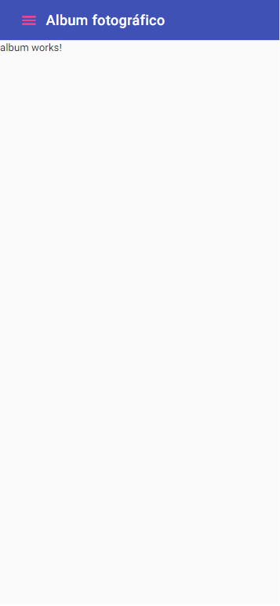
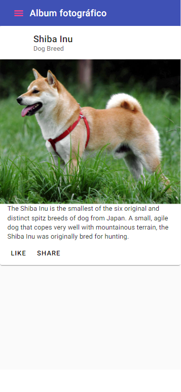

[Regresar](/DAWM/)

Angular - Rutas 
===============

<p align="center">
  
</p>

En Angular, la mejor práctica es cargar y configurar el enrutador en un módulo separado de nivel superior. El enrutador está dedicado al enrutamiento e importado por el AppModule. Por convención, el nombre de la clase del módulo es AppRoutingModule y pertenece a `app-routing.module.ts` en el directorio **src/app**.

Proyecto en Angular
===================

* * *

Crea un nuevo proyecto, según [Angular - Local](https://dawfiec.github.io/DAWM/tutoriales/angular_local.html), agregue Bootstrap según [Angular - Boostrap](https://dawfiec.github.io/DAWM/tutoriales/angular_bootstrap.html) y cree la aplicación híbrida base según [Angular - Material](https://dawfiec.github.io/DAWM/tutoriales/angular_material.html).

* O, Clone el proyecto con las [aplicaciones del curso](https://github.com/DAWFIEC/DAWM-apps) para la aplicación **hibrida/clienteAngular**
    - Para el hito: **`hito2-hibrida`**


Componentes 
-----------

Cree los componentes **album** y **foto**. 

Componente: Foto 
----------------

* En `src/app/app.component.html`
  + Extraiga la etiqueta `<mat-card>` (con todas sus etiquetas internas)
  
  ```html
    <mat-drawer-container>  
      ...
      </mat-toolbar>
      
      <mat-card class="example-card">
        ...
      </mat-card>
      
    </mat-drawer-container>
  ```

* En `src/app/foto/foto.component.html`

  + Reemplace el contenido

  ```html
  <p>foto works!</p>
  ```

  por la etiqueta `<mat-card>`

  ```html
  <mat-card class="example-card">
    <mat-card-header>
      <div mat-card-avatar class="example-header-image"></div>
      <mat-card-title>Shiba Inu</mat-card-title>
      <mat-card-subtitle>Dog Breed</mat-card-subtitle>
    </mat-card-header>
    
    <mat-card-content>
      <p>
        The Shiba Inu is the smallest of the six original and distinct spitz breeds of dog from Japan.
        A small, agile dog that copes very well with mountainous terrain, the Shiba Inu was originally
        bred for hunting.
      </p>
    </mat-card-content>
    <mat-card-actions>
      <button mat-button>LIKE</button>
      <button mat-button>SHARE</button>
    </mat-card-actions>
  </mat-card>
  ```
* De `src/app/app.component.css`
  + Recorte las reglas css `.example-card ` y `example-header-image`
  + Pegue las reglas css en `src/app/foto/foto.component.css`
  
Rutas 
-----

La etiqueta  `<router-outlet>` actúa como un marcador de posición para que Angular llene dinámicamente según el estado actual del enrutador (De acuerdo con la URL que llega del navegador).

* Modifique el archivo **app/app-routing.module.ts**
  + Agregue la referencia a los componentes **foto** y **album**.
  + Agregue las rutas a sus correspondientes componentes.
  
  <pre><code>
  import { NgModule } from '@angular/core';
  import { RouterModule, Routes } from '@angular/router';
  <b style="color: red">
  import { FotoComponent } from './foto/foto.component';
  import { AlbumComponent } from './album/album.component';
  </b>
  <b style="color: red">
  const routes: Routes = [
      { path: "foto", component: FotoComponent },
      { path: "album", component: AlbumComponent },
      { path: "**", redirectTo: "album" }
    ];
  </b>
    
  @NgModule({
    imports: [RouterModule.forRoot(routes)],
    exports: [RouterModule]
  })
  export class AppRoutingModule { }
  </code></pre>

* Modifique el archivo **src/app/app.component.html**
  + Coloque la etiqueta `<router-outlet>` en el lugar donde se encontraba la etiqueta `<mat-card>`.
    
    ```html
    <mat-drawer-container>  
      ...
      <mat-toolbar color="primary">
        ...
      </mat-toolbar>

      <router-outlet></router-outlet>

    </mat-drawer-container>
    ```

* Actualice el navegador o (re)inicie el servidor
  
  + De manera predeterminada, al acceder a la ruta **http://localhost:4200/** la aplicación redirigirá a la ruta **http://localhost:4200/album** 
  + Acceda a la ruta **http://localhost:4200/album** y el resultado debe lucir similar a

  <p align="center">
    
  </p>

  + Acceda a la ruta **http://localhost:4200/foto** y el resultado debe lucir similar a

  <p align="center">
    
  </p>


Enrutamiento 
============

Para ir de un URL a otro mediante la aplicación se utiliza el enrutamiento mediante el atributo `routerLink`.


* En `src/app/app.component.html`
  + Reemplace el contenido

  ```html
  ...
    <mat-drawer #enlaces class="example-sidenav" mode="over">
      <p> Enlaces </p>
    </mat-drawer>
  ...
  ```
  
  por

  ```html
  ...
    <mat-drawer #enlaces class="example-sidenav" mode="over">
      <ul>
        <li><a routerLink="/album">Album</a></li>
        <li><a routerLink="/foto">Foto</a></li>
      </ul>
    </mat-drawer>
  ...
  ```

* Actualice el navegador o (re)inicie el servidor
  + Desde el panel desplegable de la izquierda, acceda a los enlaces: `Foto` y `Album`

Referencias 
===========

* * *

* Navegar entre rutas de Angular utilizando routerLink. (2020). Retrieved 20 July 2022, from https://dev.to/facurodriguez/navegar-entre-rutas-de-angular-utilizando-routerlink-3gon
* Angular. (2022). Retrieved 20 July 2022, from https://angular.io/tutorial/toh-pt5
* Enrutamiento en Angular. (2017). Retrieved 26 July 2022, from https://aristotekean.medium.com/enrutamiento-en-angular-996f14e89293
* Angular 6 : 404 error during refresh after deployment. (2019). Retrieved 8 August 2022, from https://medium.com/tinywave/angular-6-404-error-during-refresh-after-deployed-8cec7140b584