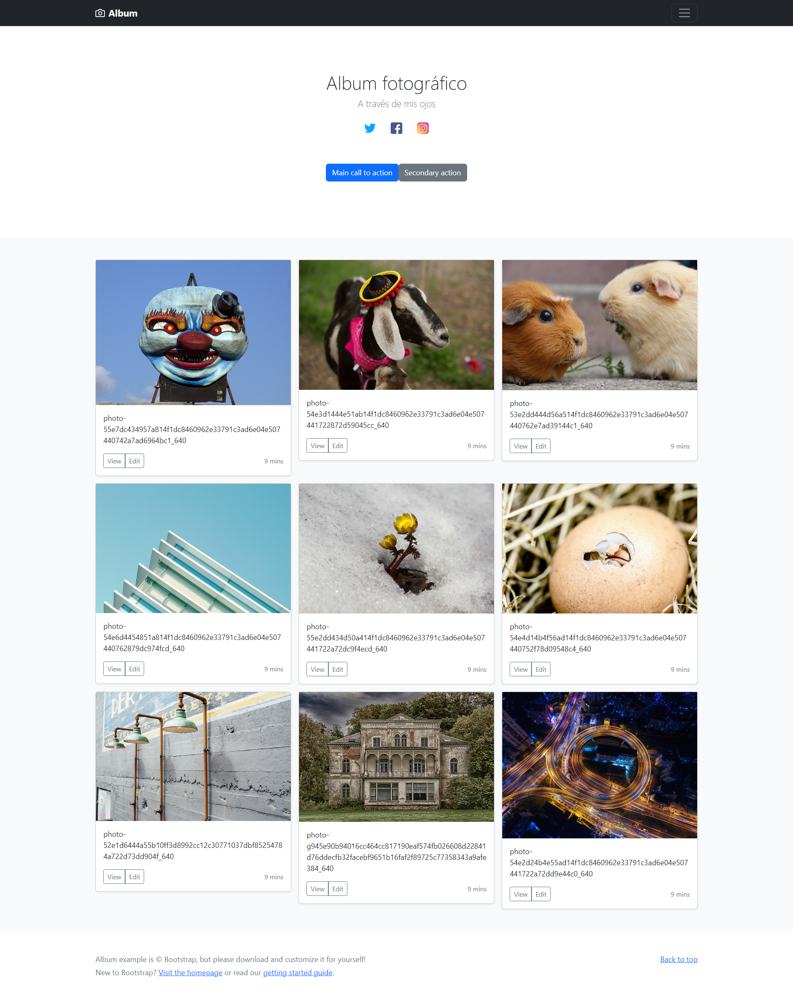

[Regresar](/DAWM/)

Angular - Servicios
===================

<p align="center">
  
</p>

Los componentes NO deben obtener o guardar datos directamente y no deben presentar datos falsos. Los componentes deben centrarse en presentar datos y delegar el acceso a los datos a un servicio.

Un servicio es un proveedor de datos, que mantiene lógica de acceso a ellos. Los servicios serán consumidos por los componentes, que delegarán en ellos la responsabilidad de acceder a la información y la realización de operaciones con los datos.

Proyecto en Angular
===================

* * *


Utiliza el proyecto que desarrollaste con los tutoriales de [Angular - Local](https://dawfiec.github.io/DAWM/tutoriales/angular_local.html), [Angular - Boostrap](https://dawfiec.github.io/DAWM/tutoriales/angular_bootstrap.html), [Angular - Componentes, Comunicación y Directivas](https://dawfiec.github.io/DAWM/tutoriales/angular_bases.html) y [Angular - PWA](https://dawfiec.github.io/DAWM/tutoriales/angular_pwa.html)

* Clone el proyecto con las [aplicaciones del curso](https://github.com/DAWFIEC/DAWM-apps) para la aplicación **album/clienteAngular**
    - Para el hito: **`hito5-album`**


Interfaz
========

Para consultar datos mediante servicios, es recomendable el uso de interfaces para reconocer su estructura.
Desde la raíz del proyecto con Angular

* Cree la interfaz **Foto**, con: `ng generate interface interfaz/foto`

* Identifique la estructura de la respuesta del servicio a consultar para definir los atributos de la interfaz de respuesta. Según el recurso [Foto](https://dawm-fiec-espol-default-rtdb.firebaseio.com/photos.json) la estructura es:

	<pre><code>
	export interface Foto {
     descripcion: string;
     id: string;
     url: string;
  }
	</code></pre>


Servicio
========

Desde la raíz del proyecto con Angular

* Acceda desde la línea de comandos
* Cree el servicio **recursos**, con: `ng generate service servicios/recursos`
  + Se creará carpeta *servicios*, y 
  + Se crearán los archivos `recursos.service.ts` y `recursos.service.spec.ts`


Inyección de dependencias
=========================

Las dependencias son servicios u objetos que una clase necesita para realizar su función. La [inyección de dependencia (DI)](https://docs.angular.lat/guide/architecture-services#inyecci%C3%B3n-de-dependencia-id) es un patrón de diseño en el que una clase solicita dependencias de fuentes externas en lugar de crearlas, para aumentar la flexibilidad y modularidad en sus aplicaciones. Angular proporciona dependencias a una clase en la creación de instancias.

Para inyectar una dependencia en un componente solo debes agregar un argumento (con el tipo de la dependencia) en el método constructor de la clase.

* En **src/app/app.component.ts** 
	+ Agregue el _import_ al servicio
	
	<pre><code>
    import { Component } from '@angular/core';
	<b style="color:red">import { RecursosService } from './servicios/recursos.service';</b>

	@Component({
	  selector: 'app-root',
	  templateUrl: './app.component.html',
	...  
  </code></pre>

	+ Agregue el constructor de la clase con la inyección de dependencia (argumento del constructor) al servicio `RecursosService`.

  <pre><code>
    ...
	export class AppComponent {
	  title  = 'testAngular';

	  <b style="color:red">constructor(private recursosService: RecursosService) {}</b>
	}
	...
  </code></pre>


Peticiones HTTP
===============

Las aplicaciones en el front-end necesitan comunicarse con un servidor a través del protocolo HTTP, para descargar o cargar datos y acceder a otros servicios back-end. Angular proporciona una API HTTP de cliente para aplicaciones Angular, la clase de servicio `HttpClient` en `@angular/common/http`.

Para este caso, Angular usa los `observables` en lugar de promesas para entregar valores de [forma asíncrona](https://docs.angular.lat/guide/comparing-observables).

* En **src/app/app.module.ts**,
	+ Importe el módulo `HttpClientModule`

	<pre><code>
		...
		import { CabeceraComponent } from './cabecera/cabecera.component';
		import { RedesComponent } from './redes/redes.component';
		...
		<b style="color:red">import { HttpClientModule } from '@angular/common/http';</b>
		...

		@NgModule({
		  declarations: [
		    AppComponent,
		...
	</code></pre>

	+ Registre el servicio en la lista de módulos de la clave **import**, para que todos los componentes puedan acceder a este servicio.

	<pre><code>
		...
		  imports: [
		    BrowserModule,
		    AppRoutingModule,
		    ...
		    <b style="color:red">HttpClientModule,</b>
		...
	</code></pre>

* En **src/app/servicios/recursos.service.ts**, 
  + Importe el módulo `HttpClient`

  <pre><code>
	import { Injectable } from '@angular/core';
	<b style="color:red">import { HttpClient } from '@angular/common/http';</b>
	
  	
	@Injectable({
	  providedIn: 'root'
	...
	</code></pre>

	+ Agregue el servicio `HttpClient` como inyección de dependencia en el método constructor.
	
	<pre><code>
	...
	export class RecursosService {
	  <b style="color:red">constructor(private http: HttpClient) { }</b>
	  ...
	}
	</code></pre>

	+ Agregue la función *obtenerDatos* para hacer una petición `http` para obtener `get` una respuesta del URL <a href="https://dawm-fiec-espol-default-rtdb.firebaseio.com/photos.json">Fotos</a>

	<pre><code>
	constructor(private http: HttpClient) { }
	...
	<b style="color:red">
	obtenerDatos() {
      return this.http.get('https://dawm-fiec-espol-default-rtdb.firebaseio.com/photos.json')
	}
	</b>
	...
	</code></pre>


Usando el servicio en el componente
===================================

Ahora, para acabar esta introducción a los servicios en Angular, tenemos que ver cómo usaríamos el servicio **RecursosService** en el componente **AppComponent**.

* En **src/app/app.component.ts** 
	+ Agregue la referencia a la interfaz **Foto** 
    
    <pre><code>
    import { Component } from '@angular/core';
    <b style="color:red">
    import { Foto } from './interfaz/foto';
    </b>

    @Component({
  		selector: 'app-root',
  		templateUrl: './app.component.html',
    ...
    </code></pre>

	+ Cree el atributo **fotos**

  <pre><code>
  ...
  export class AppComponent {
	  title = 'Angular';
	  <b style="color:red">
	  fotos: Foto[] = [];  
	  </b>

	  constructor(private recursosService: RecursosService) {
	  	
	  }
	}
  ...
  </code></pre>

	+ Modifique el constructor para suscribirse a la respuesta del servicio

  <pre><code>
  ...
  export class AppComponent {
	  title = 'Angular';
	  fotos: Foto[] = [];

	  constructor(private recursosService: RecursosService) {
	  	<b style="color:red">
	    recursosService.obtenerDatos().subscribe(respuesta => {
	      this.fotos = respuesta as Array&lt;Foto&gt;
	    })
	    </b>
	  }
	}
  ...
  </code></pre>

* En **src/app/app.component.html**, reemplace el contenido de:
	```html
	<div class="album py-5 bg-light">
		<div class="container">
		...
		</div>
	</div>
	```
	
	Por el arreglo **fotos** renderizado con la directiva \*ngFor
	```html
	<div class="album py-5 bg-light">
		<div class="container">

      <div class="row row-cols-1 row-cols-sm-2 row-cols-md-3 g-3">
        <div class="col" *ngFor="let foto of fotos">
          <div class="card shadow-sm">
            

            <div class="card-body">
              <p class="card-text">{{foto.descripcion}}</p>
              <div class="d-flex justify-content-between align-items-center">
                <div class="btn-group">
                  <button type="button" class="btn btn-sm btn-outline-secondary">View</button>
                  <button type="button" class="btn btn-sm btn-outline-secondary">Edit</button>
                </div>
                <small class="text-muted">9 mins</small>
              </div>
            </div>
          </div>
        </div>
      </div>
      
    </div>
  </div>
	```

* Actualice el navegador o (re)inicie el servidor

<p align="center">
  
</p>

Cacheo de servicios y respuestas 
================================

* Modifique el archivo `ngsw-config.json`
* Agregue la clave **dataGroups** con los siguientes valores:

	```
  "dataGroups": [
    {
      "name": "imagenes",
      "urls": [
        "https://dawm-fiec-espol-default-rtdb.firebaseio.com/photos.json"
      ],
      "cacheConfig": {
        "maxSize": 5,
        "maxAge": "6h",
        "timeout": "10s",
        "strategy": "freshness"
      }
    }
  ]
	```

* Genere el proyecto para ambiente de producción
* Levante el servidor HTTTP
* Compruebe el proyecto offline
* Actualice el navegador

Referencias 
===========

* * *

* Angular. (2022). Retrieved 18 July 2022, from https://angular.io/tutorial/toh-pt4
* Servicios en Angular. (2022). Retrieved 18 July 2022, from https://desarrolloweb.com/articulos/servicios-angular.html
* Angular. (2022). Retrieved 19 July 2022, from https://angular.io/guide/dependency-injection
* Inyección de dependencias. (2022). Retrieved 19 July 2022, from https://desarrolloweb.com/articulos/patron-diseno-contenedor-dependencias.html
* Angular. (2022). Retrieved 19 July 2022, from https://angular.io/guide/http
* Angular. (2022). Retrieved 19 July 2022, from https://docs.angular.lat/guide/comparing-observables
* Usar clases e Interfaces en los servicios Angular. (2022). Retrieved 26 July 2022, from https://desarrolloweb.com/articulos/clases-interfaces-servicios-angular.html
* Servicios en Angular. (2022). Retrieved 27 July 2022, from https://desarrolloweb.com/articulos/servicios-angular.html
* Learn How: Create A PWA with Service Workers in Angular. (2019). Retrieved 29 November 2022, from https://www.agiratech.com/pwa-angular-service-workers
* How to configure ngsw-config.json? 🤔. (2020). Retrieved 29 November 2022, from https://srashtisj.medium.com/how-to-configure-ngsw-config-json-4f2a026d8374