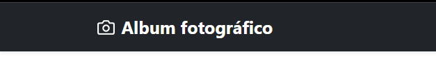
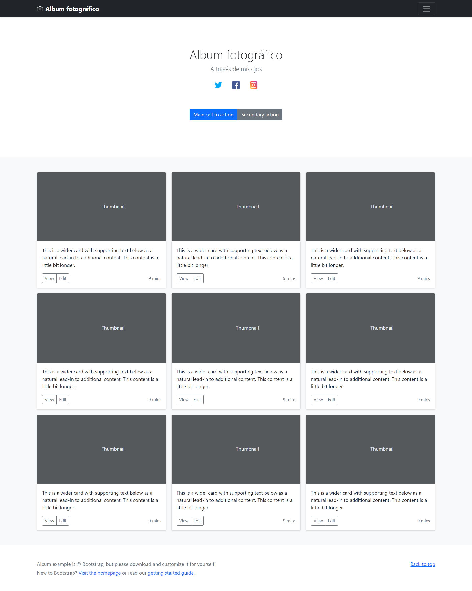

[Regresar](/DAWM-2022/)

Angular - Servicios
===================

<p align="center">
  
</p>

Los componentes NO deben obtener o guardar datos directamente y no deben presentar datos falsos. Los componentes deben centrarse en presentar datos y delegar el acceso a los datos a un servicio.

Un servicio es un proveedor de datos, que mantiene lógica de acceso a ellos. Los servicios serán consumidos por los componentes, que delegarán en ellos la responsabilidad de acceder a la información y la realización de operaciones con los datos.

Proyecto en Angular
===================

* * *

Utiliza el proyecto que desarrollaste con los tutoriales de [Angular - Local](https://dawfiec.github.io/DAWM-2022/tutoriales/angular_local.html), [Angular - Boostrap](https://dawfiec.github.io/DAWM-2022/tutoriales/angular_bootstrap.html), [Angular - Componentes, Comunicación y Directivas](https://dawfiec.github.io/DAWM-2022/tutoriales/angular_bases.html) y [Angular - PWA](https://dawfiec.github.io/DAWM-2022/tutoriales/angular_pwa.html)

* Instala las dependencias, con: `npm install`
* Verifica que funcione correctamente al levantar los servicios: `ng serve -o`

Servicio
========

Desde la raíz del proyecto con Angular

* Acceda desde la línea de comandos
* Cree el servicio **titular**, con: `ng generate service servicios/titular`
  + Se creará carpeta *servicios*, y 
  + Se crearán los archivos `titular.service.ts` y `titular.service.spec.ts`
  	
  <pre><code>
    import { Injectable } from '@angular/core';

	@Injectable({
	  providedIn: 'root'
	})
	export class TitularService {

	  constructor() { }
	}
  </code></pre>

  + Agregue la función `obtenerNombreSitio` que retorna un objeto JSON.

	<pre><code>
	  ...
	  constructor() { }

	  <b style="color:red">obtenerNombreSitio() {
	    let objeto = { cabecera: 'Album fotográfico' }
      return objeto
	  }</b>
	}
  </code></pre>


Inyección de dependencias
=========================

Las dependencias son servicios u objetos que una clase necesita para realizar su función. La [inyección de dependencia (DI)](https://docs.angular.lat/guide/architecture-services#inyecci%C3%B3n-de-dependencia-id) es un patrón de diseño en el que una clase solicita dependencias de fuentes externas en lugar de crearlas, para aumentar la flexibilidad y modularidad en sus aplicaciones. Angular proporciona dependencias a una clase en la creación de instancias.

Para inyectar una dependencia en un componente solo debes agregar un argumento (con el tipo de la dependencia) en el método constructor de la clase.

* En **app.component.ts**
	+ Agregue el _import_ al servicio
	+ Agregue el método _constructor_ de la clase
	+ Inyecte la dependencia como argumento en el constructor

  <pre><code>
    import { Component } from '@angular/core';
	<b>import { TitularService } from './servicios/titular.service';</b>

	@Component({
	  selector: 'app-root',
	  templateUrl: './app.component.html',
	  styleUrls: ['./app.component.css']
	})
	export class AppComponent {
	  title  = 'testAngular';

	  <b style="color:red">constructor(private titularService: TitularService) {}</b>
	}
  </code></pre>

  + Modifique el constructor para invocar la función `obtenerDatos()` del servicio

  <pre><code>
  	...
	  <b style="color:red">constructor(private titularService: TitularService) {
	      let objeto = titularService.obtenerNombreSitio()
	      this.title = objeto.cabecera
	  }</b>
	}
  </code></pre>

* Interpole el atributo `title` en el **app.component.html** para ver los resultados

  ```
    ...
	    <div class="navbar navbar-dark bg-dark shadow-sm">
	    <div class="container">
	      <a href="#" class="navbar-brand d-flex align-items-center">
	        <svg xmlns="http://www.w3.org/2000/svg" width="20" height="20" fill="none" stroke="currentColor" stroke-linecap="round" stroke-linejoin="round" stroke-width="2" aria-hidden="true" class="me-2" viewBox="0 0 24 24"><path d="M23 19a2 2 0 0 1-2 2H3a2 2 0 0 1-2-2V8a2 2 0 0 1 2-2h4l2-3h6l2 3h4a2 2 0 0 1 2 2z"/><circle cx="12" cy="13" r="4"/></svg>
	        <strong> {{title}}  </strong>
	      </a>
	      <button class="navbar-toggler" type="button" data-bs-toggle="collapse" data-bs-target="#navbarHeader" aria-controls="navbarHeader" aria-expanded="false" aria-label="Toggle navigation">
	        <span class="navbar-toggler-icon"></span>
	      </button>
	    </div>
	  </div>
	</header>

	<main>
	...
  ```

* Actualice el navegador o (re)inicie el servidor
* El resultado en el navegador debería lucir algo similar

<p align="center">
  
  
</p>

Peticiones HTTP
===============

Las aplicaciones en el front-end necesitan comunicarse con un servidor a través del protocolo HTTP, para descargar o cargar datos y acceder a otros servicios back-end. Angular proporciona una API HTTP de cliente para aplicaciones Angular, la clase de servicio `HttpClient` en `@angular/common/http`.

* En **servicios/titular.component.ts**, 
	+ Importe el módulo `HttpClient`
	+ Agregue el servicio `HttpClient` como inyección de dependencia en el método constructor.
	
	<pre><code>
	import { Injectable } from '@angular/core';
	<b style="color:red">import { HttpClient } from '@angular/common/http';</b>
	
  	
	@Injectable({
	  providedIn: 'root'
	})
	export class TitularService {

	  <b style="color:red">constructor(private http: HttpClient) { }</b>

	  ...
	}
	</code></pre>


Referencias 
===========

* * *

* Angular. (2022). Retrieved 18 July 2022, from https://angular.io/tutorial/toh-pt4
* Servicios en Angular. (2022). Retrieved 18 July 2022, from https://desarrolloweb.com/articulos/servicios-angular.html
* Angular. (2022). Retrieved 19 July 2022, from https://angular.io/guide/dependency-injection
* Inyección de dependencias. (2022). Retrieved 19 July 2022, from https://desarrolloweb.com/articulos/patron-diseno-contenedor-dependencias.html
* Angular. (2022). Retrieved 19 July 2022, from https://angular.io/guide/http