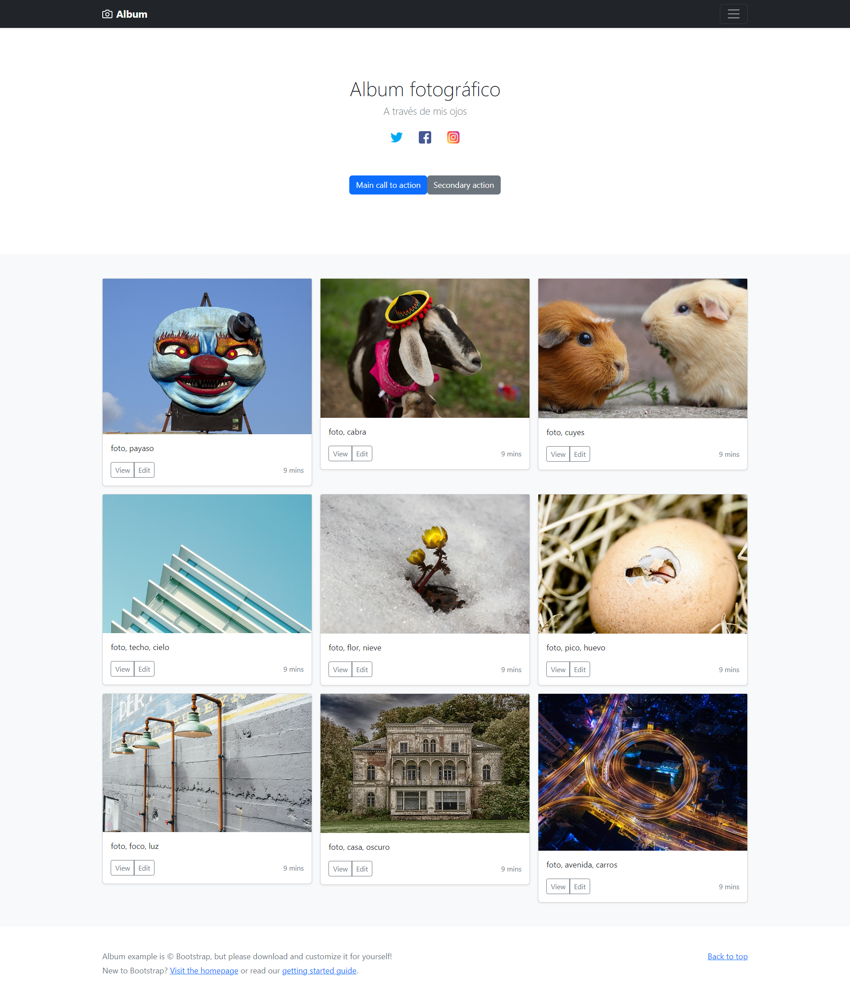

[Regresar](/DAWM-2022/)

Angular - Servicios
===================

<p align="center">
  
</p>

Los componentes NO deben obtener o guardar datos directamente y no deben presentar datos falsos. Los componentes deben centrarse en presentar datos y delegar el acceso a los datos a un servicio.

Un servicio es un proveedor de datos, que mantiene lógica de acceso a ellos. Los servicios serán consumidos por los componentes, que delegarán en ellos la responsabilidad de acceder a la información y la realización de operaciones con los datos.

Proyecto en Angular
===================

* * *

Utiliza el proyecto que desarrollaste con los tutoriales de [Angular - Local](https://dawfiec.github.io/DAWM-2022/tutoriales/angular_local.html), [Angular - Boostrap](https://dawfiec.github.io/DAWM-2022/tutoriales/angular_bootstrap.html), [Angular - Componentes, Comunicación y Directivas](https://dawfiec.github.io/DAWM-2022/tutoriales/angular_bases.html) y [Angular - PWA](https://dawfiec.github.io/DAWM-2022/tutoriales/angular_pwa.html)

* Instala las dependencias, con: `npm install`
* Verifica que funcione correctamente al levantar los servicios: `ng serve -o`


Interfaz
========

Para consultar datos mediante servicios, es recomendable el uso de interfaces para reconocer su estructura.
Desde la raíz del proyecto con Angular

* Cree la interfaz **Album**, con: `ng generate interface interfaz/album`

* Identifique la estructura de la respuesta del servicio a consultar para definir los atributos de la interfaz de respuesta. Según el recurso [Album](https://dataserverdawm.herokuapp.com/album) la estructura es:

	<pre><code>
	export interface Album {
     cabecera: string;
     principal: string;
  }
	</code></pre>


Servicio
========

Desde la raíz del proyecto con Angular

* Acceda desde la línea de comandos
* Cree el servicio **recurso**, con: `ng generate service servicios/recurso`
  + Se creará carpeta *servicios*, y 
  + Se crearán los archivos `recurso.service.ts` y `recurso.service.spec.ts`


Inyección de dependencias
=========================

Las dependencias son servicios u objetos que una clase necesita para realizar su función. La [inyección de dependencia (DI)](https://docs.angular.lat/guide/architecture-services#inyecci%C3%B3n-de-dependencia-id) es un patrón de diseño en el que una clase solicita dependencias de fuentes externas en lugar de crearlas, para aumentar la flexibilidad y modularidad en sus aplicaciones. Angular proporciona dependencias a una clase en la creación de instancias.

Para inyectar una dependencia en un componente solo debes agregar un argumento (con el tipo de la dependencia) en el método constructor de la clase.

* En **src/app/app.component.ts** 
	+ Agregue el _import_ al servicio
	
	<pre><code>
    import { Component } from '@angular/core';
	<b style="color:red">import { RecursoService } from './servicios/recurso.service';</b>

	@Component({
	  selector: 'app-root',
	  templateUrl: './app.component.html',
	...  
  </code></pre>

	+ Agregue el constructor de la clase con la inyección de dependencia (argumento del constructor) al servicio `RecursoService`.

  <pre><code>
    ...
	export class AppComponent {
	  title  = 'testAngular';

	  <b style="color:red">constructor(private recursoService: RecursoService) {}</b>
	}
	...
  </code></pre>


Peticiones HTTP
===============

Las aplicaciones en el front-end necesitan comunicarse con un servidor a través del protocolo HTTP, para descargar o cargar datos y acceder a otros servicios back-end. Angular proporciona una API HTTP de cliente para aplicaciones Angular, la clase de servicio `HttpClient` en `@angular/common/http`.

Para este caso, Angular usa los `observables` en lugar de promesas para entregar valores de [forma asíncrona](https://docs.angular.lat/guide/comparing-observables).

* En **src/app/app.module.ts**,
	+ Importe el módulo `HttpClientModule`

	<pre><code>
		...
		import { CabeceraComponent } from './cabecera/cabecera.component';
		import { RedesComponent } from './redes/redes.component';
		...
		<b style="color:red">import { HttpClientModule } from '@angular/common/http';</b>
		...

		@NgModule({
		  declarations: [
		    AppComponent,
		...
	</code></pre>

	+ Registre el servicio en la lista de módulos de la clave **import**, para que todos los componentes puedan acceder a este servicio.

	<pre><code>
		...
		  imports: [
		    BrowserModule,
		    AppRoutingModule,
		    ...
		    <b style="color:red">HttpClientModule,</b>
		...
	</code></pre>

* En **src/app/servicios/recurso.service.ts**, 
  + Importe el módulo `HttpClient`

  <pre><code>
	import { Injectable } from '@angular/core';
	<b style="color:red">import { HttpClient } from '@angular/common/http';</b>
	
  	
	@Injectable({
	  providedIn: 'root'
	...
	</code></pre>

	+ Agregue el servicio `HttpClient` como inyección de dependencia en el método constructor.
	
	<pre><code>
	...
	export class RecursoService {
	  <b style="color:red">constructor(private http: HttpClient) { }</b>
	  ...
	}
	</code></pre>

	+ Agregue la función *obtenerDatos* para hacer una petición `http` para obtener `get` una respuesta del URL <a href="https://dataserverdawm.herokuapp.com/album">Album</a>

	<pre><code>
	...
	obtenerDatos() {
      <b style="color:red">return this.http.get('https://dataserverdawm.herokuapp.com/album')</b>
	}
	...
	</code></pre>

Usando el servicio en el componente
===================================

Ahora, para acabar esta introducción a los servicios en Angular, tenemos que ver cómo usaríamos el servicio **RecursoService** en el componente **AppComponent**.

* En **src/app/app.component.ts** 
	+ Agregue la referencia a la interfaz **Album** 
    
    <pre><code>
    import { Component } from '@angular/core';
    <b style="color:red">
    import { Album } from './interfaz/album';
    </b>

    @Component({
  		selector: 'app-root',
  		templateUrl: './app.component.html',
    ...
    </code></pre>

	+ Modifique el constructor para suscribirse a la respuesta del servicio

  <pre><code>
  ...
  export class AppComponent {
	  title = 'Angular';

	  constructor(private recursoService: RecursoService) {
	  	<b style="color:red">
	    recursoService.obtenerDatos().subscribe(respuesta => {
	      let album = respuesta as Album
	      this.title = album.cabecera
	    })
	    </b>
	  }
	}
  ...
  </code></pre>

* En **src/app/app.component.html** 
	+ Renderice el atributo en la plantilla con 

	```html
		...	
		
		{{title}}
		
		...
	```

* Actualice el navegador o (re)inicie el servidor

* En el navegador debe mostrar el mensaje `Album fotográfico`.

<p align="center">
  
</p>

* Despliegue la aplicación en [Heroku](https://dawfiec.github.io/DAWM-2022/tutoriales/heroku_deploy.html)

Referencias 
===========

* * *

* Angular. (2022). Retrieved 18 July 2022, from https://angular.io/tutorial/toh-pt4
* Servicios en Angular. (2022). Retrieved 18 July 2022, from https://desarrolloweb.com/articulos/servicios-angular.html
* Angular. (2022). Retrieved 19 July 2022, from https://angular.io/guide/dependency-injection
* Inyección de dependencias. (2022). Retrieved 19 July 2022, from https://desarrolloweb.com/articulos/patron-diseno-contenedor-dependencias.html
* Angular. (2022). Retrieved 19 July 2022, from https://angular.io/guide/http
* Angular. (2022). Retrieved 19 July 2022, from https://docs.angular.lat/guide/comparing-observables
* Usar clases e Interfaces en los servicios Angular. (2022). Retrieved 26 July 2022, from https://desarrolloweb.com/articulos/clases-interfaces-servicios-angular.html
* Servicios en Angular. (2022). Retrieved 27 July 2022, from https://desarrolloweb.com/articulos/servicios-angular.html