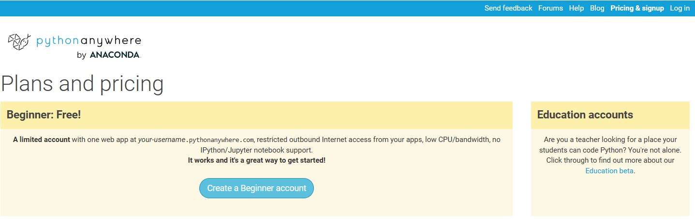

[Regresar](/DAWM/)

Django - Pythonanywhere
===============

    

Python Anywhere
==========

* * *

* Obtenga una cuenta **Beginner account** en [Python Anywhere](https://www.pythonanywhere.com/).

    
    
Fuente: <a href="https://www.pythonanywhere.com/pricing/">Python Anywhere</a> 

Referencias
=======

* PythonAnywere. (2016). Deploying an existing Django project on PythonAnywhere. Retrieved from https://help.pythonanywhere.com/pages/DeployExistingDjangoProject/
