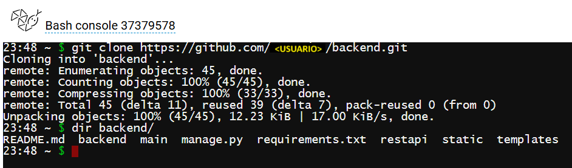
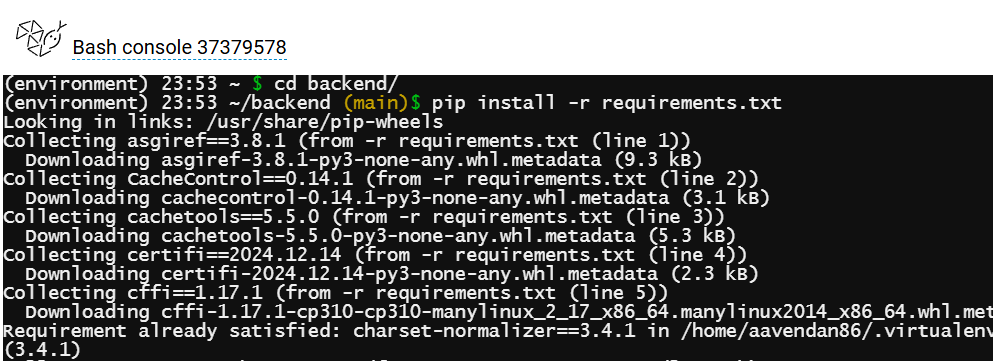
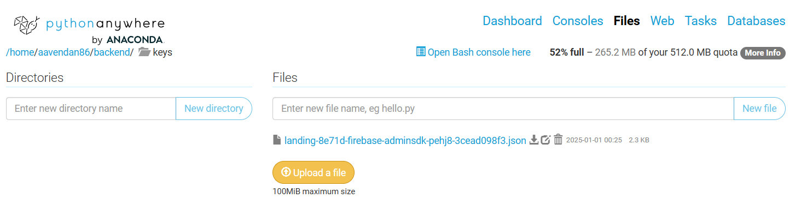
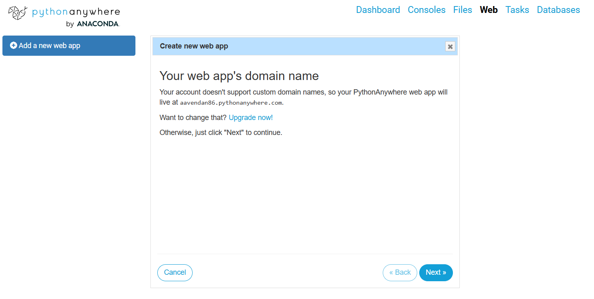
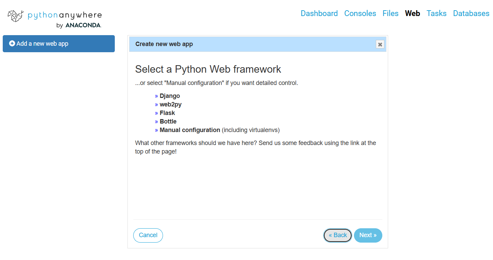
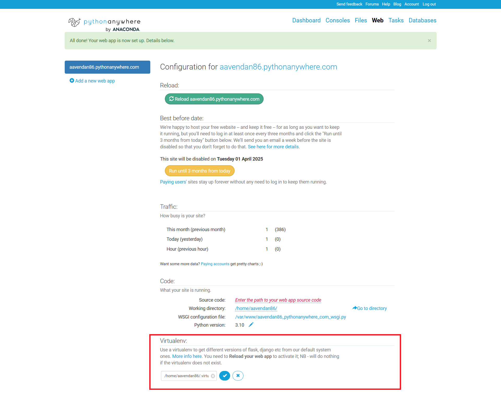
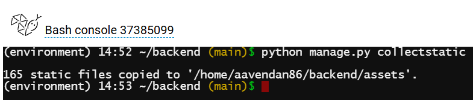
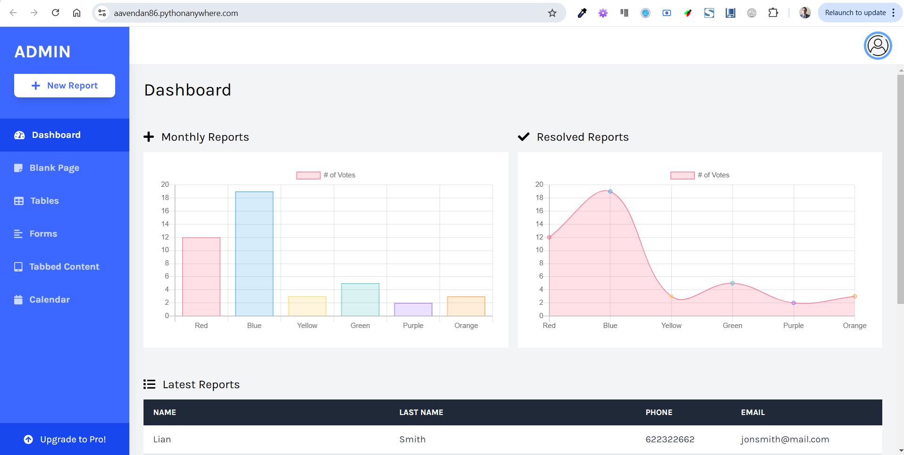

[Regresar](/DAWM/)

Django - Pythonanywhere
===============

<div align="center">
    
</div>

Python Anywhere
==========

* * *

* Obtenga una cuenta **Beginner account** en [Python Anywhere](https://www.pythonanywhere.com/).

<div align="center">
    
    <p>Fuente: <a href="https://www.pythonanywhere.com/pricing/">Python Anywhere</a> </p>
</div>

* Desde la interfaz de Python Anywhere, en la opción **Console** > **Bash**, cree una nueva consola.

<div align="center">
    
</div>

* Clone el repositorio del proyecto, con:

```command
git clone https://github.com/<USUARIO>/backend.git
```

<div align="center">
    
</div>

* En la consola, crea un entorno virtual, nómbralo como **environment** y con la versión de Python 3.10

```command
mkvirtualenv --python=/usr/bin/python3.10 environment
```

<div align="center">
    
</div>

* Acceda a la carpeta del proyecto e instale las dependencias:

```command
cd backend/
pip install -r requirements.txt
```

<div align="center">
    
</div>

Keys
==========

* * *

* Desde la interfaz de Python Anywhere, en la opción **Files**, cree la carpeta `keys` y cargue el archivo con las credenciales de Firebase. 

<div align="center">
    
</div>

Web app
==========

* * *

* Desde la interfaz de Python Anywhere, en la opción **Web**, cee una aplicación web con el botón **Add a new web app**

<div align="center">
    
</div>


* Seleccione la opción **» Manual configuration (including virtualenvs)**, con la versión de Python 3.10

<div align="center">
    
</div>

* Desde la interfaz de Python Anywhere, en la opción **Web**, en la sección **VIRTUALENV** ingrese la ruta al ambiente de Python 

```command
/home/<USUARIO-PYTHONANYWHERE>/.virtualenvs/environment
```

<div align="center">
    
</div>


* Desde la interfaz de Python Anywhere, en la opción **Web**, en la sección **CODE** modifique el ambiente de configuración del servidor `USUARIO-PYTHONANYWHERE_pythonanywhere_com_wsgi`

```python
# +++++++++++ DJANGO +++++++++++
import os
import sys

path = '/home/<USUARIO-PYTHONANYWHERE>/backend'
if path not in sys.path:
    sys.path.append(path)

os.environ['DJANGO_SETTINGS_MODULE'] = 'backend.settings'

from django.core.wsgi import get_wsgi_application
application = get_wsgi_application()
```


* Desde la interfaz de Python Anywhere, en la opción **Web**, en la sección **CODE** agregue el `Working directory` con la ruta a la carpeta del proyecto

```command
/home/<USUARIO-PYTHONANYWHERE>/backend
```

<div align="center">
    
</div>

Seguridad
==========

* * *

* Desde la interfaz de Python Anywhere, en la opción **Files**, modifique el archivo `backend/backend/settings.py` con el dominio **ALLOWED_HOSTS**

```python
...
ALLOWED_HOSTS = ['<USUARIO-PYTHONANYWHERE>.pythonanywhere.com']
...
```

Archivos estáticos
==========

* * *

* Desde la interfaz de Python Anywhere, en la opción **Files**, modifique el archivo `backend/backend/settings.py` con la ruta a los archivos estáticos **STATIC_ROOT**

```python
...
STATIC_URL = ...

STATICFILES_DIRS = [ ... ]

STATIC_ROOT = "assets/"
...
```

* Desde la interfaz de Python Anywhere, en la opción **Console**, acceda a la ruta del proyecto y genere los archivos estáticos

```command
python manage.py collectstatic
```

<div align="center">
    
</div>


* En el ambiente de configuración de la web app, relacione la URL `/static/` con el directorio `/home/<USUARIO-PYTHONANYWHERE>/backend/assets` 

<div align="center">
    
</div>

Verificación
==========

* * *

Acceda al sitio principal [https://&lt;USUARIO-PYTHONANYWHERE&gt;.pythonanywhere.com/](https://&lt;USUARIO-PYTHONANYWHERE&gt;.pythonanywhere.com/)

<div align="center">
    
</div>


Referencias
=======

* PythonAnywere. (2016). Deploying an existing Django project on PythonAnywhere. Retrieved from https://help.pythonanywhere.com/pages/DeployExistingDjangoProject/
* PythonAnywere. (2015). How to setup static files in Django. Retrieved from https://help.pythonanywhere.com/pages/DjangoStaticFiles