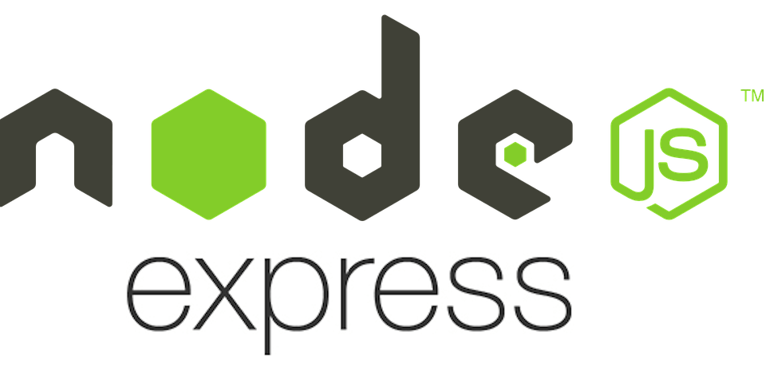
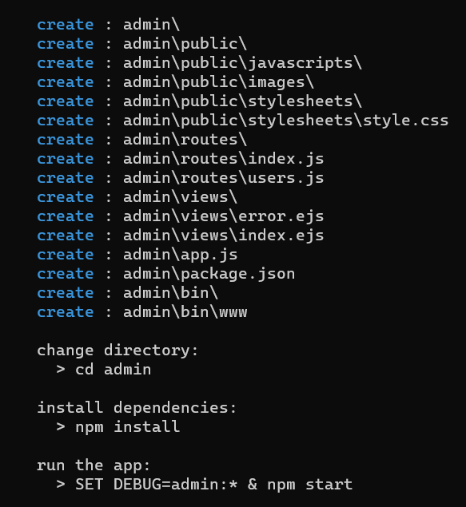
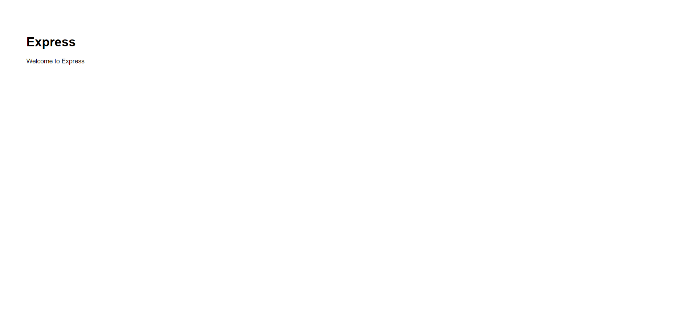

[Regresar](/DAWM/)

Express - Bases
===============

  

Node.js® es un entorno de ejecución para JavaScript construido con el [motor de JavaScript V8 de Chrome](https://v8.dev/ "https://v8.dev/"). Mientras que Express permite crear una infraestructura web rápida, minimalista y flexible el backend para Node.js

Esqueleto de un proyecto web
============================

Utilizaremos el [generador de aplicaciones de express](https://expressjs.com/en/starter/generator.html). Desde la línea de comandos:

* Instale el **express-generator**, con: `npm i -g express-generator`
  + Para obtener ayuda acerca del comando, utilice: `express --help`

* Cree un sitio de prueba llamado **admin**, con: `express --view=ejs admin`
  
  

    
  

* El generador producirá la siguiente estructura de archivos:

  <pre><code>
    .
    ├── app.js           <b style="background-color: #9b47d3;"># Configuración para la aplicación que se ejecutará en el servidor</b>
    ├── package.json     <b style="background-color: #9b47d3;"># Módulos de la aplicación</b>
    ├── package-lock.json
    ├── bin
    │   └── www          <b style="background-color: #9b47d3;"># Punto de arranque de la aplicación - Lee el archivo app.js</b>
    ├── public           <b style="background-color: #9b47d3;"># Directorio de archivos estáticos</b>
    │   ├── images
    │   ├── javascripts
    │   └── stylesheets
    │       └── style.css
    ├── routes           <b style="background-color: #9b47d3;"># Rutas de la aplicación en módulos separados</b>
    │   ├── index.js
    │   └── users.js
    └── views            <b style="background-color: #9b47d3;"># Vistas de la aplicación por renderizar</b>
        ├── error.ejs
        └── index.ejs
  </code></pre>

* Compruebe el funcionamiento del servidor, con:  
  
  <pre><code>
      cd admin   
      npm install   
      SET DEBUG=admin:\* & npm start
  </code></pre>
    
* En caso de ser necesario, resuelva los problemas con las dependencias, con:
  
  <pre><code>
    npm audit fix --force
  </code></pre>
    

* Acceda al URL `http://localhost:3000/` 

  

    
  

* El archivo `app.js` contiene la configuración para la aplicación web, con las siguientes partes
  + Módulos para la aplicación web

  <pre><code>
    var createError = require('http-errors');    <b style="background-color: #9b47d3;"># Manejo de errores por defecto</b>
    var express = require('express');            <b style="background-color: #9b47d3;"># Arquitectura de la aplicación en backend</b>
    var path = require('path');                  <b style="background-color: #9b47d3;"># Manejo de rutas</b>
    var cookieParser = require('cookie-parser'); <b style="background-color: #9b47d3;"># Manejo de cookies</b>
    var logger = require('morgan');              <b style="background-color: #9b47d3;"># Registro (log) de acciones del servidor</b>
  </code></pre>

  + Referencia a los archivos con las rutas internas 

  <pre><code>
    var indexRouter = require('./routes/index'); <b style="background-color: #9b47d3;"># Carga del manejador de subrutas para la ruta raíz</b>
    var usersRouter = require('./routes/users'); <b style="background-color: #9b47d3;"># Carga del manejador de subrutas para la ruta users </b>
  </code></pre> 

  + Instanciación de la aplicación

  <pre><code>
    var app = express();
  </code></pre>

  + Vistas (EJS que serán renderizadas en HTML)

  <pre><code>
    // view engine setup
    app.set('views', path.join(__dirname, 'views')); <b style="background-color: #9b47d3;"># Ruta a los archivos físicos que contienen las vistas </b>
    app.set('view engine', 'ejs');                     <b style="background-color: #9b47d3;"># Motor de renderización - EJS</b>
  </code></pre>

  + Configuración de la aplicación

  <pre><code>
    app.use(logger('dev'));                             <b style="background-color: #9b47d3;"># Instanciación del registrador (logger) de acciones para el MODO DE DESARROLLO</b>
    app.use(express.json());                            <b style="background-color: #9b47d3;"># Este método se usa para analizar las solicitudes entrantes con cargas JSON y se basa en el analizador de cuerpo de mensajes HTTP.</b>
    app.use(express.urlencoded({ extended: false }));   <b style="background-color: #9b47d3;"># Analiza las requests entrantes con cargas codificadas y se basa en body-parser. </b>
    app.use(cookieParser());                            <b style="background-color: #9b47d3;"># Manejo de cookies entre el cliente y el servidor </b>
    app.use(express.static(path.join(__dirname, 'public')));     <b style="background-color: #9b47d3;"># Registro de la ruta para archivos estáticos (imágenes, hojas de estilo, etc)</b>
  </code></pre>

  + Relación entre las rutas externas y las rutas internas 

  <pre><code>
    app.use('/', indexRouter);              <b style="background-color: #9b47d3;"># Pareo entre la ruta raíz y el manejador de subrutas</b>
    app.use('/users', usersRouter);         <b style="background-color: #9b47d3;"># Pareo entre la ruta users y el manejador de subrutas</b>
  </code></pre>

  + Middleware para errores

  <pre><code>
    // catch 404 and forward to error handler
    app.use(function(req, res, next) {
      next(createError(404));               <b style="background-color: #9b47d3;"># En caso de cualquier error, lanzar un error404 </b>
    });
  
    // error handler
    app.use(function(err, req, res, next) {
      // set locals, only providing error in development
      res.locals.message = err.message;
      res.locals.error = req.app.get('env') === 'development' ? err : {}; <b style="background-color: #9b47d3;"># Los errores se mostrarán en el MODO DE DESARROLLO </b>

      // render the error page
      res.status(err.status || 500);
      res.render('error');
    });
  </code></pre>

Referencias 
===========

* * *

* Introducción a Express/Node - Aprende sobre desarrollo web MDN. (2022). Retrieved 21 July 2022, from https://developer.mozilla.org/es/docs/Learn/Server-side/Express_Nodejs/Introduction
* Express - Infraestructura de aplicaciones web Node.js. (2022). Retrieved 21 July 2022, from https://expressjs.com/es/
* Express application generator. (2022). Retrieved 21 July 2022, from https://expressjs.com/en/starter/generator.html
* Express Tutorial Part 2: Creating a skeleton website - Learn web development MDN. (2022). Retrieved 21 July 2022, from https://developer.mozilla.org/en-US/docs/Learn/Server-side/Express_Nodejs/skeleton_website
* Express.js – express.json() function. (2022). Retrieved 22 July 2022, from https://www.tutorialspoint.com/express-js-express-json-function#:~:text=json()%20is%20a%20built,header%20matches%20the%20type%20option.