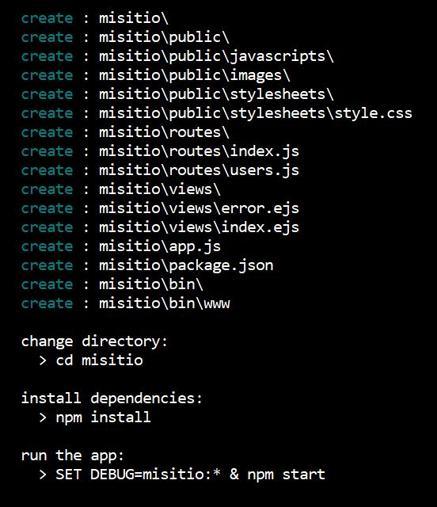

[Regresar](/DAWM-2022/)

Express - Bases
===============

  

Node.js® es un entorno de ejecución para JavaScript construido con el [motor de JavaScript V8 de Chrome (Enlaces a un sitio externo.)](https://v8.dev/ "https://v8.dev/"). Mientras que Express permite crear una infraestructura web rápida, minimalista y flexible para Node.js

Considere el tutorial [Express - Bases](https://dawfiec.github.io/DAWM-2022/tutoriales/express_bases.html).

Esqueleto de un proyecto web
============================

Utilizaremos el [generador de aplicaciones de express](https://expressjs.com/en/starter/generator.html). Desde la línea de comandos:

* Instale el **express-generator**, con: `npm i -g express-generator`
  + Para obtener ayuda acerca del comando, utilice: `express --help`

* Cree un sitio de prueba llamado **misitio**, con: `express --view=ejs misitio`
  
  

    
  

* Compruebe el funcionamiento del servidor, con:  
  
  <pre><code>
      cd misitio   
      npm install   
      SET DEBUG=misitio:\* & npm start
  </code></pre>
    
* Acceda a los rutas por defecto del sitio.

Referencias 
===========

* * *

* Introducción a Express/Node - Aprende sobre desarrollo web MDN. (2022). Retrieved 21 July 2022, from https://developer.mozilla.org/es/docs/Learn/Server-side/Express_Nodejs/Introduction
* Express - Infraestructura de aplicaciones web Node.js. (2022). Retrieved 21 July 2022, from https://expressjs.com/es/
* Express application generator. (2022). Retrieved 21 July 2022, from https://expressjs.com/en/starter/generator.html
Express Tutorial Part 2: Creating a skeleton website - Learn web development MDN. (2022). Retrieved 21 July 2022, from https://developer.mozilla.org/en-US/docs/Learn/Server-side/Express_Nodejs/skeleton_website