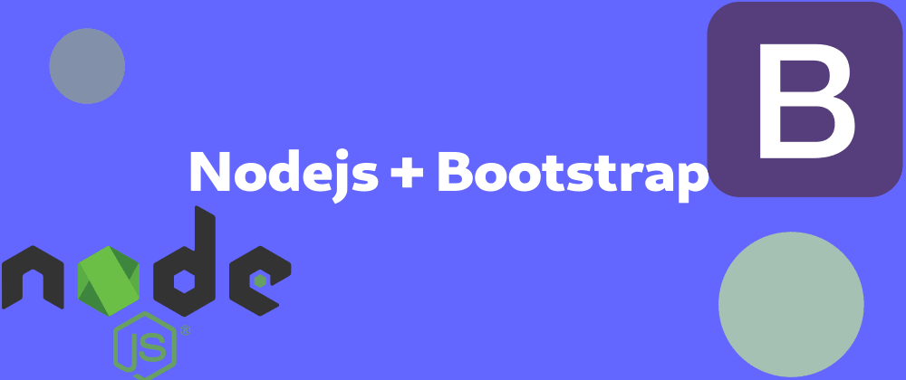
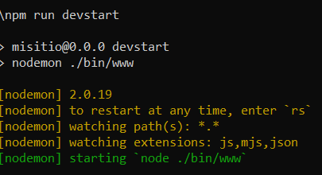

[Regresar](/DAWM-2022/)

Express - Bootstrap
===============

<p align="center">
  
</p>

Proyecto en Express
===================

* * *

Utiliza el proyecto que desarrollaste con el tutorial de [Express - Bases](https://dawfiec.github.io/DAWM-2022/tutoriales/express_bases.html).

* Instala las dependencias, con: `npm install`
* Verifica que funcione correctamente al levantar los servicios: `SET DEBUG=misitio:\* & npm start`


Detección de cambios y reinicio del servidor
============================================

* * *

Desde la línea de comandos del proyecto:

* Agregue nodemon como módulo del proyecto, con: `npm install --save-dev nodemon`
  + Con esta instrucción se agregará la clave **devDependencies** en el package.json

	<pre><code>
	"devDependencies": {  
	     "nodemon": "X.Y.Z"  
	}
	</code></pre>

* En el `package.json`, dentro de la clave **scripts**, agregue la clave **devstart**:

	<pre><code>
	"scripts": {  
	  "start": "node ./bin/www"
	  <b style="color:red">
	  ,  
	  "devstart": "nodemon ./bin/www"
		</b>
	}  
	</code></pre>

* En adelante, levante el servidor, con: **`npm run devstart`**
  + Con este script, ya no será necesario reiniciar el servidor para ver los cambios en el navegador.

  <p align="center">
    
  </p>

Bootstrap - Starter template
============================

* * *

* Levante los servicios de la aplicación.
* Utilice el [Starter template](https://getbootstrap.com/docs/5.0/getting-started/introduction/#starter-template) de bootstrap en lugar del contenido que se encuentra en **views/index.ejs**
* Revise los cambios en el navegador.


Bootstrap - Dashboard example
=============================

* * *

* Descargue y descomprima los [ejemplos de Bootstrap](https://getbootstrap.com/docs/5.0/examples/)
* Utilice la plantilla **Dashboard**.
  + Del archivo **dashboard/index.html**, copie las etiquetas `<header>` y `<div.container-fluid>`
  + En el archivo **views/index.ejs**
  	- Reemplace la etiqueta `<h1>` por las etiquetas copiadas.
  + Copie el archivo **dashboard/dashboard.css** en la carpeta **public/stylesheets**
  + Copie el archivo **dashboard/dashboard.js** en la carpeta **public/javascripts**
* En el **views/index.ejs** agregue la referencia a **dashboard.css** después del enlace al `bootstrap.min.css`

	```
		...
		<link href="https://cdn.jsdelivr.net/npm/bootstrap@5.0.2/dist/css/bootstrap.min.css" rel="stylesheet" integrity="sha384-EVSTQN3/azprG1Anm3QDgpJLIm9Nao0Yz1ztcQTwFspd3yD65VohhpuuCOmLASjC" crossorigin="anonymous">
		...
		<link rel='stylesheet' href='/stylesheets/dashboard.css' />
		...
	```

* En el **views/index.ejs** agregue la referencia a **feather.min.js**, **Chart.min.js** y **dashboard.js** después del script al `bootstrap.bundle.min.js`

	```
		...
		<script src="https://cdn.jsdelivr.net/npm/bootstrap@5.0.2/dist/js/bootstrap.bundle.min.js" integrity="sha384-MrcW6ZMFYlzcLA8Nl+NtUVF0sA7MsXsP1UyJoMp4YLEuNSfAP+JcXn/tWtIaxVXM" crossorigin="anonymous"></script>
		...
		<script src="https://cdn.jsdelivr.net/npm/feather-icons@4.28.0/dist/feather.min.js" integrity="sha384-uO3SXW5IuS1ZpFPKugNNWqTZRRglnUJK6UAZ/gxOX80nxEkN9NcGZTftn6RzhGWE" crossorigin="anonymous"></script>
		<script src="https://cdn.jsdelivr.net/npm/chart.js@2.9.4/dist/Chart.min.js" integrity="sha384-zNy6FEbO50N+Cg5wap8IKA4M/ZnLJgzc6w2NqACZaK0u0FXfOWRRJOnQtpZun8ha" crossorigin="anonymous"></script>
		<script src="/javascripts/dashboard.js"></script>
		...
	```

* Compruebe el funcionamiento del servidor, con: **npm run devstart**
* Acceda al URL `http://localhost:3000/` 

<p align="center" style="border: 0.5pt solid black;">
  
</p>


Referencias 
===========

* * *

* Express Tutorial Part 2: Creating a skeleton website - Learn web development MDN. (2022). Retrieved 22 July 2022, from https://developer.mozilla.org/en-US/docs/Learn/Server-side/Express_Nodejs/skeleton_website#enable_server_restart_on_file_changes
* Mark Otto, a. (2022). Bootstrap. Retrieved 22 July 2022, from https://getbootstrap.com/