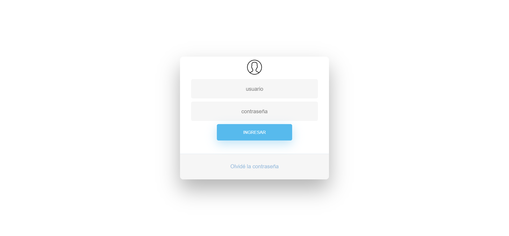
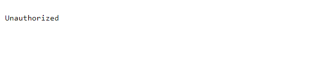
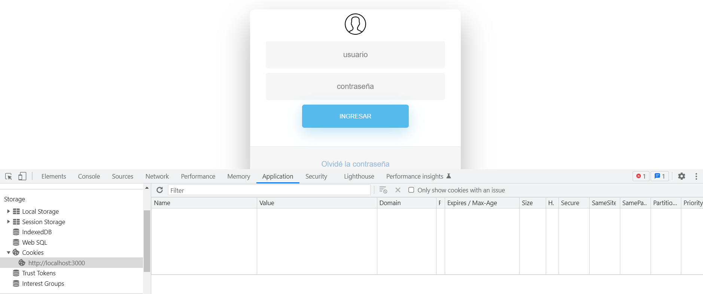
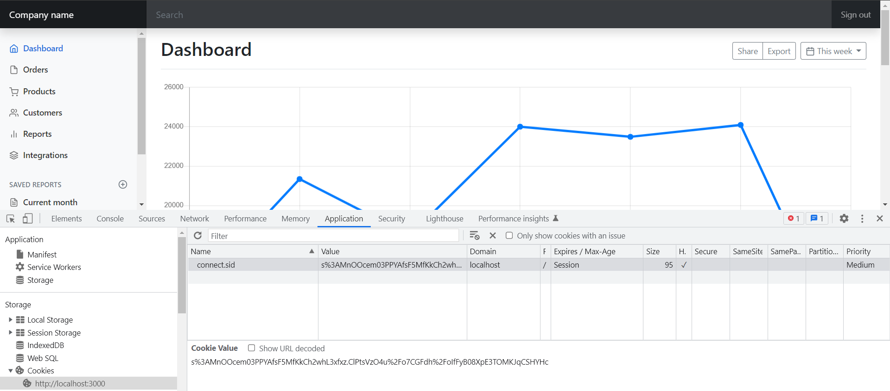

[Regresar](/DAWM/)

Express - Manejo de estados I: Sesión
=====================================

Una cookie HTTP, cookie web o cookie de navegador es una pequeña pieza de datos que un servidor envía a el navegador web del usuario. El navegador guarda estos datos y los envía de regreso junto con la nueva petición al mismo servidor. Las cookies se usan generalmente para decirle al servidor que dos peticiones tienen su origen en el mismo navegador web lo que permite, por ejemplo, mantener la sesión de un usuario abierta. Las cookies permiten recordar la información de estado en vista a que el protocolo HTTP es un protocolo sin estado.

Las cookies se utilizan principalmente con tres propósitos:

* Gestión de Sesiones. Inicios de sesión, carritos de compras, puntajes de juegos o cualquier otra cosa que el servidor deba recordar
* Personalización. Preferencias de usuario, temas y otras configuraciones
* Rastreo. Guardar y analizar el comportamiento del usuario

Proyecto en Express: REST API
=============================

* * *

Crea un nuevo proyecto, según [Express - Bases](https://dawfiec.github.io/DAWM/tutoriales/express_bases.html), [Express - ORM (Básico)](https://dawfiec.github.io/DAWM/tutoriales/express_ormbasico.html), [Express - ORM (Intermedio)](https://dawfiec.github.io/DAWM/tutoriales/express_ormintermedio.html), [Express - Parámetros de consulta y Parámetros de ruta](https://dawfiec.github.io/DAWM/tutoriales/express_pcpr.html), [Express - REST](https://dawfiec.github.io/DAWM/tutoriales/express_rest.html), [Express - Formularios I](https://dawfiec.github.io/DAWM/tutoriales/express_forms1.html) y [Express - Formularios II](https://dawfiec.github.io/DAWM/tutoriales/express_forms2.html).

* O, Clone el proyecto con las [aplicaciones del curso](https://github.com/DAWFIEC/DAWM-apps) para la aplicación **album/api**
    - Para el hito: **`hito9-api`**

* En la línea de comandos (1) del proyecto **album/api**
  + Instale las dependencias, con: `npm install`
  + Use la variable de entorno **PORT**, con: `set PORT=4444`
  + Verifique el funcionamiento al levantar los servicios, con: `npm run devstart`


Proyecto en Express: Admin
==========================

* * *

Crea un nuevo proyecto, según [Express - Bases](https://dawfiec.github.io/DAWM/tutoriales/express_bases.html), [Express - Bootstrap](https://dawfiec.github.io/DAWM/tutoriales/express_bootstrap.html), [Express - Layouts y Partials](https://dawfiec.github.io/DAWM/tutoriales/express_partials.html), [Express - Formularios I](https://dawfiec.github.io/DAWM/tutoriales/express_forms1.html) y [Express - Formularios II](https://dawfiec.github.io/DAWM/tutoriales/express_forms2.html).

* O, Clone el proyecto con las [aplicaciones del curso](https://github.com/DAWFIEC/DAWM-apps) para la aplicación **album/admin**
    - Para el hito: **`hito6-admin`**


MySQL
=====

* * *

Realice las instrucciones que se encuentran en el tutorial [Express - ORM (Avanzado)](https://dawfiec.github.io/DAWM/tutoriales/express_ormavanzado.html).


Login
=====

* * *

* Descargue y descomprima [login](archivos/login.zip).
  + Copie el archivo `login/login.ejs` a `admin/views/`
  + Copie el archivo `login/login.js` a `admin/routes/`
  + Copie el archivo `login/login.css` a `admin/public/stylesheets/`
  + Copie la carpeta `login/icons` a `admin/public/`

* Modifique `admin/app.js`
  + Obtenga la referencia a `admin/routes/login.js`

    <pre><code>
    ...
    var usersRouter = require('./routes/users');
    <b style="color:red">var loginRouter = require('./routes/login');</b>
    ...
    </code></pre>

  + Registre la ruta `/login` antes de la ruta raíz `/`

    <pre><code>
    ...
    <b style="color:red">app.use('/login', loginRouter);</b>
    app.use('/', indexRouter);
    ...
    </code></pre>


* Compruebe el funcionamiento del servidor, con: `npm run devstart`
  
  + Acceda a las URLs `http://localhost:3000/login`

  <p align="center" >
    
  </p>


Autorización
============

* * *

## Middleware: auth.js

* Cree la carpeta `admin/middlewares`
* Agregue el _script_ de autorización en `admin/middlewares/auth.js`:
  
    <pre><code>
    var express = require('express');
    var router = express.Router();

    var auth = (req, res, next) => {
      
      if (req.session && req.session.user !== undefined ) {
        return next();
      } else {
        return res.sendStatus(401);
      }
        
    };

    module.exports = auth;
    </code></pre>


## App.js: sesión


* Desde la línea de comandos en la raíz del proyecto, instale [**express-session**](https://www.npmjs.com/package/express-session) , con: `npm install express-session`
* Modifique `admin/app.js`:
  + Agregue la referencia a **express-session**, con: 

    <pre><code>
    ...
    var logger = require('morgan');
    <b style="color:red">var session = require('express-session');</b>

    var indexRouter = require('./routes/index');
    ...
    </code></pre>

  + Añada el _middleware_ del uso de sesión en la aplicación, con:

    <pre><code>
    ...
    var app = express();
    <b style="color:red">
    app.use(session({
        secret: '2C44-4D44-WppQ38S',
        resave: true,
        saveUninitialized: false,
        cookie: { maxAge: 60000 }
    }));
    </b>
    // view engine setup
    ...
    </code></pre>

  + Agregue la referencia al **middleware**, con:  

    <pre><code>
    ...
    var indexRouter = require('./routes/index');
    var usersRouter = require('./routes/users');
    var loginRouter = require('./routes/login');
    <b style="color:red">var auth = require('./middlewares/auth');</b>

    var app = express();
    ...
    </code></pre>

  + Agregue el _middleware_ **auth.js** a la ruta raíz `/`

    <pre><code>
    ...
    app.use('/login', loginRouter);
    app.use('/', <b style="color:red">auth,</b> indexRouter);
    ...
    </code></pre>

* Compruebe el funcionamiento del servidor, con: `npm run devstart`
  + Acceda a las URLs `http://localhost:3000/` y `http://localhost:3000/photos`

  <p align="center" >
    
  </p>


Autenticación
=============

* * *

## Inicio de sesión

* Desde la línea de comandos en la raíz del proyecto, instale [**bcrypt**](https://www.npmjs.com/package/bcrypt) , con: `npm install bcrypt`
* Modifique `admin/routes/login.js`:
  + Agregue la referencia a  `bcrypt`, `sequelize` y a los modelos.

    <pre><code>
    var express = require('express');
    var router = express.Router();

    <b style="color:red">
    const bcrypt = require("bcrypt");

    const sequelize = require('../models/index.js').sequelize;
    var initModels = require("../models/init-models");
    var models = initModels(sequelize);</b>
    ...
    </code></pre>

  + Agregue la instanciación de la sesión, con:

    <pre><code>
    ...
    router.post('/validate', async function(req, res, next) {

      let { user, password } = req.body

      let userdb = await models.users.findOne({
        where: {
          username: user
        } 
      })

      let valid = await bcrypt.compare(password, userdb.password);

      if(valid) {
        req.session.user = user;  
        res.redirect('/');  
      } else {  
        res.redirect('/login'); 
      }

    });
    ...
    </code></pre>

* Acceda a la ruta `/login`
  + En el inspector del navegador, revise que no exista alguna **cookies de sesión** 

  <p align="center">
    
  </p>

  + Ingrese las credenciales: `admin` y  `admin`
  + Luego de la redirección, revise las **cookies de sesión**

<p align="center">
  
</p>

## Fin de sesión


* Modifique el partial `admin/views/partials/header.ejs`. Agregue la referencia a `/login/invalidate`

    ```
    ...
    <a class="nav-link px-3" href="/login/invalidate">Sign out</a>
    ...
    ```

* Modifique el ruteador `admin/routes/login.js`. Agregue el controlador para el método **GET** de la ruta `/invalidate`

    <pre><code>
    ...
    router.get('/invalidate', function(req, res, next) { 
      req.session.destroy();
      res.redirect('/login')
    });
    ...
    </code></pre> 

  + De clic en la opción **`Sign out`** de la esquina superior a la derecha.


Referencias 
===========

* * *

* HTTP cookies - HTTP MDN. (2022). Retrieved 21 August 2022, from https://developer.mozilla.org/es/docs/Web/HTTP/Cookies
* Manejo de Cookies en Express.js · GitBook. (2021). Retrieved 23 August 2021, from https://ull-esit-pl-1617.github.io/estudiar-cookies-y-sessions-en-expressjs-victor-pamela-jesus/cookies/chapter5.html 
* Sessions en ExpressJS · GitBook. (2021). Retrieved 23 August 2021, from https://ull-esit-dsi-1617.github.io/estudiar-cookies-y-sessions-en-expressjs-alejandro-raul-35l2-p4/sessionsexpress.html
* required, b., & Hayat, M. (2017). bcrypt Error: data and hash arguments required. Retrieved 11 January 2023, from https://stackoverflow.com/questions/42241113/bcrypt-error-data-and-hash-arguments-required
* Patel, H. (2022). Password hashing in Node.js with bcrypt - LogRocket Blog. Retrieved 11 January 2023, from https://blog.logrocket.com/password-hashing-node-js-bcrypt/