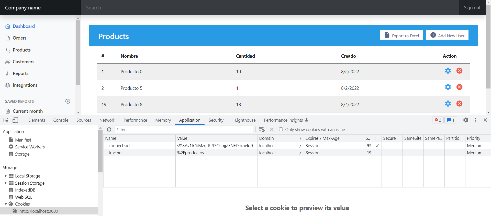

[Regresar](/DAWM/)

Express - Manejo de estados I: cookies y sessions
===============================================

Una cookie HTTP, cookie web o cookie de navegador es una pequeña pieza de datos que un servidor envía a el navegador web del usuario. El navegador guarda estos datos y los envía de regreso junto con la nueva petición al mismo servidor. Las cookies se usan generalmente para decirle al servidor que dos peticiones tienen su origen en el mismo navegador web lo que permite, por ejemplo, mantener la sesión de un usuario abierta. Las cookies permiten recordar la información de estado en vista a que el protocolo HTTP es un protocolo sin estado.

Las cookies se utilizan principalmente con tres propósitos:

* Gestión de Sesiones. Inicios de sesión, carritos de compras, puntajes de juegos o cualquier otra cosa que el servidor deba recordar
* Personalización. Preferencias de usuario, temas y otras configuraciones
* Rastreo. Guardar y analizar el comportamiento del usuario


Proyecto en Express: Admin
==========================

* * *

Crea un nuevo proyecto, según [Express - Bases](https://dawfiec.github.io/DAWM/tutoriales/express_bases.html), [Express - Bootstrap](https://dawfiec.github.io/DAWM/tutoriales/express_bootstrap.html), [Express - Layouts y Partials](https://dawfiec.github.io/DAWM/tutoriales/express_partials.html), [Express - Formularios I](https://dawfiec.github.io/DAWM/tutoriales/express_forms1.html) y [Express - Formularios II](https://dawfiec.github.io/DAWM/tutoriales/express_forms2.html).

* O, Clone el proyecto con las [aplicaciones del curso](https://github.com/DAWFIEC/DAWM-apps) para la aplicación **album/admin**
    - Para el hito: **`hito6-admin`**


Login
=====

* * *

* Descargue y descomprima [login](archivos/login.zip).
  + Copie el archivo `login/login.ejs` a `admin/views/`
  + Copie el archivo `login/login.js` a `admin/routes/`
  + Copie el archivo `login/login.css` a `admin/public/stylesheets/`
  + Copie la carpeta `login/icons` a `admin/public/`

* Modifique `admin/app.js`
  + Obtenga la referencia a `admin/routes/login.js`

    <pre><code>
    ...
    var usersRouter = require('./routes/users');
    <b style="color:red">var loginRouter = require('./routes/login');</b>
    ...
    </code></pre>

  + Registre la ruta `/login` antes de la ruta raíz `/`

    <pre><code>
    ...
    <b style="color:red">app.use('/login', loginRouter);</b>
    app.use('/', indexRouter);
    ...
    </code></pre>


* Compruebe el funcionamiento del servidor, con: `npm run devstart`
  
  + Acceda a las URLs `http://localhost:3000/login`

  <p align="center" >
    
  </p>


Middleware: auth.js
===================

* * *

* Cree la carpeta `admin/middlewares`
* Agregue el _script_ de autorización en `admin/middlewares/auth.js`:
  
    <pre><code>
    var express = require('express');
    var router = express.Router();

    let bd = {  
      'usuario': 'abc',  
      'contrasenia': '123'  
    }

    var auth = (req, res, next) => {
      if (req.session && req.session.user === bd['usuario'] && req.session.admin)
        return next();
      else
        return res.sendStatus(401);
    };

    module.exports = auth;
    </code></pre>


Autorización
============

* * *

Desde la línea de comandos en la raíz del proyecto.

* Instale [**express-session**](https://www.npmjs.com/package/express-session) , con: `npm install express-session`
* Modifique `admin/app.js`:
  + Agregue la referencia a **express-session**, con: 

    <pre><code>
    ...
    var logger = require('morgan');
    <b style="color:red">var session = require('express-session');</b>

    var indexRouter = require('./routes/index');
    ...
    </code></pre>

  + Añada el _middleware_ del uso de sesión en la aplicación, con:

    <pre><code>
    ...
    var app = express();
    <b style="color:red">
    app.use(session({
        secret: '2C44-4D44-WppQ38S',
        resave: true,
        saveUninitialized: false,
        cookie: { maxAge: 60000 }
    }));
    </b>
    // view engine setup
    ...
    </code></pre>

  + Agregue la referencia al **middleware**, con:  

    <pre><code>
    ...
    var indexRouter = require('./routes/index');
    var usersRouter = require('./routes/users');
    var loginRouter = require('./routes/login');
    <b style="color:red">var auth = require('./middlewares/auth');</b>

    var app = express();
    ...
    </code></pre>

  + Agregue el _middleware_ **auth.js** a la ruta raíz `/`

    <pre><code>
    ...
    app.use('/login', loginRouter);
    app.use('/', <b style="color:red">auth,</b> indexRouter);
    ...
    </code></pre>

* Compruebe el funcionamiento del servidor, con: `npm run devstart`
  + Acceda a las URLs `http://localhost:3000/` y `http://localhost:3000/productos`

  <p align="center" >
    
  </p>


Autenticación
=============

* * *

Inicio de sesión
================

* Modifique `admin/routes/login.js`:
  + Agregue la instanciación de la sesión, con:

    <pre><code>
    ...
    router.post('/validate', function(req, res, next) {

      let { user, password } = req.body

      if(user == bd['usuario'] && password == bd['contrasenia']) {
      
        req.session.user = bd['usuario'];
        req.session.admin = true;  
        
        res.redirect('/');  
      } else {  
        res.redirect('/login'); 
      }
    });
    ...
    </code></pre>

* Acceda a la ruta `/login`
  + En el inspector del navegador, revise que no exista alguna **cookies de sesión** 

  <p align="center">
    
  </p>

  + Ingrese las credenciales: `abc` y  `123`
  + Luego de la redirección, revise las **cookies de sesión**

<p align="center">
  
</p>

Fin de sesión
================

* Modifique el partial `admin/views/partials/header.ejs`. Agregue la referencia a `/login/invalidate`

    ```
    ...
    <a class="nav-link px-3" href="/login/invalidate">Sign out</a>
    ...
    ```

* Modifique el ruteador `admin/routes/login.js`. Agregue el controlador para el método **GET** de la ruta `/invalidate`

    <pre><code>
    ...
    router.get('/invalidate', function(req, res, next) { 
      req.session.destroy();
      res.redirect('/login')
    });
    ...
    </code></pre> 

  + De clic en la opción **`Sign out`** de la esquina superior a la derecha.


Middleware: tracking.js
=======================

* * *

* En la carpeta `admin/middlewares`
  + Agregue el _script_ de rastreo en `admin/middlewares/tracking.js`:
  
    ```
    var express = require('express');
    var router = express.Router();

    var tracking = (req, res, next) => {
      res.cookie('tracing', req._parsedOriginalUrl.path , {expire : new Date() + 9999});
      return next();
    };
    module.exports = tracking;
    ```


Rastreo
=========

* * *

* Instale [**cookie-parser**](https://www.npmjs.com/package/cookie-parser) , con: `npm install --save cookie-parser`
* Modifique `admin/app.js`:
  + Verifique o agregue la referencia a **cookie-parser**, con: 

    <pre><code>
    ...
    var path = require('path');
    <b style="color:red">var cookieParser = require('cookie-parser');</b>
    var logger = require('morgan');
    ...
    </code></pre>

  + Verifique o añada el _middleware_ session a la aplicación, con:

    <pre><code>
    ...
    app.use(express.urlencoded({ extended: false }));
    <b style="color:red">app.use(cookieParser());</b>
    ...
    </code></pre>

  + Agregue el _middleware_ **tracking.js** a la ruta raíz `/`:  

    <pre><code>
    var indexRouter = require('./routes/index');
    var usersRouter = require('./routes/users');
    var loginRouter = require('./routes/login');

    var auth = require('./middlewares/auth');
    <b style="color:red">var tracking = require('./middlewares/tracking');</b>
    
    var app = express();
    </code></pre>

  + Agregue el _middleware_ a la ruta raíz `/`

    <pre><code>
    ...
    app.use('/', auth,  <b style="color:red">tracking,</b> indexRouter);
    ...
    </code></pre>


Ultima ruta
================

* Modifique `admin/routes/login.js`:
  + Agregue el rastreo para el redireccionamiento, con:

  <pre><code>
  if(usuario == bd['usuario'] && contrasenia == bd['contrasenia']) {
    req.session.user = bd['usuario'];
    req.session.admin = true;

    <b style="color:red">
    let tracing = req.cookies.tracing  || ''
    if(tracing.length > 0)
      res.redirect(tracing)   
    else
      res.redirect('/');
    </b> 
    
  } else {
  </code></pre>

* Después dar clicks en varios enlaces en la aplicación, verifique el valor de la cookie **tracing**
  
  + Cierre y abra la sesión para comprobar el redireccionamiento.

<p align="center">
  
</p>


Referencias 
===========

* * *

* HTTP cookies - HTTP MDN. (2022). Retrieved 21 August 2022, from https://developer.mozilla.org/es/docs/Web/HTTP/Cookies
* Manejo de Cookies en Express.js · GitBook. (2021). Retrieved 23 August 2021, from https://ull-esit-pl-1617.github.io/estudiar-cookies-y-sessions-en-expressjs-victor-pamela-jesus/cookies/chapter5.html 
* Sessions en ExpressJS · GitBook. (2021). Retrieved 23 August 2021, from https://ull-esit-dsi-1617.github.io/estudiar-cookies-y-sessions-en-expressjs-alejandro-raul-35l2-p4/sessionsexpress.html