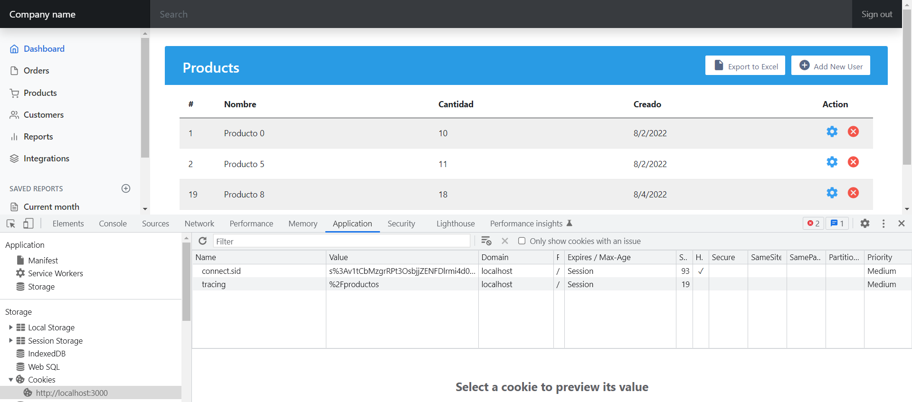

[Regresar](/DAWM/)

Express - Manejo de estados II: Cookies
=======================================

Una cookie HTTP, cookie web o cookie de navegador es una pequeña pieza de datos que un servidor envía a el navegador web del usuario. El navegador guarda estos datos y los envía de regreso junto con la nueva petición al mismo servidor. Las cookies se usan generalmente para decirle al servidor que dos peticiones tienen su origen en el mismo navegador web lo que permite, por ejemplo, mantener la sesión de un usuario abierta. Las cookies permiten recordar la información de estado en vista a que el protocolo HTTP es un protocolo sin estado.

Las cookies se utilizan principalmente con tres propósitos:

* Gestión de Sesiones. Inicios de sesión, carritos de compras, puntajes de juegos o cualquier otra cosa que el servidor deba recordar
* Personalización. Preferencias de usuario, temas y otras configuraciones
* Rastreo. Guardar y analizar el comportamiento del usuario

Proyecto en Express: REST API
=============================

* * *

Crea un nuevo proyecto, según [Express - Bases](https://dawfiec.github.io/DAWM/tutoriales/express_bases.html), [Express - ORM (Básico)](https://dawfiec.github.io/DAWM/tutoriales/express_ormbasico.html), [Express - ORM (Intermedio)](https://dawfiec.github.io/DAWM/tutoriales/express_ormintermedio.html), [Express - Parámetros de consulta y Parámetros de ruta](https://dawfiec.github.io/DAWM/tutoriales/express_pcpr.html), [Express - REST](https://dawfiec.github.io/DAWM/tutoriales/express_rest.html), [Express - Formularios I](https://dawfiec.github.io/DAWM/tutoriales/express_forms1.html) y [Express - Formularios II](https://dawfiec.github.io/DAWM/tutoriales/express_forms2.html).

* O, Clone el proyecto con las [aplicaciones del curso](https://github.com/DAWFIEC/DAWM-apps) para la aplicación **album/api**
    - Para el hito: **`hito9-api`**

* En la línea de comandos (1) del proyecto **album/api**
  + Instale las dependencias, con: `npm install`
  + Use la variable de entorno **PORT**, con: `set PORT=4444`
  + Verifique el funcionamiento al levantar los servicios, con: `npm run devstart`


Proyecto en Express: Admin
==========================

* * *

Crea un nuevo proyecto, según [Express - Bases](https://dawfiec.github.io/DAWM/tutoriales/express_bases.html), [Express - Bootstrap](https://dawfiec.github.io/DAWM/tutoriales/express_bootstrap.html), [Express - Layouts y Partials](https://dawfiec.github.io/DAWM/tutoriales/express_partials.html), [Express - Formularios I](https://dawfiec.github.io/DAWM/tutoriales/express_forms1.html), [Express - Formularios II](https://dawfiec.github.io/DAWM/tutoriales/express_forms2.html) y [Express - Manejo de estados I: Sesión](https://dawfiec.github.io/DAWM/tutoriales/express_estados1.html).

* O, Clone el proyecto con las [aplicaciones del curso](https://github.com/DAWFIEC/DAWM-apps) para la aplicación **album/admin**
    - Para el hito: **`hito7-admin`**


Rastreo
=======

* * *

## Middleware: tracking.js

* En la carpeta `admin/middlewares`
  + Agregue el _script_ de rastreo en `admin/middlewares/tracking.js`:
  
    ```
    var express = require('express');
    var router = express.Router();

    var tracking = (req, res, next) => {
      res.cookie('tracing', req._parsedOriginalUrl.path , {expire : new Date() + 9999});
      return next();
    };
    module.exports = tracking;
    ```


## App.js: cookie

* Instale [**cookie-parser**](https://www.npmjs.com/package/cookie-parser) , con: `npm install --save cookie-parser`
* Modifique `admin/app.js`:
  + Verifique o agregue la referencia a **cookie-parser**, con: 

    <pre><code>
    ...
    var path = require('path');
    <b style="color:red">var cookieParser = require('cookie-parser');</b>
    var logger = require('morgan');
    ...
    </code></pre>

  + Verifique o añada el _middleware_ session a la aplicación, con:

    <pre><code>
    ...
    app.use(express.urlencoded({ extended: false }));
    <b style="color:red">app.use(cookieParser());</b>
    ...
    </code></pre>

  + Agregue el _middleware_ **tracking.js** a la ruta raíz `/`:  

    <pre><code>
    var indexRouter = require('./routes/index');
    var usersRouter = require('./routes/users');
    var loginRouter = require('./routes/login');

    var auth = require('./middlewares/auth');
    <b style="color:red">var tracking = require('./middlewares/tracking');</b>
    
    var app = express();
    </code></pre>

  + Agregue el _middleware_ a la ruta raíz `/`

    <pre><code>
    ...
    app.use('/', auth,  <b style="color:red">tracking,</b> indexRouter);
    ...
    </code></pre>


## Ultima ruta

* Modifique `admin/routes/login.js`:
  + Agregue el rastreo para el redireccionamiento, con:

  <pre><code>
  if(valid) {
    req.session.user = user; 

    <b style="color:red">
    let tracing = req.cookies.tracing  || ''
    if(tracing.length > 0)
      res.redirect(tracing)   
    else
      res.redirect('/');
    </b> 
    
  } else {
  </code></pre>

* Después dar clicks en varios enlaces en la aplicación, verifique el valor de la cookie **tracing**
  
  + Cierre y abra la sesión para comprobar el redireccionamiento.

<p align="center">
  
</p>


Referencias 
===========

* * *

* HTTP cookies - HTTP MDN. (2022). Retrieved 21 August 2022, from https://developer.mozilla.org/es/docs/Web/HTTP/Cookies
* Manejo de Cookies en Express.js · GitBook. (2021). Retrieved 23 August 2021, from https://ull-esit-pl-1617.github.io/estudiar-cookies-y-sessions-en-expressjs-victor-pamela-jesus/cookies/chapter5.html 
* Sessions en ExpressJS · GitBook. (2021). Retrieved 23 August 2021, from https://ull-esit-dsi-1617.github.io/estudiar-cookies-y-sessions-en-expressjs-alejandro-raul-35l2-p4/sessionsexpress.html
* required, b., & Hayat, M. (2017). bcrypt Error: data and hash arguments required. Retrieved 11 January 2023, from https://stackoverflow.com/questions/42241113/bcrypt-error-data-and-hash-arguments-required
* Patel, H. (2022). Password hashing in Node.js with bcrypt - LogRocket Blog. Retrieved 11 January 2023, from https://blog.logrocket.com/password-hashing-node-js-bcrypt/