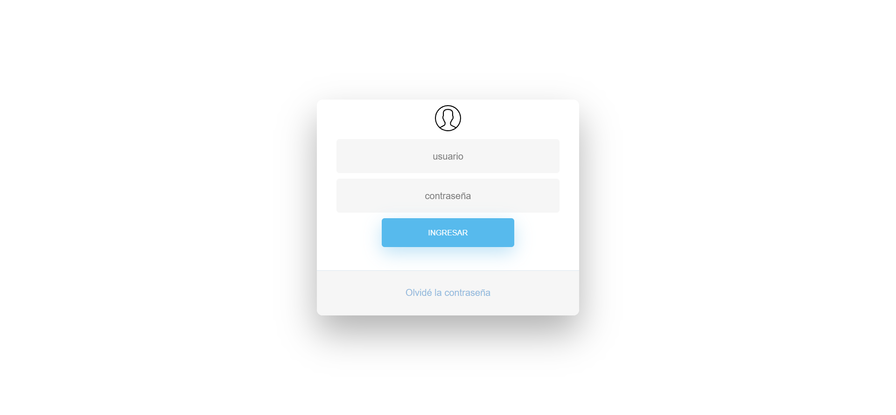

[Regresar](/DAWM-2022/)

Express - Forms
===============

El usuario, mediante el navegador, hace peticiones para traer información desde el servidor. Estas peticiones predeterminadas son etiquetadas con el verbo GET. Mientras que para enviar datos nuevos del cliente al servidor, se recomienda el uso de peticiones etiquetadas con el verbo POST mediante el uso de formularios.

  

Proyecto en Express
===================

* * *

Utiliza el proyecto que desarrollaste con el tutorial de [Express - Bases](https://dawfiec.github.io/DAWM-2022/tutoriales/express_bases.html) y [Express - Bootstrap](https://dawfiec.github.io/DAWM-2022/tutoriales/express_bootstrap.html).

* Instala las dependencias, con: `npm install`
* Verifica que funcione correctamente al levantar los servicios: `SET DEBUG=misitio:\* & npm start`

Página de ingreso
=================

* * *

Para crear la página de ingreso, o login, utilizaremos los archivos del recurso [login.rar](archivos/login.rar). La plantilla del login es [HTML Snippets for Twitter Boostrap framework](https://bootsnipp.com/snippets/dldxB).

* Copie los archivos de descomprimidos a las rutas dentro del proyecto en Express:
  + Copia el archivo **login.js** dentro de la carpeta **routes**.
  + Copia el archivo **login.ejs** dentro de la carpeta **views**.
  + Copia el archivo **login.css** dentro de la carpeta **public/stylesheets**.
  + Copia el archivo **usuario.svg** dentro de la carpeta **public/icons**.

* En el **app.js**
  + Agregue la referencia al **router** `login.js` con la ruta `'./routes/login'`

  <pre><code>
    ...
    var usersRouter = require('./routes/users');
    <b style="color:red">
    var loginRouter = require('./routes/login');
    </b>

    var app = express();

    // view engine setup
    ...
  </code></pre>

  + Agregue la ruta `"/login"` al **`router`** del login.

  <pre><code>
    ...
    app.use('/', indexRouter);
    app.use('/users', usersRouter);
    <b style="color:red">
    app.use('/login', loginRouter);
    </b>

    // catch 404 and forward to error handler
    app.use(function(req, res, next) {
    ...
  </code></pre>

* Compruebe el funcionamiento del servidor, con: **npm run devstart**
* Acceda al URL `http://localhost:3000/login` 

  

* Compruebe los requerimientos tipo **GET**, el funcionamiento automático del navegador para formularios y el envío de datos por el URL.

Envío de datos con POST
=======================

* * *

Realiza las siguientes modificaciones para enviar los datos desde el formulario del cliente al servidor.

* En el archivo **views/login.ejs**, en la etiqueta <form>
  + Agregue el atributo **action** con el valor **`/login/validate`**
  + Agregue el atributo **method** con el valor **`post`**

Referencias 
===========

* * *

* HTML Snippets for Twitter Boostrap framework : Bootsnipp.com. (2021). Retrieved 1 August 2021, from [https://bootsnipp.com/snippets/dldxB](https://bootsnipp.com/snippets/dldxB)

* Express Tutorial Part 6: Working with forms - Learn web development MDN. (2021). Retrieved 1 August 2021, from [https://developer.mozilla.org/en-US/docs/Learn/Server-side/Express\_Nodejs/forms](https://developer.mozilla.org/en-US/docs/Learn/Server-side/Express_Nodejs/forms)

* Usuario iconos vectoriales gratuitos diseñados por Smashicons. (2021). Retrieved 1 August 2021, from [https://www.flaticon.es/icono-gratis/usuario\_149452?related\_id=149452&origin=pack](https://www.flaticon.es/icono-gratis/usuario_149452?related_id=149452&origin=pack)

* Get Query Strings and Parameters in Express.js. (2021). Retrieved 1 August 2021, from [https://stackabuse.com/get-query-strings-and-parameters-in-express-js](https://stackabuse.com/get-query-strings-and-parameters-in-express-js)