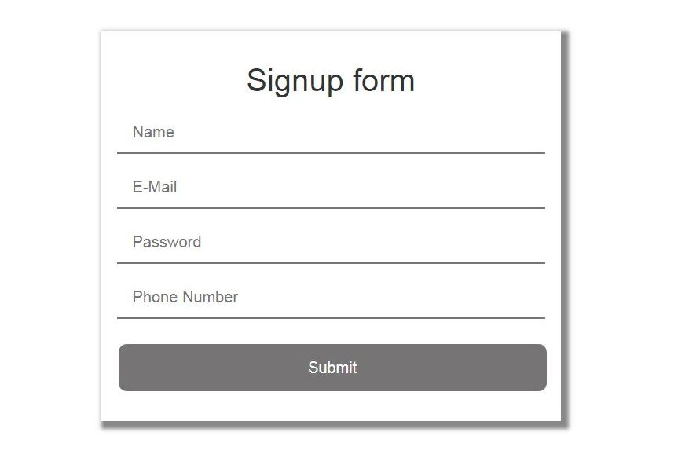
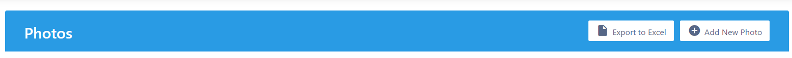
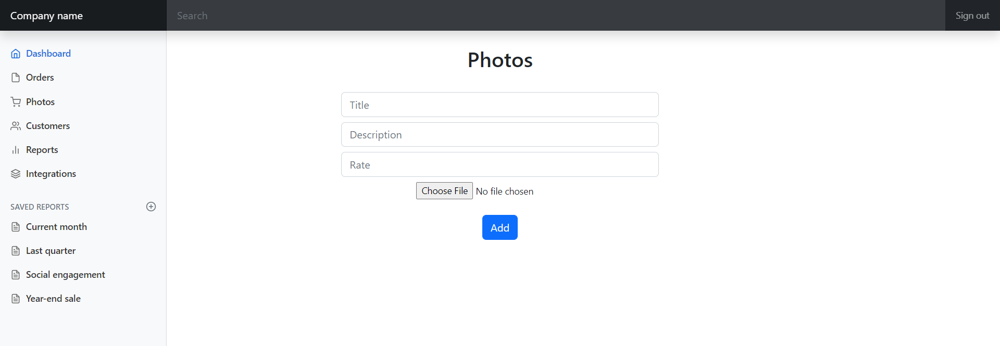

[Regresar](/DAWM/)

Express - Formularios I 
=======================

El usuario, mediante el navegador, hace peticiones para traer información desde el servidor. Estas peticiones predeterminadas son etiquetadas con el verbo GET. Mientras que para enviar datos nuevos del cliente al servidor, se recomienda el uso de peticiones etiquetadas con el verbo POST mediante el uso de formularios.

  

Proyecto en Express: REST API
=============================

* * *

Crea un nuevo proyecto, según [Express - Bases](https://dawfiec.github.io/DAWM/tutoriales/express_bases.html), [Express - ORM (Básico)](https://dawfiec.github.io/DAWM/tutoriales/express_ormbasico.html), [Express - ORM (Intermedio)](https://dawfiec.github.io/DAWM/tutoriales/express_ormintermedio.html), [Express - Parámetros de consulta y Parámetros de ruta](https://dawfiec.github.io/DAWM/tutoriales/express_pcpr.html) y [Express - REST](https://dawfiec.github.io/DAWM/tutoriales/express_rest.html).

* O, Clone el proyecto con las [aplicaciones del curso](https://github.com/DAWFIEC/DAWM-apps) para la aplicación **album/api**
    - Para el hito: **`hito8-api`**

Proyecto en Express: Admin
==========================

* * *

Crea un nuevo proyecto, según [Express - Bases](https://dawfiec.github.io/DAWM/tutoriales/express_bases.html), [Express - Bootstrap](https://dawfiec.github.io/DAWM/tutoriales/express_bootstrap.html) y [Express - Layouts y Partials](https://dawfiec.github.io/DAWM/tutoriales/express_partials.html).

* O, Clone el proyecto con las [aplicaciones del curso](https://github.com/DAWFIEC/DAWM-apps) para la aplicación **album/admin**
    - Para el hito: **`hito4-admin`**

## Vista

* Descargue y descomprima [fotos_formulario](archivos/fotos_formulario.zip).
  + Mueva el archivo `fotos_formulario.ejs` a la carpeta **admin/views**
  + Mueva el archivo `fotos_formulario_add.ejs` a la carpeta **admin/views/partials**

* Modifique vista **admin/views/partials/fotos_tabla.ejs**
  + Cambie `'#'` por la referencia a la ruta `'/photos/add'`.

  <pre><code>
  ...
    &lt;a href="/photos/add" class="btn btn-secondary"&gt; ... Add New Photo ... &lt;/a&gt;
  ...
  </code></pre>

## Controlador

* Modifique el manejador de rutas **admin/routes/index.js**
  + Agregue el controlador de la ruta `"/photos/add"` para el verbo **GET**. 

  <pre><code>
  ...
  router.get('/photos/add', function(req, res, next) {
    res.render('fotos_formulario', { title: 'Express' });
  });
  ...
  module.exports = router;
  </code></pre>

* Modifique el manejador de rutas **admin/routes/index.js**
  + Agregue el controlador de la ruta `"/photos/save"` para el verbo **POST**. 

  <pre><code>
  ...
  router.post('/photos/save', async function(req, res, next) {  

    let { title, description, rate } = req.body

    const URL = 'http://localhost:4444/rest/fotos/save'

    let data = {
        titulo:title, 
        descripcion: description, 
        calificacion: rate,
        ruta: ''
    }

    const config = {
      proxy: {
        host: 'localhost',
        port: 4444
      }
    }
    
    const response = await axios.post(URL, data, config);

    if(response.status == '200' && response.statusText == 'OK') {
      res.redirect('/photos')
    } else {
      res.redirect('/') 
    }

    
  });
  ...
  module.exports = router;
  </code></pre>

Comprobación
============

* * *

* En la línea de comandos (1) del proyecto **album/api**
  + Instale las dependencias, con: `npm install`
  + Use la variable de entorno **PORT**, con: `set PORT=4444`
  + Verifique el funcionamiento al levantar los servicios, con: `npm run devstart`

* En la línea de comandos (2) del proyecto **album/admin**
  + Instale las dependencias, con: `npm install`
  + Use la variable de entorno **PORT**, con: `set PORT=3080`
  + Verifique el funcionamiento al levantar los servicios, con: `npm run devstart`
  + En el navegador, acceda a la ruta `"/photos"` y de clic en el botón **Add New Photo**

  

    
  

  + En el navegador, se redirigirá a la ruta `"/photos/add"`

  

    
  

    - Complete el formulario con los datos solicitados y de clic en el botón **Add**
  + En el navegador, en la ruta `"http://localhost:3080/photos"`, verifique que aparezcan los datos recientemente ingresados.

Referencias 
===========

* * *

* HTML Snippets for Twitter Boostrap framework : Bootsnipp.com. (2021). Retrieved 1 August 2021, from [https://bootsnipp.com/snippets/dldxB](https://bootsnipp.com/snippets/dldxB)
* Express Tutorial Part 6: Working with forms - Learn web development MDN. (2021). Retrieved 1 August 2021, from [https://developer.mozilla.org/en-US/docs/Learn/Server-side/Express\_Nodejs/forms](https://developer.mozilla.org/en-US/docs/Learn/Server-side/Express_Nodejs/forms)
* Usuario iconos vectoriales gratuitos diseñados por Smashicons. (2021). Retrieved 1 August 2021, from [https://www.flaticon.es/icono-gratis/usuario\_149452?related\_id=149452&origin=pack](https://www.flaticon.es/icono-gratis/usuario_149452?related_id=149452&origin=pack)
* Get Query Strings and Parameters in Express.js. (2021). Retrieved 1 August 2021, from [https://stackabuse.com/get-query-strings-and-parameters-in-express-js](https://stackabuse.com/get-query-strings-and-parameters-in-express-js)