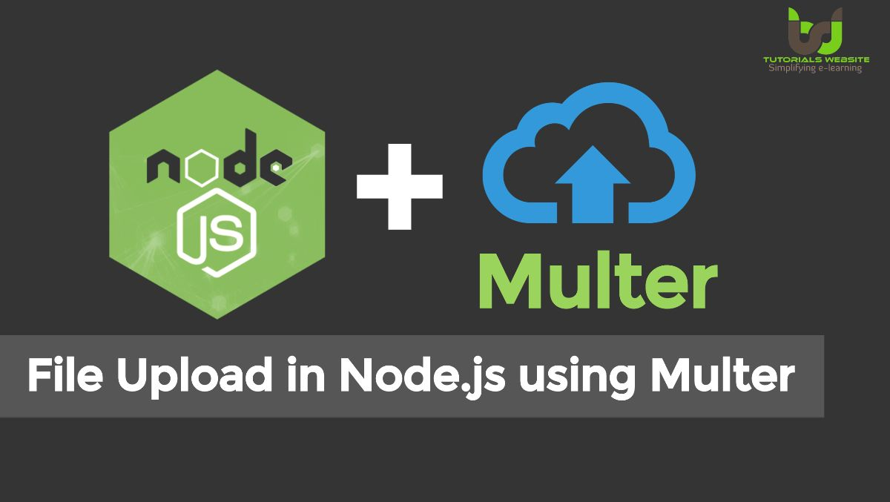

[Regresar](/DAWM/)

Express - Formularios II
========================

[Multer](https://expressjs.com/en/resources/middleware/multer.html) es un middleware de Node.js para manejar datos de varias multipart/form-data, que se usa principalmente para cargar archivos. Está escrito sobre busboy para una máxima eficiencia.

  

Proyecto en Express: REST API
=============================

* * *

Crea un nuevo proyecto, según [Express - Bases](https://dawfiec.github.io/DAWM/tutoriales/express_bases.html), [Express - ORM (Básico)](https://dawfiec.github.io/DAWM/tutoriales/express_ormbasico.html), [Express - ORM (Intermedio)](https://dawfiec.github.io/DAWM/tutoriales/express_ormintermedio.html), [Express - Parámetros de consulta y Parámetros de ruta](https://dawfiec.github.io/DAWM/tutoriales/express_pcpr.html), [Express - REST](https://dawfiec.github.io/DAWM/tutoriales/express_rest.html) y [Express - Formularios I](https://dawfiec.github.io/DAWM/tutoriales/express_forms1.html).

* O, Clone el proyecto con las [aplicaciones del curso](https://github.com/DAWFIEC/DAWM-apps) para la aplicación **album/api**
    - Para el hito: **`hito8-api`**

## Controlador - REST API

* Modifique el manejador de rutas **api/rest/fotos.js**
  + Agregue la ruta `"public/images/"` donde se almacenarán las imágenes.

    <pre><code>
    ...
    const Etiqueta = require('../models').etiqueta;  
    
    <b style="color:red">const path = "public/images/"</b>
    ...
    </code></pre>

  + Agregue la referencia a los módulos **multer**, e instance la clase _multer_. Configure la función _filename_ para asignar el nombre original del archivo.

    <pre><code>
    ...  
    const path = "public/images/"
    <b style="color:red">
    const multer = require("multer");
    const storage = multer.diskStorage(
        {
            destination: path,
            filename: function ( req, file, cb ) {
                cb( null, file.originalname);
            }
        }
    );
    const upload = multer({ storage: storage })
    </b>
    ...
    </code></pre>

  + Modifique la ruta `'/save'` del verbo POST
    - Agregue el __middleware__ con la llamada al método **single** para procesar el campo del formulario `archivo`

    <pre><code>
    ...
      router.post('/save', upload.single('archivo'),  function(req, res, next) {
    ...
    </code></pre>

    - Modifique el valor de la clave _ruta_ por **path+ruta**  

    <pre><code>
    ...
    router.post('/save', upload.single('archivo'), function(req, res, next) {  

      let {titulo, descripcion, calificacion,ruta} = req.body;
      
      Foto.create({
        titulo: titulo,
        descripcion: descripcion,
        calificacion: parseFloat(calificacion),
        <b style="color:red">ruta: path+ruta,</b>
        createdAt: new Date(),  
        updatedAt: new Date()  
      })
      .then(foto => {
        res.json(foto);
      })
      .catch(error => res.status(400).send(error))

    });
    ...
    </code></pre>

Proyecto en Express: Admin
==========================

* * *

Crea un nuevo proyecto, según [Express - Bases](https://dawfiec.github.io/DAWM/tutoriales/express_bases.html), [Express - Bootstrap](https://dawfiec.github.io/DAWM/tutoriales/express_bootstrap.html), [Express - Layouts y Partials](https://dawfiec.github.io/DAWM/tutoriales/express_partials.html) y [Express - Formularios I](https://dawfiec.github.io/DAWM/tutoriales/express_forms1.html).

* O, Clone el proyecto con las [aplicaciones del curso](https://github.com/DAWFIEC/DAWM-apps) para la aplicación **album/admin**
    - Para el hito: **`hito5-admin`**

## Vista - Admin

* Modifique vista **admin/views/partials/fotos_formulario_add.ejs**
  + Agregue el atributo _enctype_ con el valor _"multipart/form-data"_.

  <pre><code>
  ...
    &lt;form action="/photos/save" method="post" name="add" enctype="multipart/form-data"&gt;
  ...
  </code></pre>

## Controlador - Admin

* Modifique el manejador de rutas **admin/routes/index.js**
  + Agregue la referencia a los módulos **multer** y **form-data**, e instance la clase _multer_

  <pre><code>
  var router = express.Router();
  ...  
  <b style="color:red">
  const multer  = require('multer')
  const FormData = require('form-data');
  const upload = multer()
  </b>
  ...
  </code></pre>

  + Modifique la ruta `'/photos/save'` del verbo POST
    - Agregue el __middleware__ con la llamada al método **single** para procesar el campo del formulario `route`

    <pre><code>
    ...
      router.post('/photos/save', upload.single('route'), async function(req, res, next) { 
    ...
    </code></pre>

    - Extraiga los datos del archivo está almacenado en **req.file**.

    <pre><code>
    ...
    router.post('/photos/save', upload.single('route'), async function(req, res, next) {

      let { title, description, rate } = req.body
      <b style="color:red">let { buffer, originalname } = req.file</b>

      ...

    });
    ...
    </code></pre>

    - Construya el objeto **FormData** a partir de los _input_ del formulario.

    <pre><code>
    ...
    router.post('/photos/save', upload.single('route'), async function(req, res, next) {

      let { title, description, rate } = req.body
      let { buffer, originalname } = req.file

      const URL = 'http://localhost:4444/rest/fotos/save'

      <b style="color:red">
      let data = new FormData()
      data.append("titulo", title)
      data.append("descripcion", description)
      data.append("calificacion", rate)
      data.append("ruta", originalname)
      data.append("archivo", buffer, originalname)
      </b>
      ...

    });
    ...
    </code></pre>

    - Agregue las cabeceras del formulario **data.getHeaders()** al objeto _config_.

    <pre><code>
    ...
    router.post('/photos/save', upload.single('route'), async function(req, res, next) {

      let { title, description, rate } = req.body
      let { buffer, originalname } = req.file

      const URL = 'http://localhost:4444/rest/fotos/save'

      const data = new FormData()
      data.append("titulo", title)
      data.append("descripcion", description)
      data.append("calificacion", rate)
      data.append("ruta", originalname)
      data.append("archivo", buffer, originalname)
      const config = {
        <b style="color:red">headers: data.getHeaders(), </b>
        proxy: {
          host: 'localhost',
          port: 4444
        }
      }
      const response = await axios.post(URL, data, config);
     

      ...

    });
    ...
    </code></pre>

Comprobación
============

* * *

* En la línea de comandos (1) del proyecto **album/api**
  + Instale las dependencias, con: `npm install`
  + Instale la dependencia a **multer**, con: `npm install multer`
  + Use la variable de entorno **PORT**, con: `set PORT=4444`
  + Verifique el funcionamiento al levantar los servicios, con: `npm run devstart`

* En la línea de comandos (2) del proyecto **album/admin**
  + Instale las dependencias, con: `npm install`
  + Instale la dependencia a **multer** y **form-data**, con: `npm install multer form-data`
  + Use la variable de entorno **PORT**, con: `set PORT=3080`
  + Verifique el funcionamiento al levantar los servicios, con: `npm run devstart`
  + En el navegador, acceda a la ruta `"http://localhost:3080/photos/add"`
    - Complete el formulario con los datos solicitados y de clic en el botón **Add**
  + En el navegador, en la ruta `"http://localhost:3080/photos"`, verifique que aparezcan los datos recientemente ingresados.

Referencias 
===========

* * *

* HTML Snippets for Twitter Boostrap framework : Bootsnipp.com. (2021). Retrieved 1 August 2021, from [https://bootsnipp.com/snippets/dldxB](https://bootsnipp.com/snippets/dldxB)
* Express Tutorial Part 6: Working with forms - Learn web development MDN. (2021). Retrieved 1 August 2021, from [https://developer.mozilla.org/en-US/docs/Learn/Server-side/Express\_Nodejs/forms](https://developer.mozilla.org/en-US/docs/Learn/Server-side/Express_Nodejs/forms)
* Usuario iconos vectoriales gratuitos diseñados por Smashicons. (2021). Retrieved 1 August 2021, from [https://www.flaticon.es/icono-gratis/usuario\_149452?related\_id=149452&origin=pack](https://www.flaticon.es/icono-gratis/usuario_149452?related_id=149452&origin=pack)
* Get Query Strings and Parameters in Express.js. (2021). Retrieved 1 August 2021, from [https://stackabuse.com/get-query-strings-and-parameters-in-express-js](https://stackabuse.com/get-query-strings-and-parameters-in-express-js)
* Articles, A. (2020). multer Archives - TutorialsWebsite - Learn Online Programming articles, Web Development Tutorials. Retrieved 28 December 2022, from https://www.tutorialswebsite.com/topics/multer/
* Express multer middleware. (2022). Retrieved 28 December 2022, from https://expressjs.com/en/resources/middleware/multer.html