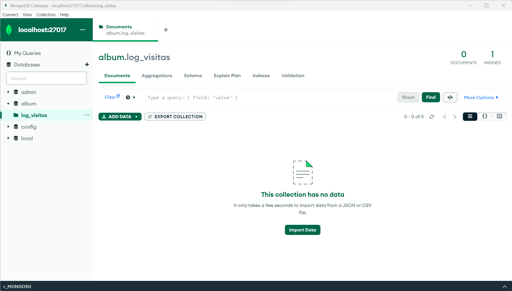
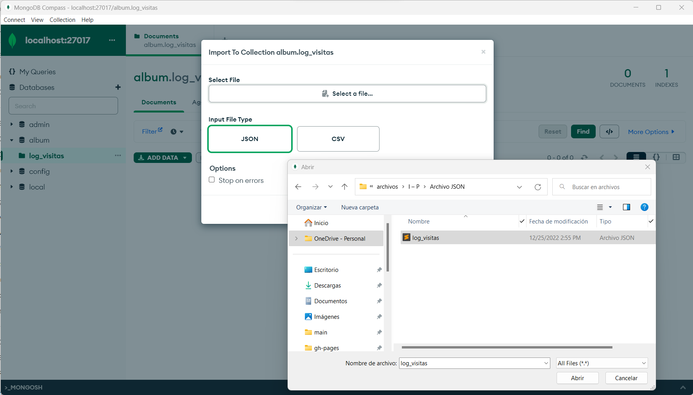
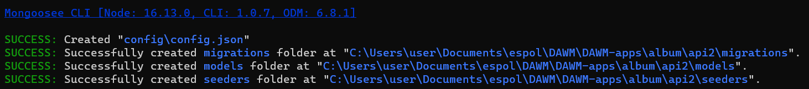
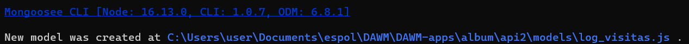
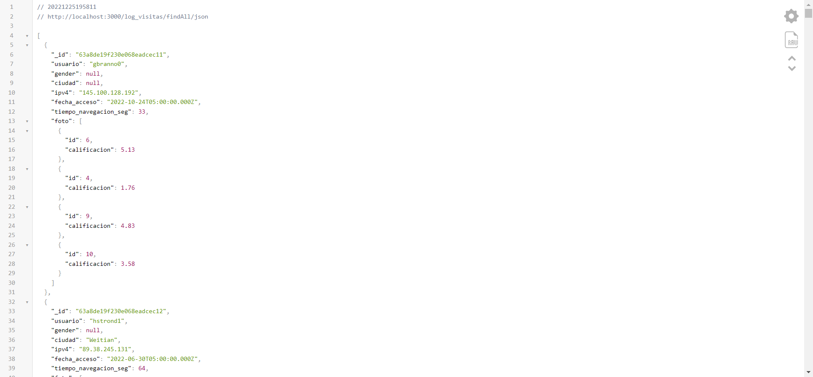
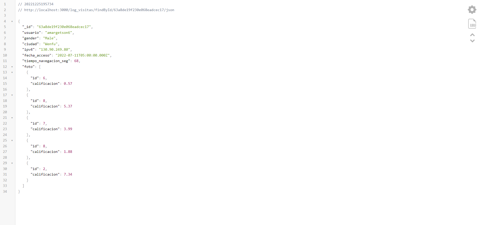

[Regresar](/DAWM/)

Express - ODM (Básico)
==========================================

Mongoose es un [ODM](https://medium.com/spidernitt/orm-and-odm-a-brief-introduction-369046ec57eb#ef3c) para Nodejs que nos permite escribir consultas para una base de datos de MongooDB.

Software a utilizar
===================
* * *

De [MongoDB](https://www.mongodb.com/home), descargue e instale:
* Motor de base de datos: [MongoDB Community Server](https://www.mongodb.com/try/download/community)
* Interfaz gráfica: [MongoDB Compass](https://www.mongodb.com/try/download/compass)

Proyecto en Express
===================

* * *

Crea un nuevo proyecto, según [Express - Bases](https://dawfiec.github.io/DAWM/tutoriales/express_bases.html).

* O, Clone el proyecto con las [aplicaciones del curso](https://github.com/DAWFIEC/DAWM-apps) para la aplicación **album/api2**
    - Para el hito: **`hito1-api2`**

Datos (Mockaroo)
================
* * *

En [Mockaroo](https://www.mockaroo.com/), acceda al _schema_ [log_visitas](https://www.mockaroo.com/83564d70) y descargue el [log_visitas.json](https://api.mockaroo.com/api/83564d70?count=1000&key=4c151800). (Backup: Descargue el archivo de [log_visitas.json](archivos/log_visitas.json))

MongoDB
=======
* * *

* Cree la base de datos **album** y la colección **log_visitas**.
* Cargue los documentos de `log_visitas.json` en la colección **log_visitas**.

  
  

ODM: Mongoose
==============
* * *

Desde la línea de comandos, en la raíz de la carpeta del proyecto.

* Instale Mongoosejs CLI de forma global, con: **`npm i -g mongoosejs-cli`**
* Instale Mongoose para el proyecto, con: **`npm install --save mongoose`**
* Genere los archivos de configuración de Sequelize, con: **`npx mongoosejs-cli init`**  
  + El archivo `config/config.json` contiene la configuración para la conexión con la base de datos no relacional.
  + La carpeta `models` contendrá las clases correspondientes a las entidades de la base de datos no relacional.
  + La carpeta `migrations` contendrá los scripts a ejecutar en la base de datos  no relacional y en la aplicación. Estos scripts actúan como registros históricos de los cambios.
  + La carpeta `seeders` contendrá los scripts para generar datos para las entidades de la base datos  no relacional.

  

* Modifique el archivo `config/config.json` con la URI para la conexión con el motor de bases de datos no relacional. En este caso, el ambiente a utilizar es **development**.

<pre><code>
{
  "development": {
    "database": {
      "url": "mongodb://localhost:27017/album",
      ...
    }
  },
  ...
</code></pre>

Modelo
======
* * *

El modelo es una representación abstracta, mediante clases (atributos y métodos), de las entidades de la base de datos no relacional. 

Desde la línea de comandos, en la raíz de la carpeta del proyecto.

* Cree el modelo: `log_visitas`, con: 

  `npx mongoosejs-cli model:create --name log_visitas --attributes usuario:String,genero:String,ciudad:String,ipv4:String,fecha_acceso:Date,tiempo_navegacion_seg:Number,foto:Array`

  + En la carpeta `models` se agregó la clase **log_visitas.js**, con la configuración predeterminada para la clase log_visitas con los atributos especificados.

    

      
    

Manejador de rutas y controladores 
==================================
* * *

Para solicitar los datos desde la base de datos, será necesario que:

* Cree y modifique un nuevo manejador de rutas **routes/log_visitas.js**.
  + Agregue el requerimiento a express, la instanciación del Router y la exportación de ruteador.

  <pre><code>
  <b style="color:red">
  var express = require('express');
  var router = express.Router();

  const models = require('../models').default;
  </b>

  
  module.exports = router;
  </code></pre>

  + Incluya el controlador de la ruta **`"/findAll/json"`**. El cual responde un json con todos los documentos (findAll) que se encuentran en la colección.

  <pre><code>
  ...
  
  <b style="color:red">
  router.get('/findAll/json', function(req, res, next) {

    models.log_visitas.find( (err, response) => {
        if (err) {
            return res.status(500).json({
                message: 'Error when getting log_visitas.',
                error: err
            });
        }

        return res.json(response);
    });

  });
  </b>

  module.exports = router;
  </code></pre>

  + Incluya el controlador de la ruta **`"/findById/:_id/json"`**. El cual responde un json con el documento (findOne) que se encuentra en la colección, dado el identificador (`_id`).

  <pre><code>
  ...
  
  <b style="color:red">
  router.get('/findById/:_id/json', function(req, res, next) {

    var _id = req.params._id;

    models.log_visitas.findOne({_id: _id}, function (err, response) {
        if (err) {
            return res.status(500).json({
                message: 'Error when getting log_visitas.',
                error: err
            });
        }

        if (!response) {
            return res.status(404).json({
                message: 'No such log_visitas'
            });
        }

        return res.json(response);
    });

  });
  </b>

  module.exports = router;
  </code></pre>

Aplicación
==========
* * *

* Modifique el archivo **app.js**
  + Agregue la referencia al manejador de rutas **'./routes/log_visitas'**

<pre><code>
...
var logVisitasRouter = require('./routes/log_visitas');
...
</code></pre>

  + Agregue la ruta **'/log_visitas'**

<pre><code>
...
app.use('/log_visitas', logVisitasRouter);
...
</code></pre>

Comprobación
============
* * *

* Compruebe el funcionamiento del servidor, con: **npm start** o **npm run devstart**
* Acceda al URL `http://localhost:3000/log_visitas/findAll/json` 

  

* Acceda a un documento especifico mendiante el `_id` del documento, por ejemplo con el URL `http://localhost:3000/log_visitas/findById/63a8de19f230e068eadcec17/json` 

  

Referencias 
===========

* * *

* mongoosejs-cli. (2020). Retrieved 26 December 2022, from https://www.npmjs.com/package/mongoosejs-cli#installation
* ORM and ODM — A Brief Introduction. (2020). Retrieved 26 December 2022, from https://medium.com/spidernitt/orm-and-odm-a-brief-introduction-369046ec57eb#ef3c
* Mockaroo - Random Data Generator and API Mocking Tool JSON / CSV / SQL / Excel. (2022). Retrieved 26 December 2022, from https://www.mockaroo.com/