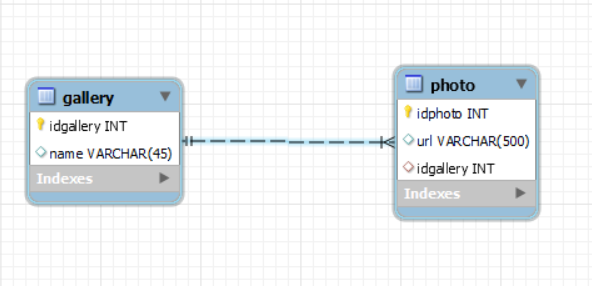
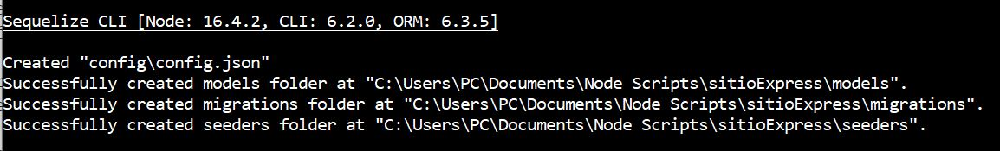
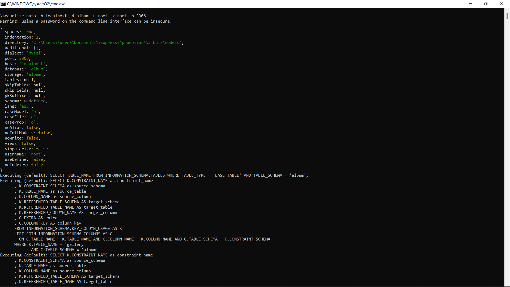

[Regresar](/DAWM/)

Express - ORM (Avanzado)
==========================================

Para reconstruir los modelos de una base de datos preconstruida (tablas, relaciones y datos) a un proyecto de Express, será necesario incorporar el módulo [sequelize-auto](https://www.npmjs.com/package/sequelize-auto).

Base de datos original
======================
* * *

Ejecute el script [dbauth.sql](archivos/dbauth.sql) en el motor de la base de datos. Use el schema **dbauth**. La base de datos a considerar contiene las tablas **users**, **roles_users** y **roles**, como se muestra a continuación.

  

ORM: Sequelize, Sequelize-cli y Sequelize-auto
==============================================
* * *

Desde la línea de comandos, en la raíz de la carpeta del proyecto.

* Instale Sequelize CLI de forma global, con: **`npm install -g sequelize-cli`**
* Instale Sequelize auto de forma global, con: **`npm install -g sequelize-auto`**
* Instale Sequelize y el conector para MySQL para el proyecto, con: **`npm install --save sequelize mysql2`**
* Genere los archivos de configuración de Sequelize, con: **`sequelize init`**  

  

* Modifique el archivo `config/config.json` con los datos para la conexión con el motor de bases de datos. En este caso, el ambiente a utilizar es **development**.

<pre><code>
{
  "development": {
    "username": "root",
    "password": null,
    "database": "database_development",
    "host": "127.0.0.1",
    "dialect": "mysql"
  },
  ...
</code></pre>

Modelos
=======
* * *

Desde la línea de comandos, en la raíz de la carpeta del proyecto.

* Reconstruya los modelos, con: `sequelize-auto -h host -d database -u user -x password -p port`
  + Especifique el hostname después del parámetro -h **"127.0.0.1"**
  + Especifique el nombre de la base de datos después del parámetro  -d **"dbauth"**
  + Especifique el nombre del usuario después del parámetro -u **"root"**
  + Especifique la contraseña del usuario después del parámetro -x **"root"**
  + Especifique el puerto después del parámetro  -p **3306**

  

* Los modelos reconstruidos son **users**, **roles_users** y **roles** en la carpeta `/models`. 
  + Además se creó el archivo **`init-models.js`** con las relaciones entre los modelos. Los alias (**user_id_users**, **role_id_roles**, **roles_users**, **role** y **user**) son utilizadas para referirse a las relaciones entre los modelos.

<pre><code>
roles.belongsToMany(users, { as: 'user_id_users', through: roles_users, foreignKey: "role_id", otherKey: "user_id" });
users.belongsToMany(roles, { as: 'role_id_roles', through: roles_users, foreignKey: "user_id", otherKey: "role_id" });

roles_users.belongsTo(roles, { as: "role", foreignKey: "role_id"});
roles.hasMany(roles_users, { as: "roles_users", foreignKey: "role_id"});

roles_users.belongsTo(users, { as: "user", foreignKey: "user_id"});
users.hasMany(roles_users, { as: "roles_users", foreignKey: "user_id"});
</code></pre>

Referencias 
===========

* * *

* Creating a Secure REST API in Node.js. (2021). Retrieved 7 August 2021, from https://www.toptal.com/nodejs/secure-rest-api-in-nodejs 
* GitHub - sequelize/sequelize-auto: Automatically generate bare sequelize models from your database. (2021). Retrieved 7 August 2021, from https://github.com/sequelize/sequelize-auto 
* Route Parameters in Express. (2019). Retrieved 7 August 2021, from https://masteringjs.io/tutorials/express/route-parameters
* Manual Sequelize. (2021). Retrieved 7 August 2021, from https://sequelize.org/master/manual/model-querying-basics.html#applying-where-clauses