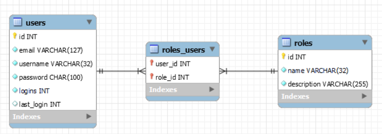

[Regresar](/DAWM/)

Express - ORM (Avanzado)
==========================================

Para reconstruir los modelos de una base de datos preconstruida (tablas, relaciones y datos) a un proyecto de Express, será necesario incorporar el módulo [sequelize-auto](https://www.npmjs.com/package/sequelize-auto).


Base de datos original
======================
* * *

1. Ejecute el script [dbauth.sql](archivos/dbauth.sql) en el motor de la base de datos. 
2. Cree el schema **dbauth**. La base de datos a considerar contiene las tablas **users**, **roles_users** y **roles**, como se muestra a continuación.

<p align="center">
  
</p>

ORM: Sequelize, Sequelize-cli y Sequelize-auto
==============================================
* * *

Desde la línea de comandos, en la raíz de la carpeta del proyecto.

* Instale **Sequelize CLI** de forma global, con: 
  
    ```command
    npm install -g sequelize-cli
    ```

* Instale **Sequelize Auto** de forma global, con: 
  
    ```command
    npm install -g sequelize-auto
    ```

* Instale **Sequelize** y el conector para **MySQL** en el proyecto, con: 

    ```command
    npm install --save sequelize mysql2
    ```

* Genere los archivos de configuración de Sequelize, con: 

    ```command
    sequelize init
    ```  

    <p align="center">
      
    </p>

* Modifique el archivo `config/config.json`, en el ambiente **development**. Modifique los datos para establecer la conexión con el motor de bases de datos.

    ```typescript
    {
      "development": {
        "username": "<USUARIO-DE-DB>",
        "password": "<CONTRASEÑA-DE-DB>",
        "database": "dbatuh",
        "host": "127.0.0.1",
        "dialect": "mysql"
      },
      ...
    ````


Modelos
=======
* * *

Desde la línea de comandos, en la raíz de la carpeta del proyecto.

* Reconstruya los modelos a partir de las tablas. Escriba el **nombre del usuario** después de la bandera -u y la **contraseña del usuario** después de la bandera -x.

    ```command
    sequelize-auto -h 127.0.0.1 -d dbauth -u <USUARIO-DE-DB> -x <CONTRASEÑA-DE-DB> -p 3306
    ```

    <p align="center">
      
    </p>

* En la carpeta `/models`:

    + Los archivos **users.js**, **roles_users.js** y **roles.js** contienen la información de los modelos reconstruidos. 

    + El archivo **`init-models.js`** contiene las relaciones entre los modelos reconstruidos. Los alias (valores de las claves **as**) son utilizadas como referencia en las relaciones entre los modelos.

    ```typescript
    ...
    roles.belongsToMany(users, { as: 'user_id_users', through: roles_users, foreignKey: "role_id", otherKey: "user_id" });
    users.belongsToMany(roles, { as: 'role_id_roles', through: roles_users, foreignKey: "user_id", otherKey: "role_id" });
    roles_users.belongsTo(roles, { as: "role", foreignKey: "role_id"});
    roles.hasMany(roles_users, { as: "roles_users", foreignKey: "role_id"});
    roles_users.belongsTo(users, { as: "user", foreignKey: "user_id"});
    users.hasMany(roles_users, { as: "roles_users", foreignKey: "user_id"});
    ...
    ```


Referencias 
===========

* * *

* Creating a Secure REST API in Node.js. (2021). Retrieved 7 August 2021, from https://www.toptal.com/nodejs/secure-rest-api-in-nodejs 
* GitHub - sequelize/sequelize-auto: Automatically generate bare sequelize models from your database. (2021). Retrieved 7 August 2021, from https://github.com/sequelize/sequelize-auto 
* Route Parameters in Express. (2019). Retrieved 7 August 2021, from https://masteringjs.io/tutorials/express/route-parameters
* Manual Sequelize. (2021). Retrieved 7 August 2021, from https://sequelize.org/master/manual/model-querying-basics.html#applying-where-clauses