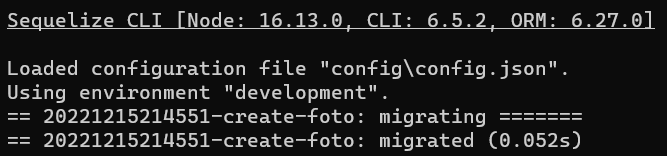
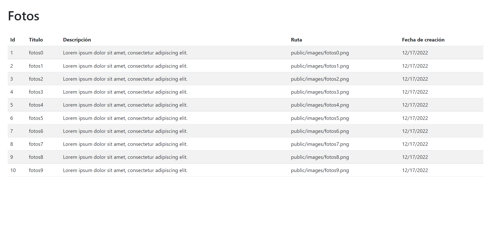

[Regresar](/DAWM/)

Express - ORM (Básico)
==========================================

Sequelize es un [ORM](https://www2.deloitte.com/es/es/pages/technology/articles/que-es-orm.html) para Nodejs que te permite agilizar el desarrollo de aplicaciones que incluyen la conexión con bases de datos relacionales como Postgres, MySQL, MariaDB, SQLite y SQL Server.


Software a utilizar
===================
* * *

De [MySQL Community Downloads](https://dev.mysql.com/downloads/), descargue e instale:
* Motor de base de datos: [MySQL Community Server](https://dev.mysql.com/downloads/mysql/)
* Interfaz gráfica: [MySQL Workbench](https://dev.mysql.com/downloads/workbench/)


Proyecto en Express
===================

* * *

Crea un nuevo proyecto, según [Express - Bases](https://dawfiec.github.io/DAWM/tutoriales/express_bases.html).

* O, Clone el proyecto con las [aplicaciones del curso](https://github.com/DAWFIEC/DAWM-apps) para la aplicación **album/api**
    - Para el hito: **`hito1-api`**


Nodemon
=======

* Agregue el módulo `nodemon` al proyecto 
* Agregue el *script* `devstart` al archivo `package.json`


ORM: Sequelize
==============
* * *

Desde la línea de comandos, en la raíz de la carpeta del proyecto.

* Instale Sequelize CLI de forma global, con: **`npm install -g sequelize-cli`**
* Instale Sequelize y el conector para MySQL para el proyecto, con: **`npm install --save sequelize mysql2`**
* Genere los archivos de configuración de Sequelize, con: **`sequelize init`**  
  + El archivo `config/config.json` contiene la configuración para la conexión con la base de datos relacional.
  + La carpeta `models` contendrá las clases correspondientes a las entidades de la base de datos relacional.
  + La carpeta `migrations` contendrá los scripts a ejecutar en la base de datos relacional y en la aplicación. Estos scripts actúan como registros históricos de los cambios.
  + La carpeta `seeders` contendrá los scripts para generar datos para las entidades de la base datos relacional.

<p align="center">
  
</p>

* Modifique el archivo `config/config.json` con los datos para la conexión con el motor de bases de datos. En este caso, el ambiente a utilizar es **development**.

<pre><code>
{
  "development": {
    "username": "root",
    "password": "root",
    "database": "album",
    "host": "127.0.0.1",
    "dialect": "mysql"
  },
  ...
</code></pre>

MySQL
=====
* * *

* Cree la base de datos (schema) con el nombre requerido, por ejemplo: **album**.

Modelo
======
* * *

El modelo es una representación abstracta, mediante clases (atributos y métodos), de las entidades de la base de datos relacional. 

Desde la línea de comandos, en la raíz de la carpeta del proyecto.

* Cree el modelo: `foto`, con: 
  
  `sequelize model:create --name foto --attributes titulo:string,descripcion:string,calificacion:float,ruta:string`

  + En la carpeta `models` se agregó la clase **foto.js**, con la configuración predeterminada para la clase foto con los atributos especificados.
  + En la carpeta `migrations` se agregó el script **YYYYMMDDHHMMSS\-create-foto.js** para crear la tabla en la base de datos.

<p align="center">
  
</p>


Migraciones
===========
* * *

Las migraciones contienen un registro histórico de los cambios realizados en los modelos y/o entidades. 

Desde la línea de comandos, en la raíz de la carpeta del proyecto.

* Ejecute TODAS las migraciones, con: **`sequelize db:migrate`**
  <p align="center">
	   
  </p>

  + Se creó la tabla vacía **fotos**. El nombre de las tablas son creadas en inglés mediante el nombre del modelo en plural, como: **orden** \-> **ordens**. 
	<p align="center">
	  
	</p>
  + Se agregó la migración ejecutada a la tabla **sequelizemeta**
	<p align="center">
	  
	</p>
  + Si intenta ejecutar el mismo comando nuevamente, no ejecutará ninguna migración que se encuentre en la tabla **sequelizemeta**.

* Es posible revertir las migraciones, con:
  + La última: **sequelize db:migrate:undo**
  + Todas las anteriores: **sequelize db:migrate:undo:all**
  + O, alguna migración específica, según como aparezca dentro de la carpeta **migrations**: **`sequelize db:migrate:undo --to XXXXXXXXXXXXXX-create-TABLE.js`**

Generadores (Seeders)
=====================
* * *

A veces, es necesario generar datos de manera automática. 

Desde la línea de comandos, en la raíz de la carpeta del proyecto.

* De no existir, cree el generador con: **`sequelize seed:generate --name fotos`**
* Dentro del archivo `seeders/YYYYMMDDHHMMSS-fotos.js`, 
  + En la función de ejecución de cambios **up**, agregue:
<pre><code>
...  
async up (queryInterface, Sequelize) {
  <b style="color:red">
  for (let i = 0; i <10; i++) {  
      await queryInterface.bulkInsert('fotos', [{  
          titulo: 'fotos'+i,  
          descripcion: 'Lorem ipsum dolor sit amet, consectetur adipiscing elit.',
          calificacion: (Math.random()*10).toFixed(2),  
          ruta: 'public/images/'+'fotos'+i+'.png',
          createdAt: new Date(),  
          updatedAt: new Date()  
      }], {});  
   } 
   </b> 
},  
...
</code></pre>

  + En la función de reversión de cambios **down**, agregue:
<pre><code>
...  
async down (queryInterface, Sequelize) {
  <b style="color:red">
  await queryInterface.bulkDelete('fotos', null, {});  
  </b>
},  
...
</code></pre>

* Ejecute el generador de datos
  + Uno a la vez, con: **`sequelize db:seed --seed YYYYMMDDHHMMSS-fotos`**
  + Todos, con: **`sequelize db:seed:all`**
  + Deshacer todos, con: **`sequelize db:seed:undo:all`**
* Revise los cambios en la base de datos.

  <p align="center">
	
  </p>


Manejador de rutas y controladores 
==================================
* * *

Para solicitar los datos desde la base de datos, será necesario que:

* Cree y modifique un nuevo manejador de rutas **routes/fotos.js**.
  + Agregue el requerimiento a express, la instanciación del Router y la exportación de ruteador.

<pre><code>
<b style="color:red">
var express = require('express');
var router = express.Router();
</b>

<b style="color:red">
module.exports = router;
</b>
</code></pre>

  + Agregue la referencia al módulo **Sequelize** y el modelo **Foto**

<pre><code>
var express = require('express');  
var router = express.Router();  
  
<b style="color:red">
const Sequelize = require('sequelize');
const Foto = require('../models').foto;  
</b>  

module.exports = router;
</code></pre>

  + Incluya el controlador de la ruta **`"/findAll/json"`**. El cual, responde con todas las fotos (findAll) que se encuentran en la tabla renderizados en un json.

<pre><code>
...
const Foto = require('../models').foto;

<b style="color:red">
router.get('/findAll/json', function(req, res, next) {  

	
  Foto.findAll({  
      attributes: { exclude: ["updatedAt"] }  
  })  
  .then(fotos => {  
      res.json(fotos);  
  })  
  .catch(error => res.status(400).send(error)) 

});
</b>

module.exports = router;
</code></pre>

  + Incluya el controlador de la ruta **`"/findAll/view"`**. El cual, responde con todas las fotos (findAll) que se encuentran en la tabla renderizados en la vista html.

<pre><code>
...

<b style="color:red">
router.get('/findAll/view', function(req, res, next) {  

  
  Foto.findAll({  
      attributes: { exclude: ["updatedAt"] }  
  })  
  .then(fotos => {  
      res.render('fotos', { title: 'Fotos', arrFotos: fotos });  
  })  
  .catch(error => res.status(400).send(error)) 

});
</b>

module.exports = router;
</code></pre>

Vista
=====
* * *

* Para mostrar los datos desde la base de datos, será necesario:
  + Cree y modifique una nueva vista **views/fotos.ejs**.
  + Agregue la estructura general de un documento html.

```
<!DOCTYPE html>
<html>
  <head>
    <title><%= title %></title>
    <link href="https://cdn.jsdelivr.net/npm/bootstrap@5.2.3/dist/css/bootstrap.min.css" rel="stylesheet" integrity="sha384-rbsA2VBKQhggwzxH7pPCaAqO46MgnOM80zW1RWuH61DGLwZJEdK2Kadq2F9CUG65" crossorigin="anonymous">
  </head>
  <body>
      
    ...

    <script src="https://cdn.jsdelivr.net/npm/bootstrap@5.2.3/dist/js/bootstrap.bundle.min.js" integrity="sha384-kenU1KFdBIe4zVF0s0G1M5b4hcpxyD9F7jL+jjXkk+Q2h455rYXK/7HAuoJl+0I4" crossorigin="anonymous"></script>
    <script src="https://cdn.jsdelivr.net/npm/feather-icons@4.28.0/dist/feather.min.js" integrity="sha384-uO3SXW5IuS1ZpFPKugNNWqTZRRglnUJK6UAZ/gxOX80nxEkN9NcGZTftn6RzhGWE" crossorigin="anonymous"></script>
    <script src="https://cdn.jsdelivr.net/npm/chart.js@2.9.4/dist/Chart.min.js" integrity="sha384-zNy6FEbO50N+Cg5wap8IKA4M/ZnLJgzc6w2NqACZaK0u0FXfOWRRJOnQtpZun8ha" crossorigin="anonymous"></script>

  </body>
</html>
```

  + Agregue una tabla e itere sobre el arreglo **arrFotos**.

```
...  
  
<div class="container-fluid p-4">

  <h1 class="pb-4"><%= title %></h1>

  <table class="table table-striped table-hover">
    <thead>
      <tr>
        <th>Id</th>
        <th>Título</th>
        <th>Descripción</th>
        <th>Ruta</th>
        <th>Fecha de creación</th>
      </tr>
    </thead>
    <tbody>
      <% arrFotos.forEach((foto) => { %>
      <tr>
        <td><%= foto.id %></td>
        <td><%= foto.titulo %></td>
        <td><%= foto.descripcion %></td>
        <td><%= foto.ruta %></td>
        <td><%= foto.createdAt.toLocaleDateString('en-US') %></td>
      </tr>
      <% }); %>
    </tbody>
  </table>

</div> 
  
...

```

Aplicación
==========
* * *

* Modifique el archivo **app.js**
  + Agregue la referencia al manejador de rutas **'./routes/fotos'**

<pre><code>
...
var fotosRouter = require('./routes/fotos');
...
</code></pre>

  + Agregue la ruta **'/fotos'**

<pre><code>
...
app.use('/fotos', fotosRouter);
...
</code></pre>

Comprobación
============
* * *

* Compruebe el funcionamiento del servidor, con: **npm run devstart**
* Acceda al URL `http://localhost:3000/fotos/findAll/json` 

<p align="center">
  
</p>

* Acceda al URL `http://localhost:3000/fotos/findAll/view` 

<p align="center">
  
</p>

* Revise la línea de comandos con el registro de las peticiones.

<p align="center">
  
</p>

Referencias 
===========

* * *

* ¿Qué es un ORM?. (2021). Retrieved 3 August 2021, from https://www2.deloitte.com/es/es/pages/technology/articles/que-es-orm.html 
* Manual Sequelize. (2021). Retrieved 4 August 2021, from https://sequelize.org/master/index.html 
* Node JS, Express y MySQL con Sequelize. (2021). Retrieved 3 August 2021, from https://tomasmalio.medium.com/node-js-express-y-mysql-con-sequelize-ec0a7c0ae292 
* Creating Sequelize Associations with the Sequelize CLI tool. (2020). Retrieved 3 August 2021, from https://levelup.gitconnected.com/creating-sequelize-associations-with-the-sequelize-cli-tool-d83caa902233 
* Creating Sequelize Associations with the Sequelize CLI tool. (2020). Retrieved 3 August 2021, from https://levelup.gitconnected.com/creating-sequelize-associations-with-the-sequelize-cli-tool-d83caa902233 
* GitHub - japsolo/curso-sequelize-migrations-seeders: Creando modelos, migraciones y seeders con Sequelize en Node + Express. (2021). Retrieved 3 August 2021, from https://github.com/japsolo/curso-sequelize-migrations-seeders
* Sequelize + Express + Migrations + Seed Starter. (2022). Retrieved 3 August 2022, from https://gist.github.com/vapurrmaid/a111bf3fc0224751cb2f76532aac2465