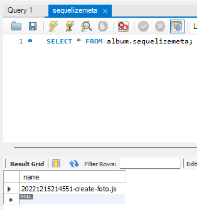

[Regresar](/DAWM-2022/)

Express - ORM (Básico)
==========================================

Sequelize es un [ORM](https://www2.deloitte.com/es/es/pages/technology/articles/que-es-orm.html) para Nodejs que te permite agilizar bastante tus desarrollos que incluyan bases de datos relacionales como Postgres, MySQL, MariaDB, SQLite y SQL Server.

Software a utilizar
===================
* * *

De [MySQL Community Downloads](https://dev.mysql.com/downloads/), descargue e instale:
* Motor de base de datos: [MySQL Community Server](https://dev.mysql.com/downloads/mysql/)
* Interfaz gráfica: [MySQL Workbench](https://dev.mysql.com/downloads/workbench/)

Proyecto en Express
===================

* * *

Utiliza el proyecto que desarrollaste con el tutorial de [Express - Bases](https://dawfiec.github.io/DAWM-2022/tutoriales/express_bases.html), [Express - Bootstrap](https://dawfiec.github.io/DAWM-2022/tutoriales/express_bootstrap.html), [Express - Formularios](https://dawfiec.github.io/DAWM-2022/tutoriales/express_forms.html) y [Express - Layout y Partials](https://dawfiec.github.io/DAWM-2022/tutoriales/express_partials.html).

* Instala las dependencias, con: `npm install`
* Verifica que funcione correctamente al levantar los servicios: `SET DEBUG=misitio:\* & npm start`

Sequelize
=========
* * *

Desde la línea de comandos del proyecto:

* Instale Sequelize CLI de forma global, con: **`npm install -g sequelize-cli`**
* Instale Sequelize y el conector para MySQL para el proyecto, con: **`npm install --save sequelize mysql2`**
* Genere los archivos de configuración de Sequelize, con: **`sequelize init`**  
  + El archivo `config/config.json` contiene la configuración para la conexión con la base de datos.
  + La carpeta `models` contendrá las clases correspondientes a las entidades de la base de datos.
  + La carpeta `migrations` contendrá los scripts a ejecutar en la base de datos y en la aplicación. Estos scripts actúan como registros históricos de los cambios.
  + La carpeta `seeders` contendrá los scripts para generar datos para las entidades de la base datos.

  

* Modifique el archivo `config/config.json` con los datos para la conexión con el motor de bases de datos. En este caso, el ambiente a utilizar es **development**.

<pre><code>
{
  "development": {
    "username": "root",
    "password": null,
    "database": "database_development",
    "host": "127.0.0.1",
    "dialect": "mysql"
  },
  ...
</code></pre>

MySQL
=====
* * *

* Cree la base de datos (schema) con el nombre requerido, por ejemplo: **misitio**.

Modelos
=======
* * *

El modelo es una representación abstracta, mediante clases (atributos y métodos), de las entidades de la base de datos relacional. 

Mediante la línea de comandos en la raíz de la carpeta del proyecto.

* Crea el modelo: producto, con: **`sequelize model:create --name producto --attributes nombre:string,cantidad:integer`**
  + En la carpeta `models` se agregó la clase **producto.js**, con la configuración predeterminada y los atributos especificados.
  + En la carpeta `migrations` se agregó el script **YYYYMMDDHHMMSS\-create-producto.js** para crear la entidad en la base de datos.

  

Migraciones
===========
* * *

Las migraciones contienen un registro histórico de los cambios realizados en los modelos y/o entidades. 

Mediante la línea de comandos en la raíz de la carpeta del proyecto.

* Ejecute TODAS las migraciones, con: **`sequelize db:migrate`**
  

	
  

  + Se creó la tabla vacía **productos**. El nombre de las tablas son creadas en inglés mediante el nombre del modelo en plural, como: **orden** \-> **ordens**. 
	

	  
	

  + Se agregó la migración ejecutada a la tabla **sequelizemeta**
	

	  
	

  + Si intenta ejecutar el mismo comando nuevamente, no ejecutará ninguna migración que se encuentre en la tabla **sequelizemeta**.

* Es posible revertir las migraciones, con:
  + La última: **sequelize db:migrate:undo**
  + Todas las anteriores: **sequelize db:migrate:undo:all**
  + O, alguna migración específica, según como aparezca dentro de la carpeta **migrations**: **`sequelize db:migrate:undo --to XXXXXXXXXXXXXX-create-TABLE.js`**

Seeders (Generadores)
=====================
* * *

A veces, es necesario generar datos de manera automática. 

Mediante la línea de comandos en la raíz de la carpeta del proyecto.

* De no existir, cree el generador con: **`sequelize seed:generate --name productos`**
* Dentro del archivo `seeders/YYYYMMDDHHMMSS-productos.js`, en la función **async up**, agregue:
<pre><code>
...  
async up (queryInterface, Sequelize) {
  <b style="color:red">
  for (let i = 0; i <10; i++) {  
      await queryInterface.bulkInsert('Productos', [{  
          nombre: 'Producto '+i,  
          cantidad: 10+i,  
          createdAt: new Date(),  
          updatedAt: new Date()  
      }], {});  
   } 
   </b> 
},  
...
</code></pre>

*   Dentro del archivo `seeders/YYYYMMDDHHMMSS-productos.js`, en la función **async down**, agregue:
<pre><code>
...  
async down (queryInterface, Sequelize) {
  <b style="color:red">
  await queryInterface.bulkDelete('Productos', null, {});  
  </b>
},  
...
</code></pre>

* Ejecute de generadores de datos
  + Uno a la vez, con: **`sequelize db:seed --seed YYYYMMDDHHMMSS-productos`**
  + Todos, con: **`sequelize db:seed:all`**
  + Deshacer todos, con: **`sequelize db:seed:undo:all`**
* Revise los cambios en la base de datos.

  

	
  

Referencias 
===========

* * *

* ¿Qué es un ORM?. (2021). Retrieved 3 August 2021, from https://www2.deloitte.com/es/es/pages/technology/articles/que-es-orm.html 
* Manual Sequelize. (2021). Retrieved 4 August 2021, from https://sequelize.org/master/index.html 
* Node JS, Express y MySQL con Sequelize. (2021). Retrieved 3 August 2021, from https://tomasmalio.medium.com/node-js-express-y-mysql-con-sequelize-ec0a7c0ae292 
* Creating Sequelize Associations with the Sequelize CLI tool. (2020). Retrieved 3 August 2021, from https://levelup.gitconnected.com/creating-sequelize-associations-with-the-sequelize-cli-tool-d83caa902233 
* Creating Sequelize Associations with the Sequelize CLI tool. (2020). Retrieved 3 August 2021, from https://levelup.gitconnected.com/creating-sequelize-associations-with-the-sequelize-cli-tool-d83caa902233 
* GitHub - japsolo/curso-sequelize-migrations-seeders: Creando modelos, migraciones y seeders con Sequelize en Node + Express. (2021). Retrieved 3 August 2021, from https://github.com/japsolo/curso-sequelize-migrations-seeders