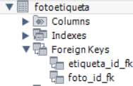
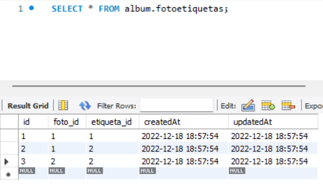
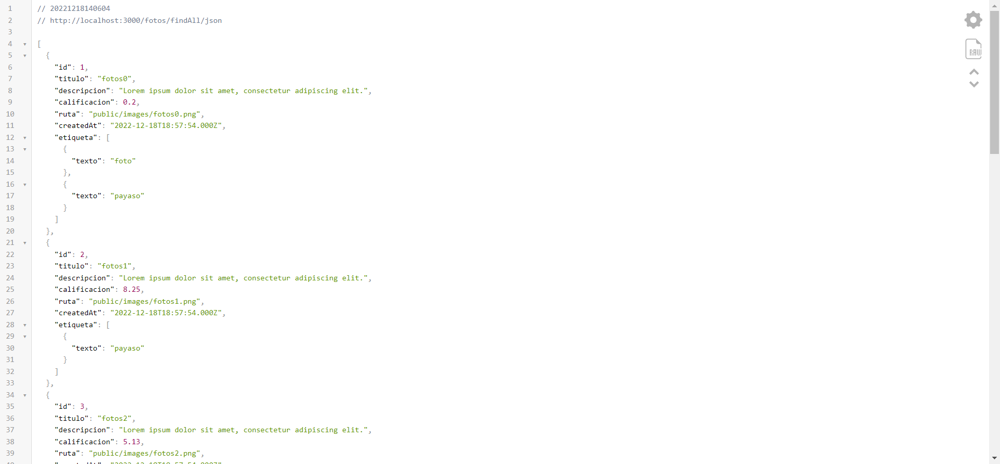

[Regresar](/DAWM/)

Express - ORM (Intermedio)
==========================================

Sequelize es un [ORM](https://www2.deloitte.com/es/es/pages/technology/articles/que-es-orm.html) para Nodejs que te permite agilizar bastante tus desarrollos que incluyan bases de datos relacionales como Postgres, MySQL, MariaDB, SQLite y SQL Server.


Software a utilizar
===================
* * *

De [MySQL Community Downloads](https://dev.mysql.com/downloads/), descargue e instale:
* Motor de base de datos: [MySQL Community Server](https://dev.mysql.com/downloads/mysql/)
* Interfaz gráfica: [MySQL Workbench](https://dev.mysql.com/downloads/workbench/)


Proyecto en Express
===================

* * *

Crea un nuevo proyecto, según [Express - Bases](https://dawfiec.github.io/DAWM/tutoriales/express_bases.html).

* O, Clone el proyecto con las [aplicaciones del curso](https://github.com/DAWFIEC/DAWM-apps) para la aplicación **album/api**
    - Para el hito: **`hito2-api`**

Relación N:M (Foto-Etiqueta)
============================

* * *

* Tome como referencia las instrucciones el tutorial [Express - ORM (Básico)](https://dawfiec.github.io/DAWM/tutoriales/express_ormbasico.html) o [Apuntes](https://dawfiec.github.io/DAWM/paginas/apuntes.html), para:

  + **Modelo:** Cree el modelo que manejará la relación física y lógica
  ```
  sequelize model:create --name fotoetiqueta  --attributes foto_id:integer,etiqueta_id:integer
  ```
    - Modifique el modelo `models/fotoetiqueta`, agregue la clave **tableName** y el nombre de la tabla `fotoetiquetas` a la cual estará relacionado
  ```
  ...
    modelName: 'fotoetiqueta',
    tableName: 'fotoetiquetas'
  ...
  ```

  + **Migración (Creación):** Modifique la migración `migrations/YYYYMMDDHHMMSS-create-etiqueta` para que el nombre de la tabla sea `etiquetas`

  ```
  ...
    await queryInterface.createTable('fotoetiquetas' 
  ...
    await queryInterface.dropTable('fotoetiquetas' 
  ...
  ```

  + **Migración (Modificación):** Cree una nueva migración para registrar la asociación
  ```
  sequelize migration:generate --name associate-foto-etiqueta
  ```

    - Agregue en la función de ejecución de cambios **up**
    ```
    ...
      await queryInterface.addConstraint('fotoetiquetas', {
          fields: ['foto_id'],
          name: 'foto_id_fk',
          type: 'foreign key',
          references: {
            table: 'fotos',
            field: 'id'
          },
          onDelete: 'cascade',
          onUpdate: 'set null'
        });

        await queryInterface.addConstraint('fotoetiquetas', {
          fields: ['etiqueta_id'],
          name: 'etiqueta_id_fk',
          type: 'foreign key',
          references: {
            table: 'etiquetas',
            field: 'id'
          },
          onDelete: 'cascade',
          onUpdate: 'set null'
        });
    ..
    ```

    - Agregue en la función de reversión de cambios **down**

    ```
    await queryInterface.removeConstraint('fotoetiquetas', 'foto_id_fk')
    await queryInterface.removeConstraint('fotoetiquetas', 'etiqueta_id_fk')
    ```

    - Ejecute la migración y revise los cambios en la base de datos.

<p align="center">
  
</p>

  + **Generador:** Cree el generador de datos para el modelo `fotoetiqueta`
    - En la función de ejecución de cambios **up**, agregue:
  <pre><code>
  </code></pre>
    
    - En la función de reversión de cambios **down**, agregue:
  <pre><code>
  </code></pre>

    - Ejecute el generador de datos y revise los cambios en la base de datos.

<p align="center">
  
</p>


  + **Asociación:** Entre los modelos `foto -> (fotoetiqueta) -> etiqueta` y `etiqueta -> (fotoetiqueta) -> foto`

    - Del modelo `models/foto`, modifique el método **associate** con la asociacion lógica al modelo `etiqueta` 

  <pre><code>
    ...
    static associate(models) {
      // define association here
      <b style="color:red">
      models.foto.belongsToMany(models.etiqueta, { through: 'fotoetiqueta', foreignKey: "foto_id" } );
      </b>
    }
    ...
  </code></pre>

    - Del modelo `models/etiqueta`, modifique el método **associate** con la asociacion lógica al modelo `foto` 

  <pre><code>
    ...
    static associate(models) {
      // define association here
      <b style="color:red">
      models.etiqueta.belongsToMany(models.foto, { through: 'fotoetiqueta', foreignKey: "etiqueta_id" });
      </b>
    }
    ...
  </code></pre>


  + **Manejador de rutas y controladores:** modifique el controlador para la ruta `/findAll/json` al:
    - Incluir (clave _include_) el modelo `etiqueta` 
    - Mostrar solo el atributo `texto`
    - Evitando cargar todos los modelos relacionados ([Nested eager loading](https://sequelize.org/v3/docs/models-usage/index.html#nested-eager-loading)).

  <pre><code>
    Foto.findAll({  
        attributes: { exclude: ["updatedAt"] },
        <b style="color:red">
        include: [{
          model: Etiqueta,
          attributes: ['texto'],
          through: {attributes: []}
        }],
        </b>
    }) 
  </code></pre>


Comprobación
============
* * *

* Compruebe el funcionamiento del servidor, con: **npm run devstart**
* Acceda al URL `http://localhost:3000/fotos/findAll/json` 

<p align="center">
  
</p>


Referencias 
===========

* * *

* ¿Qué es un ORM?. (2021). Retrieved 3 August 2021, from https://www2.deloitte.com/es/es/pages/technology/articles/que-es-orm.html 
* Manual Sequelize. (2021). Retrieved 4 August 2021, from https://sequelize.org/master/index.html 
* Node JS, Express y MySQL con Sequelize. (2021). Retrieved 3 August 2021, from https://tomasmalio.medium.com/node-js-express-y-mysql-con-sequelize-ec0a7c0ae292 
* Creating Sequelize Associations with the Sequelize CLI tool. (2020). Retrieved 3 August 2021, from https://levelup.gitconnected.com/creating-sequelize-associations-with-the-sequelize-cli-tool-d83caa902233 
* Creating Sequelize Associations with the Sequelize CLI tool. (2020). Retrieved 3 August 2021, from https://levelup.gitconnected.com/creating-sequelize-associations-with-the-sequelize-cli-tool-d83caa902233 
* GitHub - japsolo/curso-sequelize-migrations-seeders: Creando modelos, migraciones y seeders con Sequelize en Node + Express. (2021). Retrieved 3 August 2021, from https://github.com/japsolo/curso-sequelize-migrations-seeders
* Sequelize + Express + Migrations + Seed Starter. (2022). Retrieved 3 August 2022, from https://gist.github.com/vapurrmaid/a111bf3fc0224751cb2f76532aac2465
* through.attribute, S., & Kammer, F. (2016). Sequelize: Include model of through.attribute. Retrieved 18 December 2022, from https://stackoverflow.com/questions/38726793/sequelize-include-model-of-through-attribute
* Usage - Sequelize | The Node.js / io.js ORM for PostgreSQL, MySQL, SQLite and MSSQL. (2022). Retrieved 18 December 2022, from https://sequelize.org/v3/docs/models-usage/index.html#nested-eager-loading