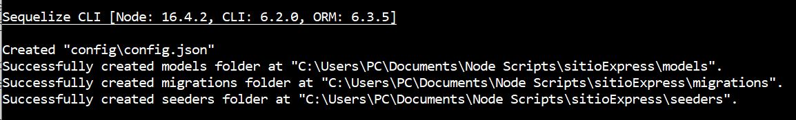

[Regresar](/DAWM/)

Express - ORM (Intermedio)
==========================================

Para reconstruir los modelos de una base de datos preconstruida (tablas, relaciones y datos) a un proyecto de Express, será necesario incorporar el módulo [sequelize-auto](https://www.npmjs.com/package/sequelize-auto).

Proyecto en Express
===================

* * *

Utiliza el proyecto que desarrollaste con el tutorial de [Express - Bases](https://dawfiec.github.io/DAWM/tutoriales/express_bases.html), [Express - Bootstrap](https://dawfiec.github.io/DAWM/tutoriales/express_bootstrap.html), [Express - Formularios](https://dawfiec.github.io/DAWM/tutoriales/express_forms.html) y [Express - Layout y Partials](https://dawfiec.github.io/DAWM/tutoriales/express_partials.html).

* Instala las dependencias, con: `npm install`
* Verifica que funcione correctamente al levantar los servicios: `SET DEBUG=misitio:\* & npm start`

Base de datos original
======================
* * *

La base de dato a considerar contiene las tablas **gallery** y **photo**, como se muestra a continuación.

  

ORM: Sequelize, Sequelize-cli y Sequelize-auto
==============================================
* * *

Desde la línea de comandos, en la raíz de la carpeta del proyecto.

* Instale Sequelize CLI de forma global, con: **`npm install -g sequelize-cli`**
* Instale Sequelize auto de forma global, con: **`npm install -g sequelize-auto`**
* Instale Sequelize y el conector para MySQL para el proyecto, con: **`npm install --save sequelize mysql2`**
* Genere los archivos de configuración de Sequelize, con: **`sequelize init`**  

  

* Modifique el archivo `config/config.json` con los datos para la conexión con el motor de bases de datos. En este caso, el ambiente a utilizar es **development**.

<pre><code>
{
  "development": {
    "username": "root",
    "password": null,
    "database": "database_development",
    "host": "127.0.0.1",
    "dialect": "mysql"
  },
  ...
</code></pre>

Modelos
=======
* * *

Desde la línea de comandos, en la raíz de la carpeta del proyecto.

* Reconstruya los modelos, con: `sequelize-auto -h host -d database -u user -x password -p port`
  + Especifique el hostname después del parámetro -h **host**
  + Especifique el nombre de la base de datos después del parámetro  -d **database**
  + Especifique el nombre del usuario después del parámetro -u **user**
  + Especifique la contraseña del usuario después del parámetro -x **password**
  + Especifique el puerto después del parámetro  -p **port**

  

* Los modelos reconstruidos son **photos** y **gallery** en la carpeta `/models`. 
  + Además se creó el archivo **`init-models.js`** con las relaciones entre los modelos. Los alias de las claves foráneas (**idgallery_gallery** y **photos**) son utilizadas para referirse a los datos asociados.

<pre><code>
photo.belongsTo(gallery, { as: "idgallery_gallery", foreignKey: "idgallery"});
gallery.hasMany(photo, { as: "photos", foreignKey: "idgallery"});
</code></pre>

Controlador
===========
* * *

Para solicitar los datos desde la base de datos, será necesario:

* Agregue al **routes/index.js** la referencia a la instanciación **sequelize** y a los **modelos**

<pre><code>
var express = require('express');  
var router = express.Router();  
  
<b style="color:red">
const sequelize = require('../models/index.js').sequelize;
var initModels = require("../models/init-models");
var models = initModels(sequelize);  
</b>  
  
/* GET home page. */  
router.get('/', function(req, res, next) {
</code></pre>

* El controlador de la ruta **`"/photos"`** solicitará todos las fotos (findAll).
  + El atributo **include** es opcional. El atributo **include** permite traer los datos asociados (**gallery**) mediante el alias de la clave foránea (**idgallery_gallery**)

<pre><code>
router.get('/photos', function(req, res, next) {  
  
  	<b style="color:red">
    models.photo.findAll({
      include: [{ 
        model: models.gallery,
        as: 'idgallery_gallery'
      }],
    })
   .then(photos => {
      res.json(photos)
   })
   .catch(error => res.status(400).send(error))
	</b>

});
</code></pre>

  

* El controlador de la ruta **`"/galleries"`** solicitará todas las galerías (findAll).
  + El atributo **include** es opcional. El atributo **include** permite traer los datos asociados (**photo**) mediante el alias de la clave foránea (**photos**)

<pre><code>
router.get('/galleries', function(req, res, next) {  
  
    <b style="color:red">
    models.gallery.findAll({
       include: [{ 
          model: models.photo,
          as: 'photos'
       }],
    })
   .then(galleries => {
      res.json(galleries)
   })
   .catch(error => res.status(400).send(error))
  </b>

});
</code></pre>

  

Referencias 
===========

* * *

* Creating a Secure REST API in Node.js. (2021). Retrieved 7 August 2021, from https://www.toptal.com/nodejs/secure-rest-api-in-nodejs 
* GitHub - sequelize/sequelize-auto: Automatically generate bare sequelize models from your database. (2021). Retrieved 7 August 2021, from https://github.com/sequelize/sequelize-auto 
* Route Parameters in Express. (2019). Retrieved 7 August 2021, from https://masteringjs.io/tutorials/express/route-parameters
* Manual Sequelize. (2021). Retrieved 7 August 2021, from https://sequelize.org/master/manual/model-querying-basics.html#applying-where-clauses