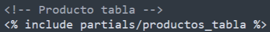
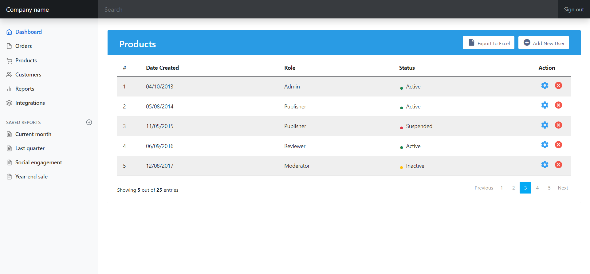

[Regresar](/DAWM/)

Express - Layouts y Partials
============================

Para ahorrar líneas de código y reutilizar componentes, Express ofrece el uso de partials como porciones reutilizables de etiquetas de HTML.

<p align="center">
  
</p>

Proyecto en Express
===================

Crea un nuevo proyecto, según [Express - Bases](https://dawfiec.github.io/DAWM/tutoriales/express_bases.html) y [Express - Bootstrap](https://dawfiec.github.io/DAWM/tutoriales/express_bootstrap.html).

* O, Clone el proyecto con las [aplicaciones del curso](https://github.com/DAWFIEC/DAWM-apps) para la aplicación **album/admin**
    - Para el hito: **`hito2-admin`**

* Instale las dependencias, con: `npm install`
* Verifique el funcionamiento al levantar los servicios, con: `npm run devstart`

Partial: main
=================

* * *

Para el sitio de ejemplo será necesario separar las secciones que pueden reutilizarse otras vistas (layout) y las secciones que son únicas por vista.

* Del archivo **views/index.ejs**
  + Extraiga la etiqueta `<main>` junto con todo su contenido.
* Dentro de la carpeta **views**
  + Cree la carpeta **`partials`** . 
  + Cree el archivo **`views/partials/main.ejs`**.
  + Pegue las etiquetas copiadas dentro del archivo **`views/partials/main.ejs`**.
* En el archivo **views/index.ejs**
  + Coloque **`<%- include("partials/main") -%>`**, en el lugar donde se encontraba la etiqueta `<main>`.

<p align="center">
  
</p>

* Compruebe el funcionamiento del servidor, con: **npm run devstart**
* Acceda al URL `http://localhost:3000/` 

<p align="center">
  
</p>


Partial: header y nav
=============================

* * *

Del **`views/index.ejs`**, repite el proceso anterior para las etiquetas `<header>` y `<nav>`.

* Coloque la etiqueta **`<header>`** en el partial  **`views/partials/header.ejs`**
* Coloque la etiqueta **`<nav>`** en el partial  **`views/partials/nav.ejs`**

<p align="center">
  
</p>

Productos: layout y partial
===========================

* * *

Para crear la página de productos, utilizaremos los archivos del recurso [productos.zip](archivos/productos.zip). La plantilla del productos es [Bootstrap User Management Data Table](https://www.tutorialrepublic.com/snippets/preview.php?topic=bootstrap&file=user-management-data-table).

* Copie el archivo **`productos.ejs`** dentro de la carpeta **`views`**.
* Copie el archivo **`productos_tabla.ejs`** dentro de la carpeta **`views/partials`**.
  + Agregue la referencia al partial **`productos_tabla.ejs`**

<p align="center">
  
</p>

* Copie el archivo **`table.css`** dentro de la carpeta **`public/stylesheets`**. 
* En el **`routes/index.js`**
  + Enlaza la ruta **`"/products"`** con la vista **`productos.ejs`**.

<pre><code>
  ...
    router.get('/products', function(req, res, next) {
      res.render('productos', { title: 'Productos' });
    })
  ...
</code></pre>  


* Compruebe el funcionamiento del servidor, con: **npm run devstart**
* Acceda al URL `http://localhost:3000/products` 

<p align="center">
  
</p>

Productos: ruta
===============

* * *

* En el **`views/partials/nav.ejs`**
  + Modifique la referencia del texto _Products_

  ```
  ...
    <a class="nav-link" href="#">
      <span data-feather="shopping-cart" class="align-text-bottom"></span>
      Products
    </a>
  ...
  ```

  por

  ```
  ...
    <a class="nav-link" href="/productos">
      <span data-feather="shopping-cart" class="align-text-bottom"></span>
       Products
    </a>
  ... 
  ```

  + Modifique la referencia del texto _Dashboard_

  ```
  ...
    <a class="nav-link active" aria-current="page" href="#">
      <span data-feather="home" class="align-text-bottom"></span>
      Dashboard
    </a>
  ... 
  ```

  por

  ```
  ...
    <a class="nav-link active" aria-current="page" href="/">
      <span data-feather="home" class="align-text-bottom"></span>
      Dashboard
    </a>
  ... 
  ```

* Compruebe el funcionamiento del servidor, con: **npm run devstart**
* Acceda al URL `http://localhost:3000/`
  + Acceda en la opción _Products_.
  + Acceda en la opción _Dashboard_.  


Referencias 
===========

* * *

* Cómo usar EJS para crear una plantilla de su aplicación Node DigitalOcean. (2021). Retrieved 3 August 2021, from https://www.digitalocean.com/community/tutorials/how-to-use-ejs-to-template-your-node-application-es
* GitHub - tj/ejs: Embedded JavaScript templates for node. (2021). Retrieved 3 August 2021, from https://github.com/tj/ejs#includes
* problem, S., Latif, U., Agarwal, J., & T&#249;ng, N. (2019). SyntaxError: Unexpected Indentifier while compiling ejs problem. Retrieved 14 December 2022, from https://stackoverflow.com/questions/59106739/syntaxerror-unexpected-indentifier-while-compiling-ejs-problem