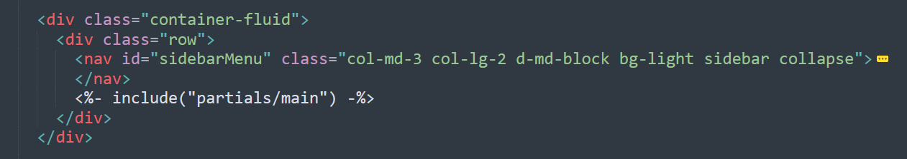
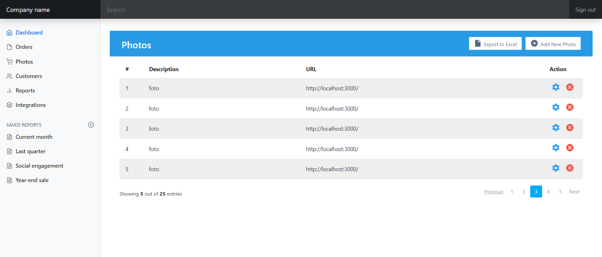

[Regresar](/DAWM/)

Express - Layouts y Partials
============================

Para ahorrar líneas de código y reutilizar componentes, Express ofrece el uso de partials como porciones reutilizables de etiquetas de HTML.

<p align="center">
  
</p>

Proyecto en Express
===================

* * *

Crea un nuevo proyecto, según [Express - Bases](https://dawfiec.github.io/DAWM/tutoriales/express_bases.html) y [Express - Bootstrap](https://dawfiec.github.io/DAWM/tutoriales/express_bootstrap.html).

* O, Clone el proyecto con las [aplicaciones del curso](https://github.com/DAWFIEC/DAWM-apps) para la aplicación **album/admin**
    - Para el hito: **`hito2-admin`**
* Instale las dependencias, con: `npm install`
* Verifique el funcionamiento al levantar los servicios, con: `npm run devstart`


Partial: main
=================

* * *

Para el sitio de ejemplo será necesario separar las secciones que pueden reutilizarse otras vistas (layout) y las secciones que son únicas por vista.

* Del archivo **views/index.ejs**
  + Extraiga la etiqueta `<main>` junto con todo su contenido.
* Dentro de la carpeta **views**
  + Cree la carpeta **`partials`** . 
  + Cree el archivo **`views/partials/main.ejs`**.
  + Pegue las etiquetas copiadas dentro del archivo **`views/partials/main.ejs`**.
* En el archivo **views/index.ejs**
  + Coloque **`<%- include("partials/main") -%>`**, en el lugar donde se encontraba la etiqueta `<main>`.

<p align="center">
  
</p>

* Compruebe el funcionamiento del servidor, con: **npm run devstart**
* Acceda al URL `http://localhost:3000/` 

<p align="center">
  
</p>


Partial: header y nav
=============================

* * *

Del **`views/index.ejs`**, repite el proceso anterior para las etiquetas `<header>` y `<nav>`.

* Coloque la etiqueta **`<header>`** en el partial  **`views/partials/header.ejs`**
* Coloque la etiqueta **`<nav>`** en el partial  **`views/partials/nav.ejs`**

<p align="center">
  
</p>

Fotos: layout y partial
===========================

* * *

Para crear la página de fotos, utilizaremos los archivos del recurso [fotos.zip](archivos/fotos.zip). La plantilla del fotos es [Bootstrap User Management Data Table](https://www.tutorialrepublic.com/snippets/preview.php?topic=bootstrap&file=user-management-data-table).

* Copie el archivo **`fotos.ejs`** dentro de la carpeta **`views`**.
* Copie el archivo **`fotos_tabla.ejs`** dentro de la carpeta **`views/partials`**.
  + Agregue la referencia al partial **`fotos_tabla.ejs`**

<p align="center">
  
</p>

* Copie el archivo **`table.css`** dentro de la carpeta **`public/stylesheets`**. 
* En el **`routes/index.js`**
  + Enlaza la ruta **`"/photos"`** con la vista **`fotos.ejs`**.

<pre><code>
  ...
    router.get('/photos', function(req, res, next) {
      res.render('fotos', { title: 'Fotos' });
    })
  ...
</code></pre>  


* Compruebe el funcionamiento del servidor, con: **npm run devstart**
* Acceda al URL `http://localhost:3000/photos` 

<p align="center">
  
</p>

Fotos: ruta
===============

* * *

* En el **`views/partials/nav.ejs`**
  + Modifique el texto y la referencia del texto _Products_

  ```
  ...
    <a class="nav-link" href="#">
      ...
      Products
    </a>
  ...
  ```

  por

  ```
  ...
    <a class="nav-link" href="/photos">
      ...
      Photos
    </a>
  ... 
  ```

  + Modifique la referencia del texto _Dashboard_

  ```
  ...
    <a class="nav-link active" aria-current="page" href="#">
      ...
      Dashboard
    </a>
  ... 
  ```

  por

  ```
  ...
    <a class="nav-link active" aria-current="page" href="/">
      ...
      Dashboard
    </a>
  ... 
  ```

* Compruebe el funcionamiento del servidor, con: **npm run devstart**
* Acceda al URL `http://localhost:3000/`
  + Acceda en la opción _Photos_.
  + Acceda en la opción _Dashboard_.  

Fotos: datos - controlador
==========================

* * *

* Desde la línea de comandos, agregue `axios`, con: `npm i axios`
* Modifique el `routes/index.js`
  + Agregue la referencia a `axios`

  ```
  ...
    var express = require('express');
    const axios = require('axios')
  ...
  ```

  + Modifique el controlador para la ruta `/photos`

  ```
  ...
  router.get('/photos', async function(req, res, next) {
  
    const URL = 'https://dawm-fiec-espol-default-rtdb.firebaseio.com/photos.json'
    const config = {
      proxy: {
        host: 'localhost',
        port: 4444
      }
    }
    const response = await axios.get(URL, config) #de ser necesario, incluya la constante config como segundo parámetro del método get
    
    res.render('fotos', { title: 'Fotos', fotos: response.data });
  })
  ...
  ```

* En caso de tener problemas con el endpoint:
  + Descargue el recurso [photos.json](https://dawm-fiec-espol-default-rtdb.firebaseio.com/photos.json)
  + Guarde el recurso en una carpeta local
  + Levante un servidor HTTP con Python o Chrome server
  + Modifique el `routes/index.js`, en el controlador para la ruta `/photos`
    - Cambie la variable _URL_ por la nueva ruta, por ejemplo: `http://localhost:8080/photos.json`

Fotos: datos - vista
====================

* En la vista de fotos, del archivo **views/fotos.ejs**, envíe como parámetro el arreglo de fotos.

  ```
  ...  
  <div class="container-fluid">  
       <div class="row">  
          <%- include("partials/nav") -%>
          <!-- Foto tabla -->
          <%- include("partials/fotos_tabla", {arrFotos:fotos} ) -%>

       </div>  
  </div>  
  ...

  ```

* En la vista, en el partial **views/partials/fotos_tabla.ejs**, reemplace el contenido de la etiqueta `<table>`:

  ```
  ...  
    
  <table class="table table-striped table-hover">
    <thead>
        <tr>
            <th>#</th>
            <th>Description</th>
            <th>URL</th>
            <th>Action</th>
        </tr>
    </thead>
    <tbody>  
        <% arrFotos.forEach((foto, idx) => { %>  
          <tr>
            <td><%= idx %></td>  
            <td><%= foto.descripcion %></td>  
            <td><%= foto.url %></td>   
            <td>  
                <a href="#" class="settings" title="Settings" data-toggle="tooltip"><i class="material-icons">&#xE8B8;</i></a>  
                <a href="#" class="delete" title="Delete" data-toggle="tooltip"><i class="material-icons">&#xE5C9;</i></a>  
            </td>  
          </tr>  
        <% }); %>  
    </tbody>  
  </table>
  ...

  ```

<p align="center">
  
</p>

Referencias 
===========

* * *

* Cómo usar EJS para crear una plantilla de su aplicación Node DigitalOcean. (2021). Retrieved 3 August 2021, from https://www.digitalocean.com/community/tutorials/how-to-use-ejs-to-template-your-node-application-es
* GitHub - tj/ejs: Embedded JavaScript templates for node. (2021). Retrieved 3 August 2021, from https://github.com/tj/ejs#includes
* problem, S., Latif, U., Agarwal, J., & T&#249;ng, N. (2019). SyntaxError: Unexpected Indentifier while compiling ejs problem. Retrieved 14 December 2022, from https://stackoverflow.com/questions/59106739/syntaxerror-unexpected-indentifier-while-compiling-ejs-problem