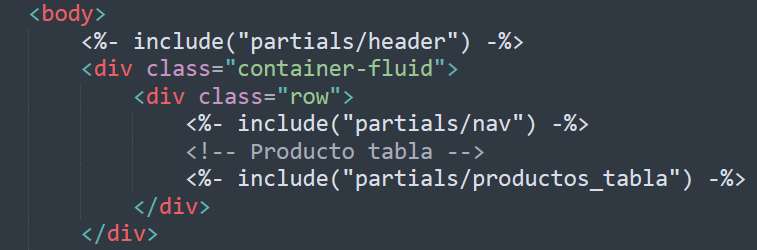

[Regresar](/DAWM-2022/)

Express - Layouts y Partials
============================

Para ahorrar líneas de código y reutilizar componentes, Express ofrece el uso de partials como porciones reutilizables de etiquetas de HTML.

  

Proyecto en Express
===================

* * *

Utiliza el proyecto que desarrollaste con el tutorial de [Express - Bases](https://dawfiec.github.io/DAWM-2022/tutoriales/express_bases.html), [Express - Bootstrap](https://dawfiec.github.io/DAWM-2022/tutoriales/express_bootstrap.html) y [Express - Formularios](https://dawfiec.github.io/DAWM-2022/tutoriales/express_forms.html).

* Instala las dependencias, con: `npm install`
* Verifica que funcione correctamente al levantar los servicios: `SET DEBUG=misitio:\* & npm start`

Partial: `<main>`
=================

* * *

Para el sitio de ejemplo será necesario separar las secciones que pueden reutilizarse otras vistas (layout) y las secciones que son únicas por vista.

* Del archivo **views/index.ejs**
  + Corta la etiqueta `<main>` junto con todo su contenido.
* Dentro de la carpeta **views**
  + Crea la carpeta **`partials`** . 
  + Crea el archivo **`views/partials/main.ejs`**.
  + Pega las etiquetas copiadas dentro del archivo **`views/partials/main.ejs`**.
* En el archivo **views/index.ejs**
  + Coloca **`<% include partials/main %>`**, en el lugar donde se encontraba la etiqueta `<main>`.
* Compruebe el funcionamiento del servidor, con: **npm run devstart**
* Acceda al URL `http://localhost:3000/` 

  

Productos: layout y partial
===========================

* * *

Para crear la página de productos, utilizaremos los archivos del recurso [productos.zip](archivos/productos.zip). La plantilla del productos es [Bootstrap User Management Data Table](https://www.tutorialrepublic.com/snippets/preview.php?topic=bootstrap&file=user-management-data-table).

* Copia el archivo **`productos.ejs`** dentro de la carpeta **`views`**.
* Copia el archivo **`productos_tabla.ejs`** dentro de la carpeta **`views/partials`**.
  + Agregue la referencia al partial **`productos_tabla.ejs`**
* Copia el archivo **`table.css`** dentro de la carpeta **`public/stylesheets`**. 
* En el **`routes/index.js`**
  + Enlaza la ruta **`"/productos"`** con la vista **`productos.ejs`**.
* Compruebe el funcionamiento del servidor, con: **npm run devstart**
* Acceda al URL `http://localhost:3000/productos` 

  

  

Referencias 
===========

* * *

* Cómo usar EJS para crear una plantilla de su aplicación Node DigitalOcean. (2021). Retrieved 3 August 2021, from https://www.digitalocean.com/community/tutorials/how-to-use-ejs-to-template-your-node-application-es
* GitHub - tj/ejs: Embedded JavaScript templates for node. (2021). Retrieved 3 August 2021, from https://github.com/tj/ejs#includes