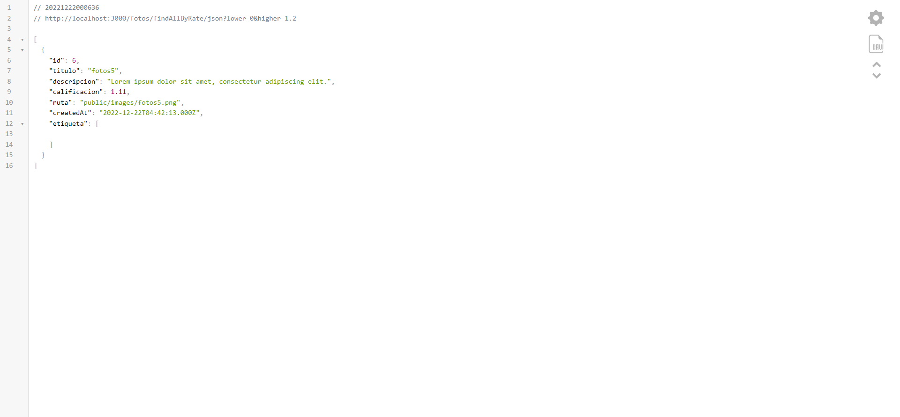
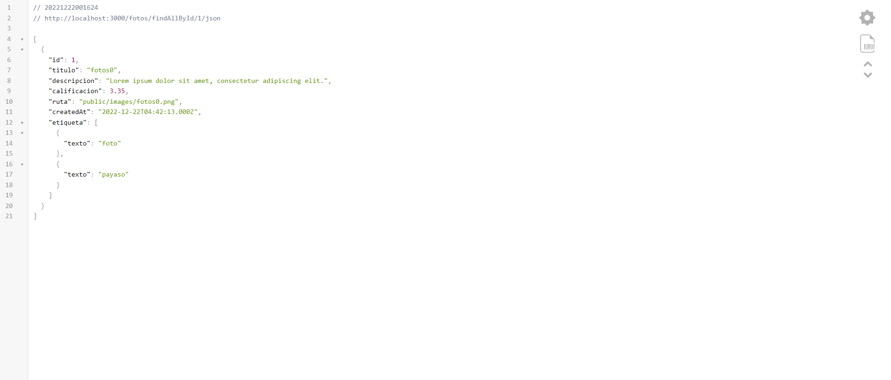

[Regresar](/DAWM/)

Express - Parámetros de consulta y Parámetros de ruta
=====================================================

Express.js ofrece dos mecanismos para proveer de datos al servidor para el filtrado de datos: parámetros de consulta (Query String) y parámetros de ruta (Route parameters).

Software a utilizar
===================
* * *

De [MySQL Community Downloads](https://dev.mysql.com/downloads/), descargue e instale:
* Motor de base de datos: [MySQL Community Server](https://dev.mysql.com/downloads/mysql/)
* Interfaz gráfica: [MySQL Workbench](https://dev.mysql.com/downloads/workbench/)

Proyecto en Express
===================

* * *

Crea un nuevo proyecto, según [Express - Bases](https://dawfiec.github.io/DAWM/tutoriales/express_bases.html), [Express - ORM (Básico)](https://dawfiec.github.io/DAWM/tutoriales/express_ormbasico.html) y [Express - ORM (Intermedio)](https://dawfiec.github.io/DAWM/tutoriales/express_ormintermedio.html).

* O, Clone el proyecto con las [aplicaciones del curso](https://github.com/DAWFIEC/DAWM-apps) para la aplicación **album/api**
    - Para el hito: **`hito3-api`**

Cláusula WHERE
===============
* * *

La cláusula where se utiliza para filtrar la consulta. Hay muchos operadores para usar en la cláusula where, disponibles con el símbolos de **`Op`**: `Op.between`, `Op.and`, `Op.or`, etc.

* En el manejador de rutas **`routes/fotos.js`**
 + Cambie el import para usar el operador **Op**, .

  <pre><code>
  const Sequelize = require('sequelize');
  </code></pre>

  por

  <pre><code>
  <b style="color:red">const { Sequelize, Op } = require('sequelize');</b>
  </code></pre>

Parámetros de consulta (Query String)
=====================================
* * *

Los parámetros de consulta forman parte de una URL después del signo de interrogación (?). Sirve para enviar datos al servidor, que se utilizarán como filtros para la respuesta.

* En el ruteador **`routes/fotos.js`**
  + Agregue el controlador para el método **`GET`** con la subruta **`/findAllByRate/json`**
  + Dentro del controlador
    - Obtenga los parámetros de consulta **`lower`** y **`higher`**, con:

    <pre><code>
  	...
  	let lower = parseFloat(req.query.lower);
  	let higher = parseFloat(req.query.higher);
  	...
    </code></pre>

    - Agregue el _query_ al controlador de la subruta, con:

    <pre><code>
    ...
    Foto.findAll({
      attributes: { exclude: ["updatedAt"] } ,
      include: [{
        model: Etiqueta,
        attributes: ['texto'],
        through: {attributes: []}
      }], 
      where: { 
        calificacion: { 
          [Op.between]: [lower, higher]
        }
      }
    })  
    .then(fotos => {  
      res.json(fotos);  
    })  
    .catch(error => res.status(400).send(error)) 
    ...
    </code></pre>

* Compruebe el funcionamiento del servidor, con: **npm run devstart**
* Acceda a la siguiente URL: `http://localhost:3000/fotos/findAllByRate/json?lower=0&higher=1.2`  
  - El resultado es diferente debido a que el valor del atributo `calificacion` es aleatorio. 

  

  

* Compruebe su funcionamiento con otros valores

  + `http://localhost:3000/fotos/findAllByRate/json?lower=1.2&higher=4.7`
  + `http://localhost:3000/fotos/findAllByRate/json?lower=3&higher=6.2`

Parámetros de ruta (Route parameters)
=====================================
* * *

Otra forma para pasar datos al servidor consiste en colocar información dentro de la ruta URL real. A este mecanismo se denomina parámetros de ruta. 

* En el ruteador **`routes/fotos.js`**
  + Agregue el controlador para el método **`GET`** con la subruta **`/findAllById/:id/json`**
  + Obtenga el parámetro **`id`**, con:

  <pre><code>
  ...
  let id = parseInt(req.params.id);
  ...
  </code></pre>

  + Agregue el _query_ al controlador de la subruta, con:

  <pre><code>
   ...
   Foto.findAll({  
      attributes: { exclude: ["updatedAt"] } ,
      include: [{
          model: Etiqueta,
          attributes: ['texto'],
          through: {attributes: []}
        }], 
      where: { 
        [Op.and]: [
          {id: id}
        ]
      }
  })  
  .then(fotos => {  
      res.json(fotos);  
  })  
  .catch(error => res.status(400).send(error)) 
   ...
  </code></pre>

* Compruebe el funcionamiento del servidor, con: **npm run devstart**
* Acceda al URL `http://localhost:3000/fotos/findAllById/1/json` 

  

* Compruebe su funcionamiento con otros valores

  + `http://localhost:3000/fotos/findAllById/2/json`
  + `http://localhost:3000/fotos/findAllById/6/json`

Referencias 
===========

* * *

* ᐉ Obtener cadenas de consulta y parámetros en Express.js Pharos. (2021). Retrieved 1 August 2022, from https://pharos.sh/obtener-cadenas-de-consulta-y-parametros-en-express-js/
* Query vs. URL Parameters in Express.js. (2020). Retrieved 1 August 2022, from https://javascript.plainenglish.io/query-strings-url-parameters-d1a35b9a694f
* Get Query Strings and Parameters in Express.js. (2017). Retrieved 1 August 2022, from https://stackabuse.com/get-query-strings-and-parameters-in-express-js/
* Concepts, C., & Finders, M. (2022). Model Querying - Finders Sequelize. Retrieved 3 August 2022, from https://sequelize.org/docs/v6/core-concepts/model-querying-finders/
* Concepts, C., & Basics, M. (2022). Model Querying - Basics Sequelize. Retrieved 4 August 2022, from https://sequelize.org/docs/v6/core-concepts/model-querying-basics/