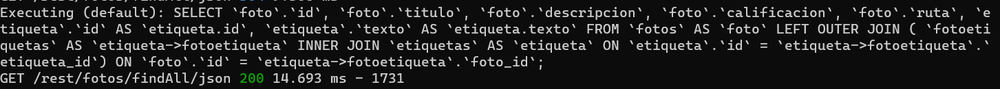
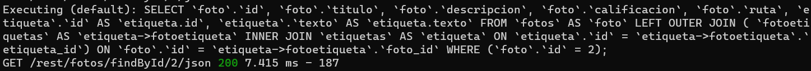
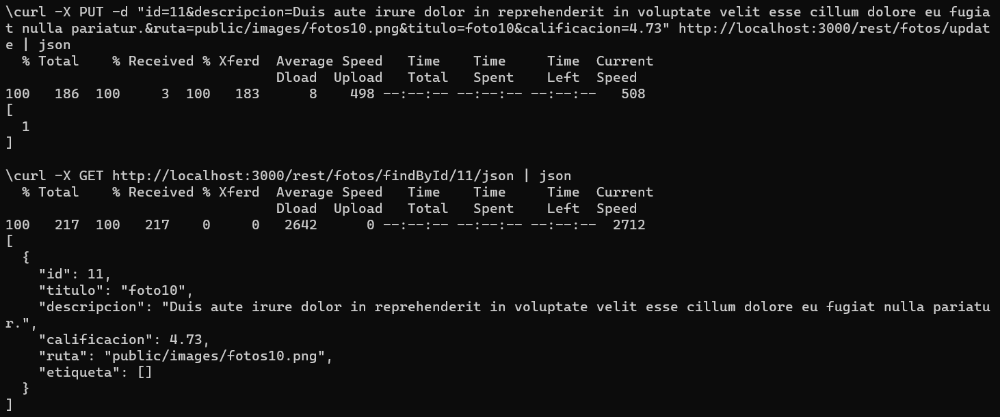
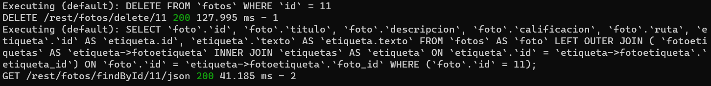

[Regresar](/DAWM/)

Express - REST
=====================================================

A lo largo de los años, existieron algunas interfaces de comunicación (API) populares entre cliente y servidor. Sin embargo, el más popular se llama REST definido en 2000 por Roy Fielding. Es una arquitectura que aprovecha el protocolo HTTP para permitir la comunicación entre un cliente y una aplicación de servidor. Una aplicación de servidor que ofrece una API REST también se denomina servidor RESTful. Los servidores que no siguen la arquitectura REST al 100% se llaman RESTish en lugar de RESTful. A continuación, implementaremos dicha API REST para nuestra aplicación de servidor Express, pero primero conozcamos las herramientas que nos permiten interactuar con una API REST.

Software a utilizar
===================
* * *

De [MySQL Community Downloads](https://dev.mysql.com/downloads/), descargue e instale:
* Motor de base de datos: [MySQL Community Server](https://dev.mysql.com/downloads/mysql/)
* Interfaz gráfica: [MySQL Workbench](https://dev.mysql.com/downloads/workbench/)


Curl + Jsontool
==============
* * *

* Instale el módulo `jsontool` de manera global, con: `npm i -g jsontool`
* Desde la línea de comandos, realice una petición con [**cURL**](https://curl.se/), con: 

`curl https://dawm-fiec-espol-default-rtdb.firebaseio.com/potterhead.json | json`

Que resulta en:

<p align="center">
  
</p>

Proyecto en Express: REST API
=============================

* * *

Crea un nuevo proyecto, según [Express - Bases](https://dawfiec.github.io/DAWM/tutoriales/express_bases.html), [Express - ORM (Básico)](https://dawfiec.github.io/DAWM/tutoriales/express_ormbasico.html), [Express - ORM (Intermedio)](https://dawfiec.github.io/DAWM/tutoriales/express_ormintermedio.html) y [Express - Parámetros de consulta y Parámetros de ruta](https://dawfiec.github.io/DAWM/tutoriales/express_pcpr.html).

* O, Clone el proyecto con las [aplicaciones del curso](https://github.com/DAWFIEC/DAWM-apps) para la aplicación **album/api**
    - Para el hito: **`hito6-api`**


## Manejador de rutas y registro en la aplicación

* Cree el manejador de rutas **rest/fotos.js**.
* Registre la ruta **`'/rest/fotos'`** en la aplicación para el controlador de rutas **rest/fotos.js**. 
* Incluya los módulos y modelos en el encabezado del manejador de rutas **rest/fotos.js**  

```
var express = require('express');
var router = express.Router();

const { Sequelize, Op } = require('sequelize');
const Foto = require('../models').foto;
const Etiqueta = require('../models').etiqueta;  
...
```

### GET-All

Para obtener TODOS los registros de una entidad en una base de datos relacional, implemente el controlador para el verbo **GET** con el método **findAll** de la clase.

* Cree el controlador para el verbo GET de la ruta **`/findAll/json`** que retorna un json con todos los fotos.

  ```
  ...
  router.get('/findAll/json', function(req, res, next) {  

    Foto.findAll({  
        attributes: { exclude: ["updatedAt", "createdAt"] } ,
        include: [{
            model: Etiqueta,
            attributes: ['texto'],
            through: {attributes: []}
          }], 
    })  
    .then(fotos => {  
        res.json(fotos);  
    })  
    .catch(error => res.status(400).send(error)) 

  });
  ...
  ```

* Compruebe el funcionamiento del servidor, con: **npm run devstart**
  + En la línea de comandos del cliente, realice una petición GET al URL `http://localhost:3000/rest/fotos/findAll/json`

  `curl -X GET http://localhost:3000/rest/fotos/findAll/json | json` 

<p align="center">
  
</p>

  + En la línea de comandos del servidor del proyecto de Express aparece la petición:

<p align="center">
  
</p>


### GET-id

Para obtener UN registro de una entidad en una base de datos relacional, implemente el controlador para el verbo **GET** con el método **findOne** de la clase.

* Cree el controlador para el verbo GET de la ruta **`/findAll/:id/json`** que retorna un json dado el id de un foto.

  ```
  router.get('/findById/:id/json', function(req, res, next) {  

    let id = parseInt(req.params.id);

    Foto.findAll({  
        attributes: { exclude: ["updatedAt", "createdAt"] } ,
        include: [{
            model: Etiqueta,
            attributes: ['texto'],
            through: {attributes: []}
          }], 
        where: { 
          [Op.and]: [
            {id: id}
          ]
        }
    })  
    .then(fotos => {  
        res.json(fotos);  
    })  
    .catch(error => res.status(400).send(error)) 

  });
  ```

* Compruebe el funcionamiento del servidor, con: **npm run devstart**
  + En la línea de comandos del cliente, realice una petición GET al URL `http://localhost:3000/rest/fotos/findById/2/json` 

  `curl -X GET http://localhost:3000/rest/fotos/findById/2/json | json`

<p align="center">
  
</p>

  + En la línea de comandos del servidor del proyecto de Express aparece la petición:

<p align="center">
  
</p>


### POST

Para guardar UN registro de una entidad en una base de datos relacional, implemente el controlador para el verbo **POST** con el método **create** de la clase.

* Cree el controlador para el verbo POST de la ruta **`/save`** que recibe los datos de un foto en el cuerpo del requerimiento y guarda los datos en la base de datos relacional.

  ```
  router.post('/save', function(req, res, next) {  

      let {titulo, descripcion, calificacion,ruta} = req.body;
      
      Foto.create({
        titulo: titulo,
        descripcion: descripcion,
        calificacion: parseFloat(calificacion),
        ruta: ruta,
        createdAt: new Date(),  
        updatedAt: new Date()  
      })
      .then(foto => {
        res.json(foto);
      })
      .catch(error => res.status(400).send(error))

  });
  ```

  * Compruebe el funcionamiento del servidor, con: **npm run devstart**
    + En la línea de comandos del cliente, realice una petición POST al URL `http://localhost:3000/rest/fotos/save` con los siguientes parámetros en el **body**:

    `curl -X POST -d "titulo=fotos10&descripcion=Lorem ipsum dolor sit amet, consectetur adipiscing elit.&calificacion=4.35&ruta=public/images/fotos10.png" http://localhost:3000/rest/fotos/save | json`

<p align="center">
  
</p>

  + En la línea de comandos del servidor del proyecto de Express aparece la petición:

<p align="center">
  
</p>

### PUT 

Para actualizar UN registro de una entidad en una base de datos relacional, implemente el controlador para el verbo **PUT** con el método **update** de la clase.

* Cree el controlador para el verbo PUT de la ruta **`/update`** que recibe los datos de una foto en el cuerpo del requerimiento y guarda los datos en la base de datos relacional de acuerdo con el identificador original.

  ```
  router.put('/update', function(req, res, next) {  

      let {id, titulo, descripcion, calificacion,ruta} = req.body;
      
      Foto.update({
        titulo: titulo,
        descripcion: descripcion,
        calificacion: parseFloat(calificacion),
        ruta: ruta,
        createdAt: new Date(),  
        updatedAt: new Date()  
      },
      {
          where: {
            id: parseInt(id)
          }
      })
      .then(respuesta => {
        res.json(respuesta);
      })
      .catch(error => res.status(400).send(error))

  });
  ```

  * Compruebe el funcionamiento del servidor, con: **npm run devstart**
    + En la línea de comandos del cliente, realice una petición PUT al URL `http://localhost:3000/rest/fotos/update` con los siguientes parámetros en el **body**:

    `curl -X PUT -d "id=11&descripcion=Duis aute irure dolor in reprehenderit in voluptate velit esse cillum dolore eu fugiat nulla pariatur.&ruta=public/images/fotos10.png&titulo=foto10&calificacion=4.73" http://localhost:3000/rest/fotos/update | json`

<p align="center">
  
</p>

  + En la línea de comandos del servidor del proyecto de Express aparece la petición:

<p align="center">
  
</p>

### DELETE

Para eliminar UN registro de una entidad en una base de datos relacional, implemente el controlador para el verbo **DELETE** con el método **destroy** de la clase.

* Cree el controlador para el verbo DELETE de la ruta **`/delete/:id`** que recibe el id de una foto en el cuerpo del requerimiento y elimina el registro de la base de datos relacional.

  ```
  ...
  router.delete('/delete/:id', function(req, res, next) {  

        let id = parseInt(req.params.id);
        
        Foto.destroy({
          where: { 
            id: id
          }
        })
        .then(respuesta => {
          res.json(respuesta);
        })
        .catch(error => res.status(400).send(error))

  });
  ...
  ```

  * Compruebe el funcionamiento del servidor, con: **npm run devstart**
    + En la línea de comandos del cliente, realice una petición DELETE al URL `http://localhost:3000/rest/fotos/delete/11` con los siguientes parámetros en el **body**:

    `curl -X DELETE http://localhost:3000/rest/fotos/delete/11 | json`

<p align="center">
  
</p>

  + En la línea de comandos del servidor del proyecto de Express aparece la petición:

<p align="center">
  
</p>


Referencias 
===========

* * *

* Terminal, F. (2011). Formatting cURL Output in the Windows Terminal. Retrieved 11 August 2022, from https://superuser.com/questions/275229/formatting-curl-output-in-the-windows-terminal
* Wieruch, R. (2020). How to create a REST API with Express.js in Node.js. Retrieved 10 August 2022, from https://www.robinwieruch.de/node-express-server-rest-api/
* Node.js Rest APIs example with Express, Sequelize & MySQL - BezKoder. (2020). Retrieved 14 August 2022, from https://www.bezkoder.com/node-js-express-sequelize-mysql/
* -->QueryInterface, H. (2022). sequelize.QueryInterface.removeColumn JavaScript and Node.js code examples Tabnine. Retrieved 24 December 2022, from https://www.tabnine.com/code/javascript/functions/sequelize/QueryInterface/removeColumn
* -->QueryInterface, H. (2022). sequelize.QueryInterface.addColumn JavaScript and Node.js code examples Tabnine. Retrieved 24 December 2022, from https://www.tabnine.com/code/javascript/functions/sequelize/QueryInterface/addColumn
* orm, b., bagade, a., Panneerselvam, S., Grin, O., & OurBigBook.com, C. (2019). bulkUpdate in sequelize orm. Retrieved 24 December 2022, from https://stackoverflow.com/questions/54898994/bulkupdate-in-sequelize-orm
* S., McConnell, H., & McConnell, H. (2020). Sequelize many-to-many M:N relationship not functioning. Error: 'SequelizeEagerLoadingError:${model1} is not associated to ${model2}'. Retrieved 24 December 2022, from https://stackoverflow.com/questions/64790882/sequelize-many-to-many-mn-relationship-not-functioning-error-sequelizeeagerl
* expected, O., & Vidal, L. (2021). One To Many relationship using Sequelize creates more foreign keys than expected. Retrieved 24 December 2022, from https://stackoverflow.com/questions/66696143/one-to-many-relationship-using-sequelize-creates-more-foreign-keys-than-expected