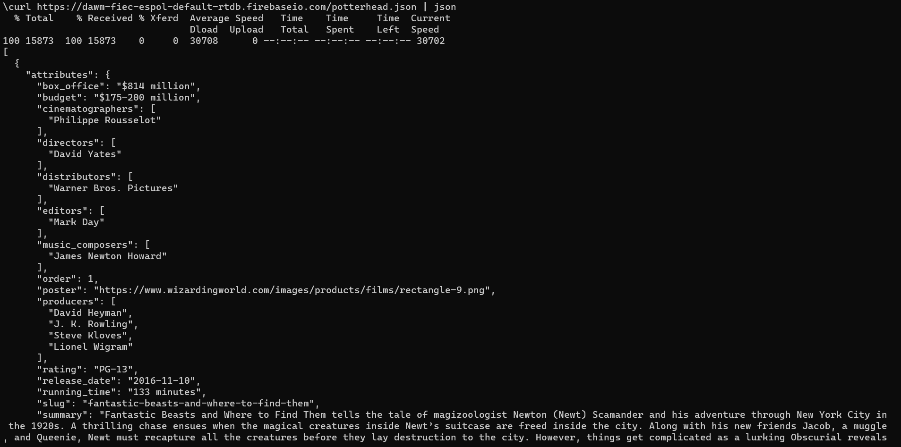
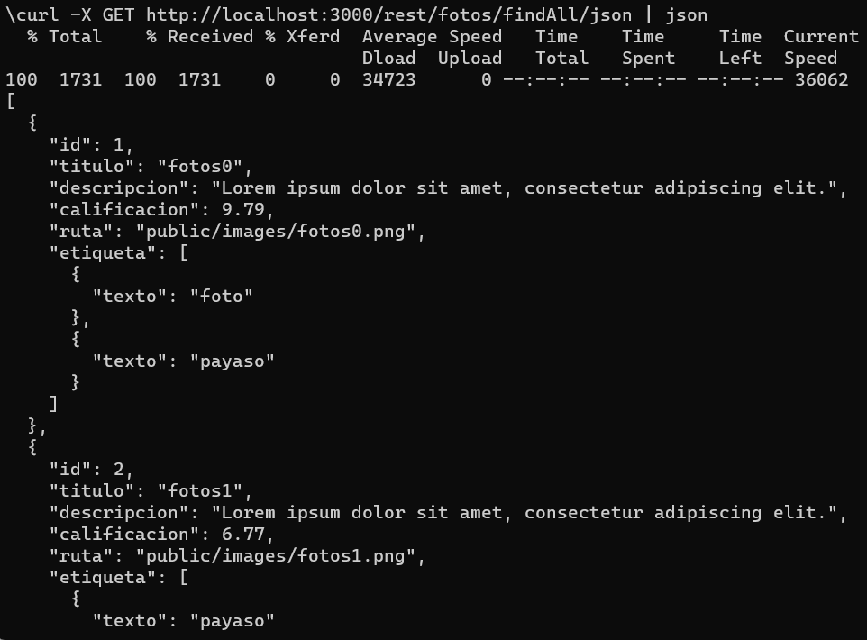
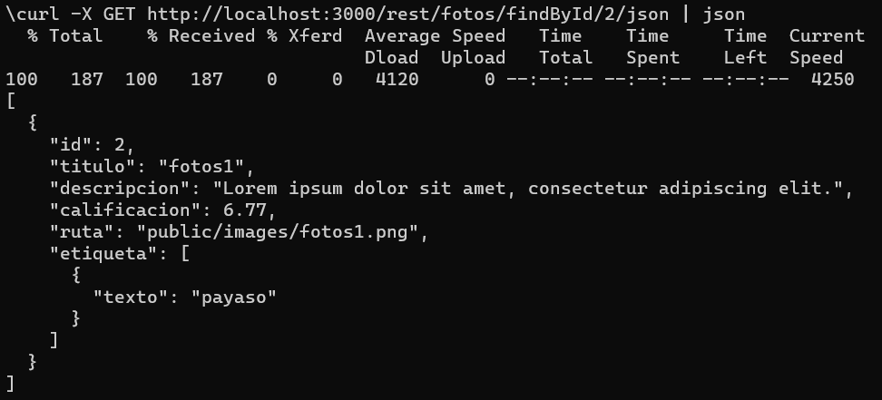
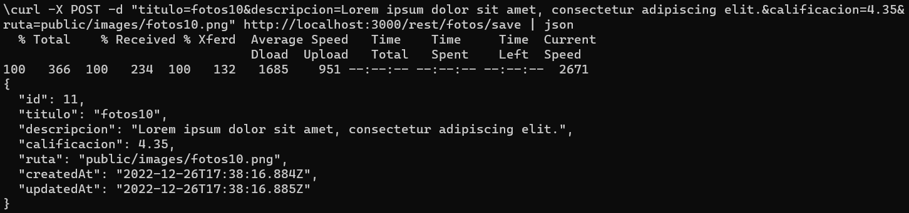
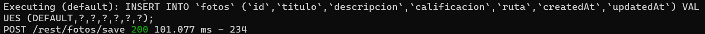
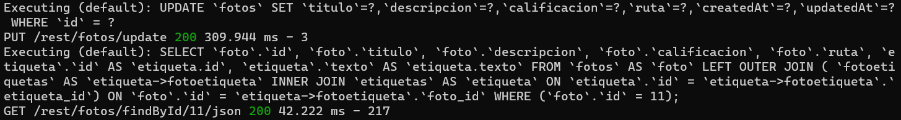
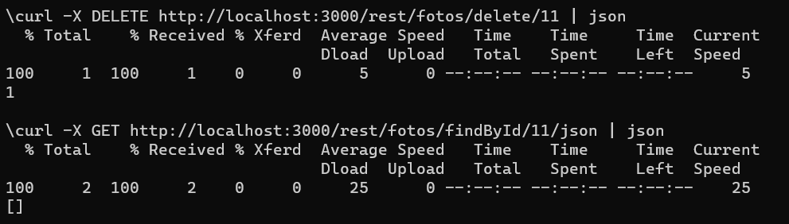

[Regresar](/DAWM/)

Express - REST
=====================================================

A lo largo de los años, existieron algunas interfaces de comunicación (API) populares entre ambas entidades. Sin embargo, el más popular se llama REST definido en 2000 por Roy Fielding. Es una arquitectura que aprovecha el protocolo HTTP para permitir la comunicación entre un cliente y una aplicación de servidor. Una aplicación de servidor que ofrece una API REST también se denomina servidor RESTful. Los servidores que no siguen la arquitectura REST al 100% se llaman RESTish en lugar de RESTful. A continuación, implementaremos dicha API REST para nuestra aplicación de servidor Express, pero primero conozcamos las herramientas que nos permiten interactuar con una API REST.


Proyecto en Express
===================

* * *

Utiliza el proyecto que desarrollaste con los tutoriales de [Express - Bases](https://dawfiec.github.io/DAWM/tutoriales/express_bases.html), [Express - Bootstrap](https://dawfiec.github.io/DAWM/tutoriales/express_bootstrap.html), [Express - Formularios](https://dawfiec.github.io/DAWM/tutoriales/express_forms.html), [Express - Layouts y Partials](https://dawfiec.github.io/DAWM/tutoriales/express_partials.html), [Express - ORM (Básico)](https://dawfiec.github.io/DAWM/tutoriales/express_ormbasico.html) y [Express - Parámetros de consulta y Parámetros de ruta](https://dawfiec.github.io/DAWM/tutoriales/express_pcpr.html).

* Instala las dependencias, con: `npm install`
* Verifica que funcione correctamente al levantar los servicios: `SET DEBUG=misitio:\* & npm start`

Curl + Jsontool
==============
* * *

* Instale el módulo `jsontool` de manera global, con: `npm i -g jsontool`
* Desde la línea de comandos, realice una petición con **cURL**, con: 

`curl https://dataserverdawm.herokuapp.com/anuncios/json | json`

Que resulta en:

<p align="center">
  
</p>

Entidad: Cliente 
================
* * *

* La entidad **Cliente** tiene los atributos `nombres:string`,`apellidos:string`,`fechanacimiento:date` y `rating:integer`
  + Cree el **modelo**
  + Ejecute las **migraciones**
  + Complete y ejecute el **generador** para llenar la tabla de la base de datos

GET-All
=======
* * *

Para obtener TODOS los registros de una entidad en una base de datos relacional, implemente el controlador para el verbo **GET** con el método **findAll** de la clase.

* Use el ruteador **routes/api**
  + Cree el método GET de la subruta **`/clientes`** que retorna un json con todos los clientes.

  ```
  router.get('/clientes', function(req, res, next) {
    Cliente.findAll({})  
    .then(clientes => {  
        res.json(clientes);  
    })  
    .catch(error => res.status(400).send(error))
  });
  ```

* Compruebe el funcionamiento del servidor, con: **npm run devstart**
  + En la línea de comandos del cliente, realice una petición GET al URL `http://localhost:3000/api/clientes`

  `curl -X GET http://localhost:3000/api/clientes | json` 

<p align="center">
  
</p>

  + En la línea de comandos del servidor del proyecto de Express aparece la petición:

<p align="center">
  
</p>


GET-id
=======
* * *

Para obtener UN registro de una entidad en una base de datos relacional, implemente el controlador para el verbo **GET** con el método **findOne** de la clase.

* Use el ruteador **routes/api**
  + Cree el método GET de la subruta **`/clientes/:id`** que retorna un json del cliente dado el id.

  ```
  router.get('/clientes/:id', function(req, res, next) {
    Cliente.findOne({
      where: { 
        id: parseInt(req.params.id)
      }
    })
    .then(cliente => {  
        res.json( cliente );  
    })  
    .catch(error => res.status(400).send(error))
  });
  ```

* Compruebe el funcionamiento del servidor, con: **npm run devstart**
  + En la línea de comandos del cliente, realice una petición GET al URL `http://localhost:3000/api/clientes/3` 

  `curl -X GET http://localhost:3000/api/clientes/3 | json`

<p align="center">
  
</p>

  + En la línea de comandos del servidor del proyecto de Express aparece la petición:

<p align="center">
  
</p>


POST
====
* * *

Para guardar UN registro de una entidad en una base de datos relacional, implemente el controlador para el verbo **POST** con el método **create** de la clase.

* Use el ruteador **routes/api**
  + Cree el método POST de la subruta **`/clientes`** que recibe los datos de un cliente en el cuerpo del requerimiento y guarda los datos en la base de datos relacional.

  ```
  router.post('/clientes', (req, res, next) => {
    Cliente.create({
      nombres: req.body.nombres,
      apellidos: req.body.apellidos,
      rating: parseInt(req.body.rating),
      fechanacimiento: new Date(req.body.fechanacimiento),  
      createdAt: new Date(),  
      updatedAt: new Date()  
    })
    .then(cliente => {
      res.send(cliente);
    })
    .catch(error => res.status(400).send(error))
  })
  ```

  * Compruebe el funcionamiento del servidor, con: **npm run devstart**
    + En la línea de comandos del cliente, realice una petición POST al URL `http://localhost:3000/api/clientes` con los siguientes parámetros en el **body**:

    `curl -X POST -d "nombres=Juan&apellidos=Perez&rating=5&fechanacimiento=08/22/1998" http://localhost:3000/api/clientes | json`

<p align="center">
  
</p>

  + En la línea de comandos del servidor del proyecto de Express aparece la petición:

<p align="center">
  
</p>

PUT 
===
* * *

Para actualizar UN registro de una entidad en una base de datos relacional, implemente el controlador para el verbo **PUT** con el método **update** de la clase.

* Use el ruteador **routes/api**
  + Cree el método PUT de la subruta **`/clientes`** que recibe los datos de un cliente en el cuerpo del requerimiento y guarda los datos en la base de datos relacional de acuerdo con el identificador original.

  ```
  router.put('/clientes', (req, res, next) => {
    Cliente.update({
      nombres: req.body.nombres,
      apellidos: req.body.apellidos,
      rating: parseInt(req.body.rating),
      fechanacimiento: new Date(req.body.fechanacimiento),  
      createdAt: new Date(),  
      updatedAt: new Date()  
    },
    {
      where: {
        id: req.body.id
      }
    })
    .then(respuesta => {
      res.send(respuesta);
    })
    .catch(error => res.status(400).send(error))
  })
  ```

  * Compruebe el funcionamiento del servidor, con: **npm run devstart**
    + En la línea de comandos del cliente, realice una petición PUT al URL `http://localhost:3000/api/clientes` con los siguientes parámetros en el **body**:

    `curl -X PUT -d "id=11&nombres=Marina&apellidos=Rosales&rating=9&fechanacimiento=04/22/2018" http://localhost:3000/api/clientes | json`

<p align="center">
  
</p>

  + En la línea de comandos del servidor del proyecto de Express aparece la petición:

<p align="center">
  
</p>

DELETE
======
* * *

Para eliminar UN registro de una entidad en una base de datos relacional, implemente el controlador para el verbo **DELETE** con el método **destroy** de la clase.

* Use el ruteador **routes/api**
  + Cree el método DELETE de la subruta **`/clientes/:id`** que retorna el cliente dado el id.

  ```
  router.delete('/clientes/:id', function(req, res, next) {
    Cliente.destroy({
      where: { 
        id: parseInt(req.params.id)
      }
    })
    .then(resultado => {  
        res.json( resultado );  
    })  
    .catch(error => res.status(400).send(error))
  });
  ```

  * Compruebe el funcionamiento del servidor, con: **npm run devstart**
    + En la línea de comandos del cliente, realice una petición DELETE al URL `http://localhost:3000/api/clientes/3` con los siguientes parámetros en el **body**:

    `curl -X DELETE http://localhost:3000/api/clientes/3 | json`

<p align="center">
  
</p>

  + En la línea de comandos del servidor del proyecto de Express aparece la petición:

<p align="center">
  
</p>


Referencias 
===========

* * *

* Terminal, F. (2011). Formatting cURL Output in the Windows Terminal. Retrieved 11 August 2022, from https://superuser.com/questions/275229/formatting-curl-output-in-the-windows-terminal
* Wieruch, R. (2020). How to create a REST API with Express.js in Node.js. Retrieved 10 August 2022, from https://www.robinwieruch.de/node-express-server-rest-api/
* Node.js Rest APIs example with Express, Sequelize & MySQL - BezKoder. (2020). Retrieved 14 August 2022, from https://www.bezkoder.com/node-js-express-sequelize-mysql/