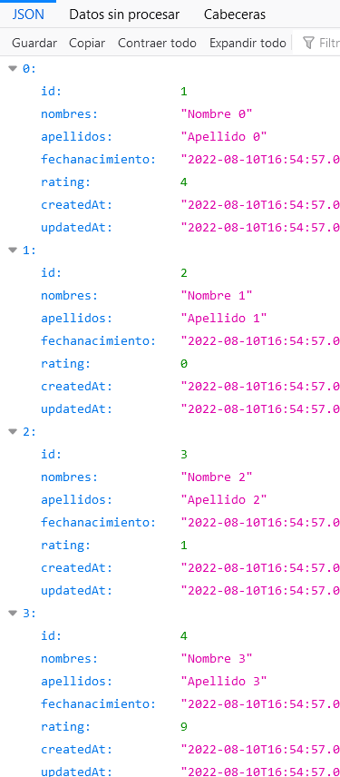
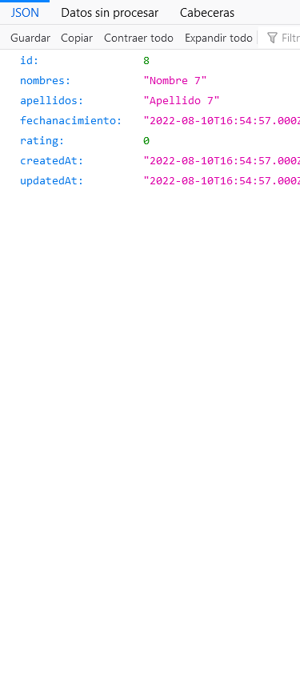

[Regresar](/DAWM-2022/)

Express - REST
=====================================================

A lo largo de los años, existieron algunas interfaces de comunicación (API) populares entre ambas entidades. Sin embargo, el más popular se llama REST definido en 2000 por Roy Fielding. Es una arquitectura que aprovecha el protocolo HTTP para permitir la comunicación entre un cliente y una aplicación de servidor. Una aplicación de servidor que ofrece una API REST también se denomina servidor RESTful. Los servidores que no siguen la arquitectura REST al 100% se llaman RESTish en lugar de RESTful. A continuación, implementaremos dicha API REST para nuestra aplicación de servidor Express, pero primero conozcamos las herramientas que nos permiten interactuar con una API REST.

Proyecto en Express
===================

* * *

Utiliza el proyecto que desarrollaste con los tutoriales de [Express - Bases](https://dawfiec.github.io/DAWM-2022/tutoriales/express_bases.html), [Express - Bootstrap](https://dawfiec.github.io/DAWM-2022/tutoriales/express_bootstrap.html), [Express - Formularios](https://dawfiec.github.io/DAWM-2022/tutoriales/express_forms.html), [Express - Layouts y Partials](https://dawfiec.github.io/DAWM-2022/tutoriales/express_partials.html), [Express - ORM (Básico)](https://dawfiec.github.io/DAWM-2022/tutoriales/express_ormbasico.html) y [Express - Parámetros de consulta y Parámetros de ruta](https://dawfiec.github.io/DAWM-2022/tutoriales/express_pcpr.html).

* Instala las dependencias, con: `npm install`
* Verifica que funcione correctamente al levantar los servicios: `SET DEBUG=misitio:\* & npm start`

Cliente 
=======
* * *

* La entidad **Cliente** tiene los atributos `nombres:string`,`apellidos:string`,`fechanacimiento:date` y `rating:integer`
  + Cree el **modelo**
  + Ejecute las **migraciones**
  + Complete y ejecute el **generador** para llenar la tabla

Get-All y Get-Id
================
* * *

* Use el ruteador **routes/api**
  + Cree el método GET de la subruta **`/cliente`** que retorna un json con todos los clientes.
  + Cree el método GET de la subruta **`/cliente/:id`** que retorna un json del cliente dado el id.

* Compruebe el funcionamiento del servidor, con: **npm run devstart**
* Acceda al URL `http://localhost:3000/api/clientes` y `http://localhost:3000/api/clientes/8` 

  
  

Referencias 
===========

* * *

* Wieruch, R. (2020). How to create a REST API with Express.js in Node.js. Retrieved 10 August 2022, from https://www.robinwieruch.de/node-express-server-rest-api/