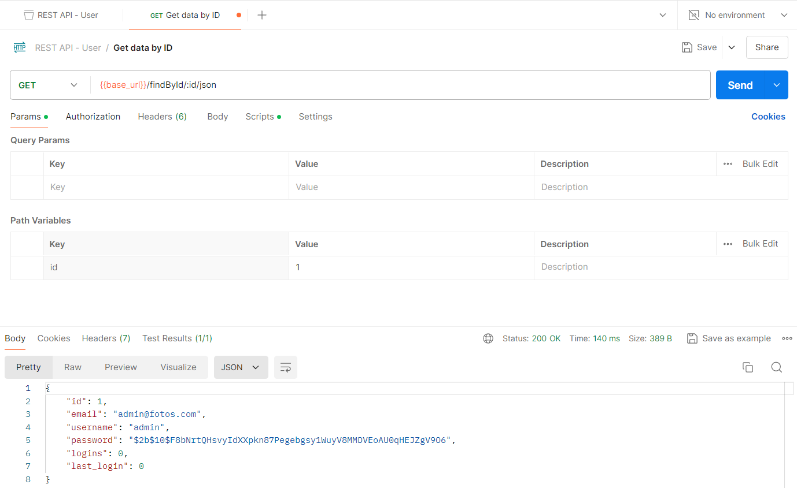
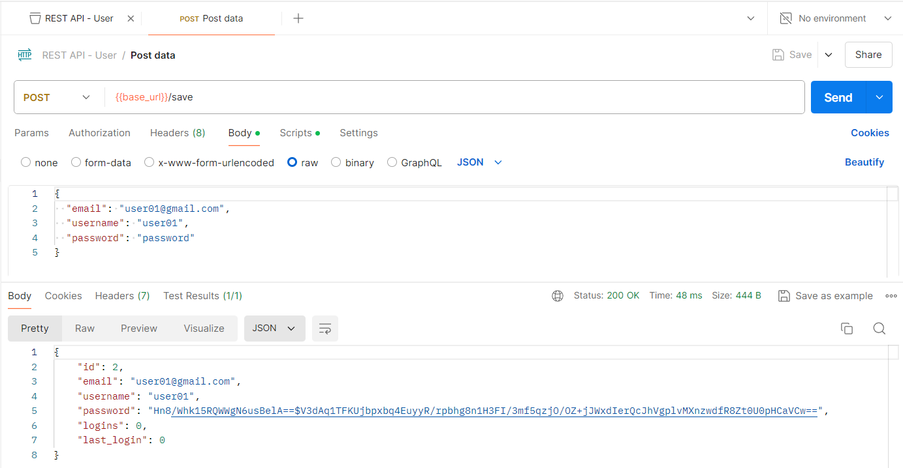
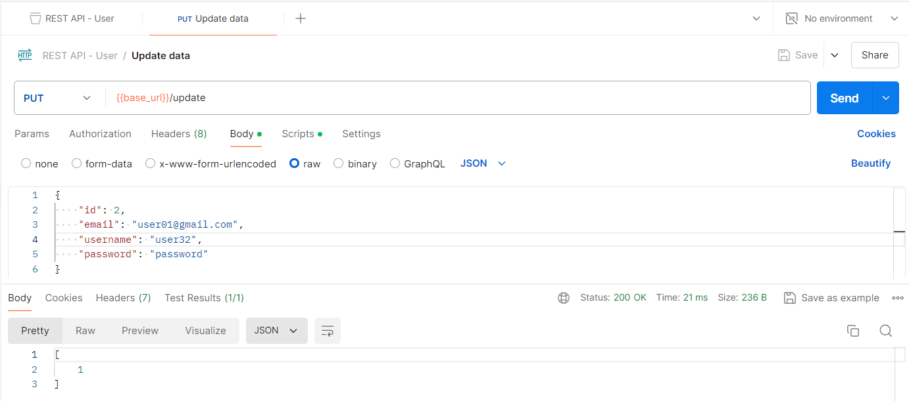

[Regresar](/DAWM/)

Express - REST II
=====================================================

A lo largo de los años, existieron algunas interfaces de comunicación (API) populares entre cliente y servidor. Sin embargo, el más popular se llama REST definido en 2000 por Roy Fielding. Es una arquitectura que aprovecha el protocolo HTTP para permitir la comunicación entre un cliente y una aplicación de servidor. Una aplicación de servidor que ofrece una API REST también se denomina servidor RESTful. Los servidores que no siguen la arquitectura REST al 100% se llaman RESTish en lugar de RESTful. A continuación, implementaremos dicha API REST para nuestra aplicación de servidor Express, pero primero conozcamos las herramientas que nos permiten interactuar con una API REST.

Software a utilizar
===================
* * *

De [MySQL Community Downloads](https://dev.mysql.com/downloads/), descargue e instale:
* Motor de base de datos: [MySQL Community Server](https://dev.mysql.com/downloads/mysql/)
* Interfaz gráfica: [MySQL Workbench](https://dev.mysql.com/downloads/workbench/)


## Manejador de rutas y registro en la aplicación

Modifique el manejador de rutas **rest/users.js**.

* Incluya los objetos `Sequelize` y `Op` del módulo **sequelize** y el modelo `Users` 

```
var express = require('express');
var router = express.Router();

const { Sequelize, Op } = require('sequelize');
const Users = require('../models').users;
...
```

### GET-All

Para obtener TODOS los registros de una entidad en una base de datos relacional, implemente el controlador para el verbo **GET** con y el requerimiento al método **findAll** del modelo.

* Cree el controlador para el verbo GET de la ruta **`/findAll/json`** que retorna un json con todos los fotos.

  ```
  /* GET users listing. */
  router.get('/', function(req, res, next) {
    Users.findAll({  
    })  
    .then(users => {  
        res.json(users);  
    })  
    .catch(error => res.status(400).send(error)) 
  });
  ...
  ```

* Reinicie el servidor para comprobar el funcionamiento del controlador.

  + En postman, realice una petición GET al URL `http://localhost:3000/users`

<p align="center">
  
</p>


### GET-id

Para obtener UN registro de una entidad en una base de datos relacional, implemente el controlador para el verbo **GET** y el requerimiento al método **findOne** del modelo.

* Cree el controlador para el verbo GET de la ruta **`/findAll/:id/json`** que retorna un json dado el id de un foto.

  ```
  /* GET user by id. */
  router.get('/findById/:id/json', function(req, res, next) {  

    let id = parseInt(req.params.id);

    Users.findOne({  
        where: { 
          [Op.and]: [
            {id: id}
          ]
        }
    })  
    .then(users => {  
        res.json(users);  
    })  
    .catch(error => res.status(400).send(error)) 
  });
  ```

* Reinicie el servidor para comprobar el funcionamiento del controlador.

  + En postman, realice una petición GET al URL `http://localhost:3000/users/findById/1/json`

<p align="center">
  
</p>


### POST

Para guardar UN registro de una entidad en una base de datos relacional, implemente el controlador para el verbo **POST** y el requerimineto al método **create** del modelo.

* Cree el controlador para el verbo POST de la ruta **`/save`** que recibe los datos de un foto en el cuerpo del requerimiento y guarda los datos en la base de datos relacional.

  ```
  /* POST user. */
  router.post('/save', function(req, res, next) {  

      let {email, username, password} = req.body;
        
      Users.create({
        email: email,
        username: username,
        password: password,
        logins: 0,
        last_login: 0
      })
      .then(users => {  
        res.json(users);  
    })  
    .catch(error => res.status(400).send(error)) 
  });
  ```

  * Reinicie el servidor para comprobar el funcionamiento del controlador.

  + En postman, realice una petición POST al URL `http://localhost:3000/users/save` y envíe los datos en el cuerpo de la petición 

  ```typescript
  {
    "email": "user01@gmail.com",
    "username": "user01",
    "password": "password"
  }
  ```

<p align="center">
  
</p>


### PUT 

Para actualizar UN registro de una entidad en una base de datos relacional, implemente el controlador para el verbo **PUT** y el requerimineto al método **update** del modelo.

* Cree el controlador para el verbo PUT de la ruta **`/update`** que recibe los datos de una foto en el cuerpo del requerimiento y guarda los datos en la base de datos relacional de acuerdo con el identificador original.

  ```
  /* PUT user. */
  router.put('/update', function(req, res, next) {  

      let {id, email, username, password} = req.body;
        
      Users.update({
        email: email,
        username: username,
        password: password,
        logins: 0,
        last_login: 0
      },
      {
          where: {
            id: parseInt(id)
          }
      })
      .then(users => {  
        res.json(users);  
    })  
    .catch(error => res.status(400).send(error)) 
  });
  ```

  * Reinicie el servidor para comprobar el funcionamiento del controlador.

  + En postman, realice una petición PUT al URL `http://localhost:3000/users/update` y envíe los datos en el cuerpo de la petición 

  ```typescript
  {
      "id": 2,
      "email": "user01@gmail.com",
      "username": "user3",
      "password": "password"
  }
  ```

<p align="center">
  
</p>

### DELETE

Para eliminar UN registro de una entidad en una base de datos relacional, implemente el controlador para el verbo **DELETE** y el requerimineto al método **destroy** del modelo.

* Cree el controlador para el verbo DELETE de la ruta **`/delete/:id`** que recibe el id de una foto en el cuerpo del requerimiento y elimina el registro de la base de datos relacional.

  ```
  /* DELETE user. */
  router.delete('/delete/:id', function(req, res, next) {  

        let id = parseInt(req.params.id);
          
        Users.destroy({
          where: { 
            id: id
          }
        })
        .then(users => {  
        res.json(users);  
    })  
    .catch(error => res.status(400).send(error)) 
  });
  ```

  * Reinicie el servidor para comprobar el funcionamiento del controlador.

  + En postman, realice una petición DELETE al URL `http://localhost:3000/users/delete/2`

<p align="center">
  
</p>


Referencias 
===========

* * *

* Terminal, F. (2011). Formatting cURL Output in the Windows Terminal. Retrieved 11 August 2022, from https://superuser.com/questions/275229/formatting-curl-output-in-the-windows-terminal
* Wieruch, R. (2020). How to create a REST API with Express.js in Node.js. Retrieved 10 August 2022, from https://www.robinwieruch.de/node-express-server-rest-api/
* Node.js Rest APIs example with Express, Sequelize & MySQL - BezKoder. (2020). Retrieved 14 August 2022, from https://www.bezkoder.com/node-js-express-sequelize-mysql/
* -->QueryInterface, H. (2022). sequelize.QueryInterface.removeColumn JavaScript and Node.js code examples Tabnine. Retrieved 24 December 2022, from https://www.tabnine.com/code/javascript/functions/sequelize/QueryInterface/removeColumn
* -->QueryInterface, H. (2022). sequelize.QueryInterface.addColumn JavaScript and Node.js code examples Tabnine. Retrieved 24 December 2022, from https://www.tabnine.com/code/javascript/functions/sequelize/QueryInterface/addColumn
* orm, b., bagade, a., Panneerselvam, S., Grin, O., & OurBigBook.com, C. (2019). bulkUpdate in sequelize orm. Retrieved 24 December 2022, from https://stackoverflow.com/questions/54898994/bulkupdate-in-sequelize-orm
* S., McConnell, H., & McConnell, H. (2020). Sequelize many-to-many M:N relationship not functioning. Error: 'SequelizeEagerLoadingError:${model1} is not associated to ${model2}'. Retrieved 24 December 2022, from https://stackoverflow.com/questions/64790882/sequelize-many-to-many-mn-relationship-not-functioning-error-sequelizeeagerl
* expected, O., & Vidal, L. (2021). One To Many relationship using Sequelize creates more foreign keys than expected. Retrieved 24 December 2022, from https://stackoverflow.com/questions/66696143/one-to-many-relationship-using-sequelize-creates-more-foreign-keys-than-expected