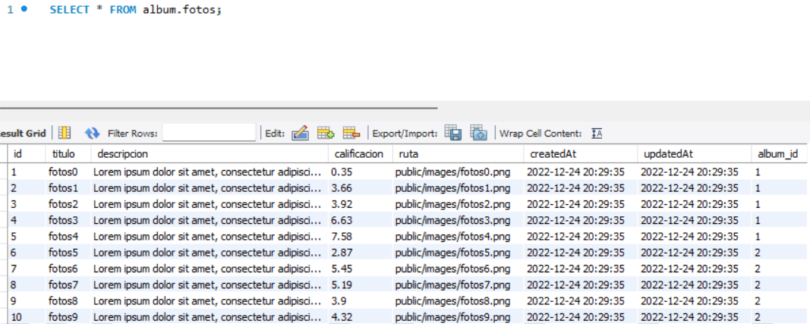

[Regresar](/DAWM/)

Express - REST
=====================================================

A lo largo de los años, existieron algunas interfaces de comunicación (API) populares entre cliente y servidor. Sin embargo, el más popular se llama REST definido en 2000 por Roy Fielding. Es una arquitectura que aprovecha el protocolo HTTP para permitir la comunicación entre un cliente y una aplicación de servidor. Una aplicación de servidor que ofrece una API REST también se denomina servidor RESTful. Los servidores que no siguen la arquitectura REST al 100% se llaman RESTish en lugar de RESTful. A continuación, implementaremos dicha API REST para nuestra aplicación de servidor Express, pero primero conozcamos las herramientas que nos permiten interactuar con una API REST.

Software a utilizar
===================
* * *

De [MySQL Community Downloads](https://dev.mysql.com/downloads/), descargue e instale:
* Motor de base de datos: [MySQL Community Server](https://dev.mysql.com/downloads/mysql/)
* Interfaz gráfica: [MySQL Workbench](https://dev.mysql.com/downloads/workbench/)

Proyecto en Express
===================

* * *

Crea un nuevo proyecto, según [Express - Bases](https://dawfiec.github.io/DAWM/tutoriales/express_bases.html), [Express - ORM (Básico)](https://dawfiec.github.io/DAWM/tutoriales/express_ormbasico.html), [Express - ORM (Intermedio)](https://dawfiec.github.io/DAWM/tutoriales/express_ormintermedio.html) y [Express - Parámetros de consulta y Parámetros de ruta](https://dawfiec.github.io/DAWM/tutoriales/express_pcpr.html).

* O, Clone el proyecto con las [aplicaciones del curso](https://github.com/DAWFIEC/DAWM-apps) para la aplicación **album/api**
    - Para el hito: **`hito6-api`**


Curl + Jsontool
==============
* * *

* Instale el módulo `jsontool` de manera global, con: `npm i -g jsontool`
* Desde la línea de comandos, realice una petición con **cURL**, con: 

`curl https://dawm-fiec-espol-default-rtdb.firebaseio.com/photos.json | json`

Que resulta en:

<p align="center">
  
</p>

Relación 1:M (Album-Foto)
================
* * *

* Tome como referencia las instrucciones los tutoriales [Express - ORM (Básico)](https://dawfiec.github.io/DAWM/tutoriales/express_ormbasico.html) y [Express - ORM (Intermedio)](https://dawfiec.github.io/DAWM/tutoriales/express_ormintermedio.html), o [Apuntes](https://dawfiec.github.io/DAWM/paginas/apuntes.html), para:

  + **Modelo:** Cree el modelo _album_ con los atributos `titulo:string` y `calificacion:float`.
    - Modifique el modelo `models/album`, agregue la clave **tableName** y el nombre de la tabla `albumes` a la cual estará relacionado
  + **Migración:** _Creación de la tabla_ 
    - Modifique la migración `migrations/YYYYMMDDHHMMSS-create-album` para que el nombre de la tabla sea `albumes`
  + **Migración:** _Modificación de la tabla:_ 
    - Cree una nueva migración para registrar la asociación
    - Modifique la migración `migrations/YYYYMMDDHHMMSS-associate-album-foto`, agregue en la función de ejecución de cambios **up**
    ```
    ...
    await queryInterface.addColumn('fotos', 'album_id', { type: Sequelize.INTEGER, allowNull: true });
    await queryInterface.addConstraint('fotos', {
      fields: ['album_id'],
      type: 'foreign key',
      name: 'album_foto_id_fk',
      references: {
       table: 'albumes',
       field: 'id'
      },
      onCascade: 'set null',
      onDelete: 'set null'
    });
    ...
    ```
    - Método **down**

    ```
    ...
    await queryInterface.removeColumn('fotos', 'album_id')
    ...
    ```
    - Ejecute la migración y revise los cambios en la base de datos.

<p align="center">
  
</p>
  
  + **Generador:** Cree el generador de datos para el modelo `album`
    - En la función de ejecución de cambios **up**, agregue:

    ```
    ...
    await queryInterface.bulkInsert('albumes', [{  titulo: 'album1', calificacion: 5.6, createdAt: new Date(), updatedAt: new Date() }])
    await queryInterface.bulkInsert('albumes', [{  titulo: 'album2', calificacion: 2.7, createdAt: new Date(), updatedAt: new Date() }])  

    let [albumes, albumes_metadata] = await queryInterface.sequelize.query('SELECT id FROM albumes')
    let [fotos, fotos_metadata] = await queryInterface.sequelize.query('SELECT id FROM fotos')

    await queryInterface.bulkUpdate('fotos', { album_id: albumes[0].id });
    await queryInterface.bulkUpdate('fotos', { album_id: albumes[1].id }, 
      { 
        id: [ fotos[5].id, fotos[6].id, fotos[7].id, fotos[8].id, fotos[9].id   ] 
      });
    ...
    ```

    - En la función de reversión de cambios **down**, agregue:

    ```
    ...
    await queryInterface.bulkUpdate('fotos', { album_id: null });
    await queryInterface.bulkDelete('albumes', null, {});  
    ...
    ```

    - Ejecute el generador de datos y revise los cambios en la base de datos.

<p align="center">
  
</p>

  + **Asociación:** Entre los modelos `album -< foto`

    - Del modelo `models/foto.js`, modifique el método **associate** con la asociacion lógica al modelo `album` 

    <pre><code>
      ...
      static associate(models) {
        // define association here
        <b style="color:red">
        models.foto.belongsTo(models.album, { as: "foto_album" } );
        </b>
      }
      ...
    </code></pre>

    - Del modelo `models/album.js`, modifique el método **associate** con la asociacion lógica al modelo `foto` 

    <pre><code>
      ...
      static associate(models) {
        // define association here
        <b style="color:red">
        models.album.hasMany(models.foto, { as: "album_foto", foreignKey: "album_id" } );
        </b>
      }
      ...
    </code></pre>


Manejador de rutas y registro en la aplicación
==============================================
* * *  

* Cree el manejador de rutas **routes/album**.
* Registre la ruta **`'/album'`** en la aplicación para el controlador de rutas **routes/album**. 
* Incluya los módulos y modelos en el encabezado del manejador de rutas **routes/album**  

```
var express = require('express');
var router = express.Router();

const Sequelize = require('sequelize');
const Album = require('../models').album;
const Foto = require('../models').foto; 
...
```

GET-All
=======
* * *

Para obtener TODOS los registros de una entidad en una base de datos relacional, implemente el controlador para el verbo **GET** con el método **findAll** de la clase.

* Cree el controlador para el verbo GET de la ruta **`/findAll/json`** que retorna un json con todos los albumes.

  ```
  ...
  router.get('/findAll/json', function(req, res, next) {  
  
      Album.findAll({  
          attributes: { exclude: ["createdAt","updatedAt"] } ,
          include: [{
              model: Foto,
              as: 'album_foto',
              attributes: ['titulo']
            }], 
        })  
        .then(albumes => {  
          res.json(albumes);  
        })  
      .catch(error => res.status(400).send(error)) 

  });
  ...
  ```

* Compruebe el funcionamiento del servidor, con: **npm run devstart**
  + En la línea de comandos del cliente, realice una petición GET al URL `http://localhost:3000/album/findAll/json`

  `curl -X GET http://localhost:3000/album/findAll/json | json` 

<p align="center">
  
</p>

  + En la línea de comandos del servidor del proyecto de Express aparece la petición:

<p align="center">
  
</p>


GET-id
=======
* * *

Para obtener UN registro de una entidad en una base de datos relacional, implemente el controlador para el verbo **GET** con el método **findOne** de la clase.

* Cree el controlador para el verbo GET de la ruta **`/findAll/:id/json`** que retorna un json dado el id de un album.

  ```
  router.get('/findById/:id/json', function(req, res, next) {  
  
      let id = parseInt(req.params.id)

      Album.findOne({  
          attributes: { exclude: ["createdAt","updatedAt"] } ,
          include: [{
              model: Foto,
              as: 'album_foto',
              attributes: ['titulo']
            }], 
          where: { 
            id: id
          }
      })  
      .then(album => {  
          res.json(album);  
      })  
      .catch(error => res.status(400).send(error)) 

  });
  ```

* Compruebe el funcionamiento del servidor, con: **npm run devstart**
  + En la línea de comandos del cliente, realice una petición GET al URL `http://localhost:3000/album/findById/2/json` 

  `curl -X GET http://localhost:3000/album/findById/2/json | json`

<p align="center">
  
</p>

  + En la línea de comandos del servidor del proyecto de Express aparece la petición:

<p align="center">
  
</p>


POST
====
* * *

Para guardar UN registro de una entidad en una base de datos relacional, implemente el controlador para el verbo **POST** con el método **create** de la clase.

* Cree el controlador para el verbo POST de la ruta **`/save`** que recibe los datos de un album en el cuerpo del requerimiento y guarda los datos en la base de datos relacional.

  ```
  router.post('/save', function(req, res, next) {  

      let {titulo, calificacion} = req.body;
      
      Album.create({
        titulo: titulo,
        calificacion: parseFloat(calificacion),
        createdAt: new Date(),  
        updatedAt: new Date()  
      })
      .then(album => {
        res.json(album);
      })
      .catch(error => res.status(400).send(error))

  });
  ```

  * Compruebe el funcionamiento del servidor, con: **npm run devstart**
    + En la línea de comandos del cliente, realice una petición POST al URL `http://localhost:3000/album/save` con los siguientes parámetros en el **body**:

    `curl -X POST -d "titulo=album 3&calificacion=4.5" http://localhost:3000/album/save | json`

<p align="center">
  
</p>

  + En la línea de comandos del servidor del proyecto de Express aparece la petición:

<p align="center">
  
</p>

PUT 
===
* * *

Para actualizar UN registro de una entidad en una base de datos relacional, implemente el controlador para el verbo **PUT** con el método **update** de la clase.

* Cree el controlador para el verbo PUT de la ruta **`/update`** que recibe los datos de un album en el cuerpo del requerimiento y guarda los datos en la base de datos relacional de acuerdo con el identificador original.

  ```
  router.put('/update', function(req, res, next) {  

      let {id, titulo, calificacion} = req.body;
      
      Album.update({
        titulo: titulo,
        calificacion: parseFloat(calificacion),
        createdAt: new Date(),  
        updatedAt: new Date()  
      },
      {
          where: {
            id: parseInt(id)
          }
      })
      .then(respuesta => {
        res.json(respuesta);
      })
      .catch(error => res.status(400).send(error))

  });
  ```

  * Compruebe el funcionamiento del servidor, con: **npm run devstart**
    + En la línea de comandos del cliente, realice una petición PUT al URL `http://localhost:3000/album/update` con los siguientes parámetros en el **body**:

    `curl -X PUT -d "id=3&titulo=album3&calificacion=10.0" http://localhost:3000/album/update | json`

<p align="center">
  
</p>

  + En la línea de comandos del servidor del proyecto de Express aparece la petición:

<p align="center">
  
</p>

DELETE
======
* * *

Para eliminar UN registro de una entidad en una base de datos relacional, implemente el controlador para el verbo **DELETE** con el método **destroy** de la clase.

* Cree el controlador para el verbo DELETE de la ruta **`/delete/:id`** que recibe el id de un album en el cuerpo del requerimiento y elimina el registro de la base de datos relacional.

  ```
  ...
  router.delete('/delete/:id', function(req, res, next) {  

        let id = parseInt(req.params.id);
        
        Album.destroy({
          where: { 
            id: id
          }
        })
        .then(respuesta => {
          res.json(respuesta);
        })
        .catch(error => res.status(400).send(error))

  });
  ...
  ```

  * Compruebe el funcionamiento del servidor, con: **npm run devstart**
    + En la línea de comandos del cliente, realice una petición DELETE al URL `http://localhost:3000/album/delete/3` con los siguientes parámetros en el **body**:

    `curl -X DELETE http://localhost:3000/album/delete/3 | json`

<p align="center">
  
</p>

  + En la línea de comandos del servidor del proyecto de Express aparece la petición:

<p align="center">
  
</p>


Referencias 
===========

* * *

* Terminal, F. (2011). Formatting cURL Output in the Windows Terminal. Retrieved 11 August 2022, from https://superuser.com/questions/275229/formatting-curl-output-in-the-windows-terminal
* Wieruch, R. (2020). How to create a REST API with Express.js in Node.js. Retrieved 10 August 2022, from https://www.robinwieruch.de/node-express-server-rest-api/
* Node.js Rest APIs example with Express, Sequelize & MySQL - BezKoder. (2020). Retrieved 14 August 2022, from https://www.bezkoder.com/node-js-express-sequelize-mysql/
* -->QueryInterface, H. (2022). sequelize.QueryInterface.removeColumn JavaScript and Node.js code examples Tabnine. Retrieved 24 December 2022, from https://www.tabnine.com/code/javascript/functions/sequelize/QueryInterface/removeColumn
* -->QueryInterface, H. (2022). sequelize.QueryInterface.addColumn JavaScript and Node.js code examples Tabnine. Retrieved 24 December 2022, from https://www.tabnine.com/code/javascript/functions/sequelize/QueryInterface/addColumn
* orm, b., bagade, a., Panneerselvam, S., Grin, O., & OurBigBook.com, C. (2019). bulkUpdate in sequelize orm. Retrieved 24 December 2022, from https://stackoverflow.com/questions/54898994/bulkupdate-in-sequelize-orm
* S., McConnell, H., & McConnell, H. (2020). Sequelize many-to-many M:N relationship not functioning. Error: 'SequelizeEagerLoadingError:${model1} is not associated to ${model2}'. Retrieved 24 December 2022, from https://stackoverflow.com/questions/64790882/sequelize-many-to-many-mn-relationship-not-functioning-error-sequelizeeagerl
* expected, O., & Vidal, L. (2021). One To Many relationship using Sequelize creates more foreign keys than expected. Retrieved 24 December 2022, from https://stackoverflow.com/questions/66696143/one-to-many-relationship-using-sequelize-creates-more-foreign-keys-than-expected