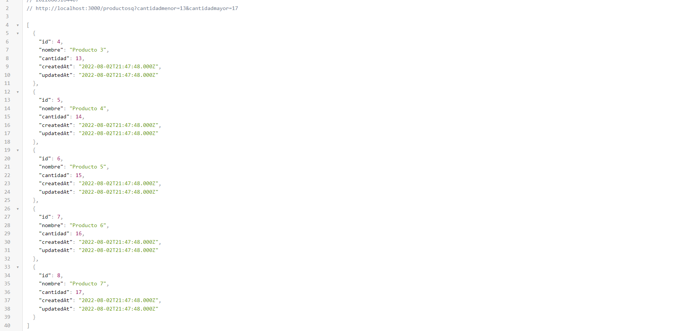
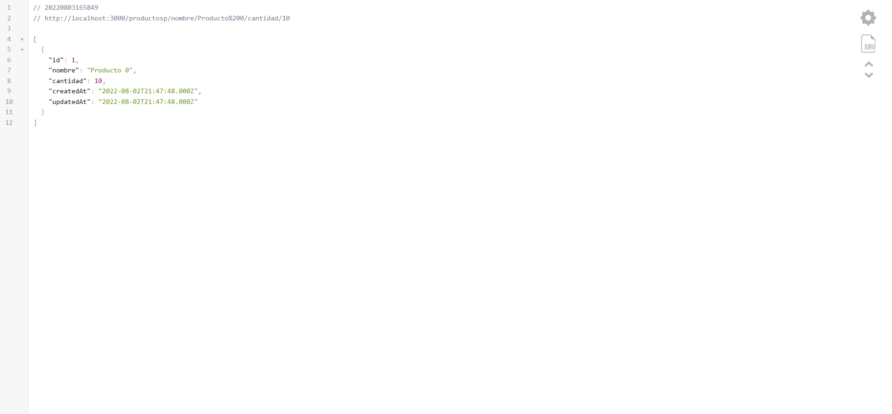

[Regresar](/DAWM-2022/)

Express - Parámetros de consulta y Parámetros de ruta
=====================================================

Express.js ofrece dos mecanismos para proveer de datos al servidor para el filtrado de datos: parámetros y cadena de consultas

Proyecto en Express
===================

* * *

Utiliza el proyecto que desarrollaste con el tutorial de [Express - Bases](https://dawfiec.github.io/DAWM-2022/tutoriales/express_bases.html), [Express - Bootstrap](https://dawfiec.github.io/DAWM-2022/tutoriales/express_bootstrap.html), [Express - Formularios](https://dawfiec.github.io/DAWM-2022/tutoriales/express_forms.html), [Express - Layouts y Partials](https://dawfiec.github.io/DAWM-2022/tutoriales/express_partials.html) y [Express - ORM (Básico)](https://dawfiec.github.io/DAWM-2022/tutoriales/express_ormbasico.html).

* Instala las dependencias, con: `npm install`
* Verifica que funcione correctamente al levantar los servicios: `SET DEBUG=misitio:\* & npm start`

Parámetros de consulta (Query String)
=====================================
* * *

Una cadena de consulta es parte de una URL después del signo de interrogación (?). Sirve para enviar datos al servidor, que se utilizarán como filtros para la respuesta.

* En el ruteador **`routes/index.js`**
  + Cambie el import para usar el operador **Op**, .

  <pre><code>
  const Sequelize = require('sequelize');
  </code></pre>

  por

  <pre><code>
  <b style="color:red">const { Sequelize, Op } = require('sequelize');</b>
  </code></pre>

  + Agregue el controlador para el método **`GET`** con la subruta **`/productosq`**
  + Obtenga los parámetros **`cantidadmenor`** y **`cantidadmayor`**, con:

  <pre><code>
  	...
  	let cantidadmenor = parseInt(req.query.cantidadmenor);
  	let cantidadmayor = parseInt(req.query.cantidadmayor);
  	...
  </code></pre>

  + Agregue el _query_ a los productos, con:

  <pre><code>
   ...
   Producto.findAll({
	    where: { 
	      cantidad: { 
	    	    [Op.between]: [cantidadmenor, cantidadmayor]
	      }
	    }
	  })
	  .then(productos => {  
	      res.json( productos );  
	  })  
	  .catch(error => res.status(400).send(error))
   ...
  </code></pre>

* Compruebe el funcionamiento del servidor, con: **npm run devstart**
* Acceda al URL `http://localhost:3000/productosq?cantidadmenor=13&cantidadmayor=17` 

  

* Compruebe su funcionamiento con otros valores

Parámetros de Consulta
======================
* * *

Otra forma para pasar datos al servidor, es colocar información dentro de la ruta URL real. A este mecanismo se denomina parámetros de ruta en Express. 

* En el ruteador **`routes/index.js`**
  + Agregue el controlador para el método **`GET`** con la subruta **`/productosp/nombre/:nombre/cantidad/:cantidad`**
  + Obtenga los parámetros **`cantidadmenor`** y **`cantidadmayor`**, con:

  <pre><code>
  	...
  	let cantidadmenor = parseInt(req.query.cantidadmenor);
  	let cantidadmayor = parseInt(req.query.cantidadmayor);
  	...
  </code></pre>

  + Agregue el _query_ a los productos, con:

  <pre><code>
   ...
   Producto.findAll({
	    where: { 
	      cantidad: { 
	    	    [Op.between]: [cantidadmenor, cantidadmayor]
	      }
	    }
	  })
	  .then(productos => {  
	      res.json( productos );  
	  })  
	  .catch(error => res.status(400).send(error))
   ...
  </code></pre>

* Compruebe el funcionamiento del servidor, con: **npm run devstart**
* Acceda al URL `http://localhost:3000/productosp/nombre/Producto%200/cantidad/10` 

  

* Compruebe su funcionamiento con otros valores

Referencias 
===========

* * *

* ᐉ Obtener cadenas de consulta y parámetros en Express.js Pharos. (2021). Retrieved 1 August 2022, from https://pharos.sh/obtener-cadenas-de-consulta-y-parametros-en-express-js/
* Query vs. URL Parameters in Express.js. (2020). Retrieved 1 August 2022, from https://javascript.plainenglish.io/query-strings-url-parameters-d1a35b9a694f
* Get Query Strings and Parameters in Express.js. (2017). Retrieved 1 August 2022, from https://stackabuse.com/get-query-strings-and-parameters-in-express-js/
* Concepts, C., & Finders, M. (2022). Model Querying - Finders Sequelize. Retrieved 3 August 2022, from https://sequelize.org/docs/v6/core-concepts/model-querying-finders/