[Regresar](/DAWM/)

Firebase - Firestore
====================

* * *

* Obtenga una cuenta en la [consola de Firebase](https://console.firebase.google.com/)

  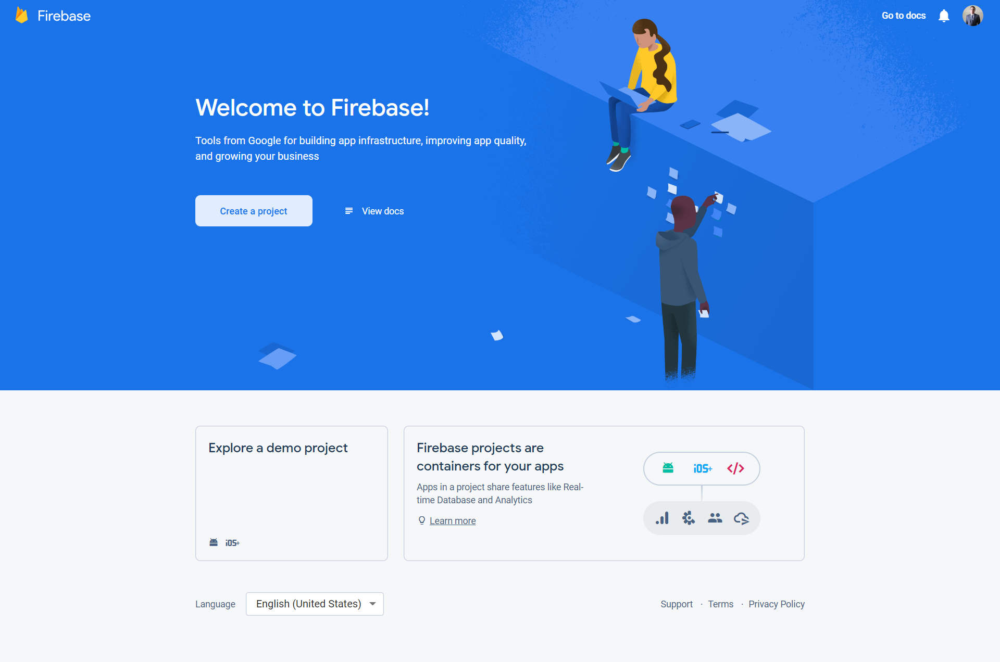

* Cree un proyecto para Firebase

  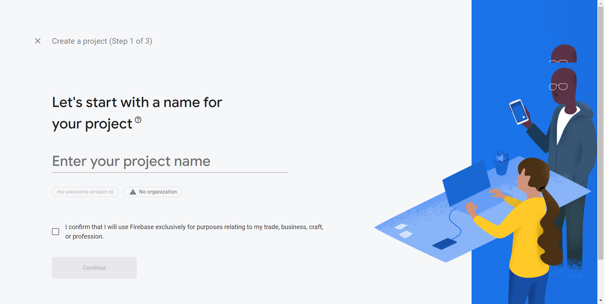
  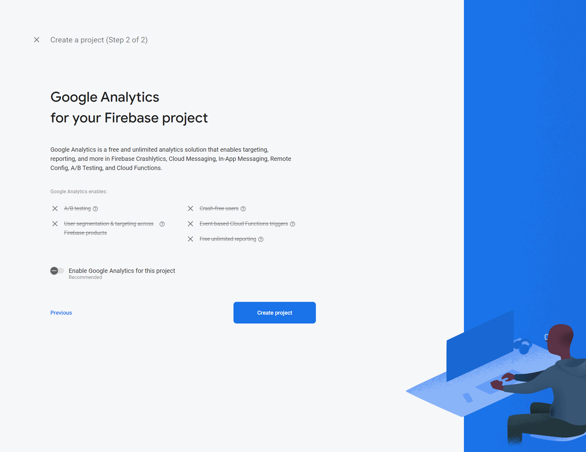
  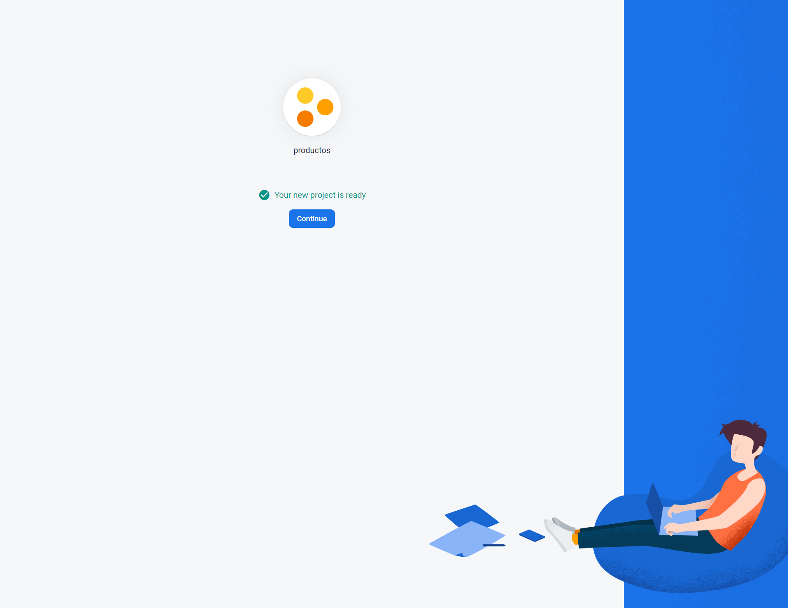

* Acceda a la opción **Firestore Database** a través de la opción **`Build > Firestore Database`** para **Create Database**

  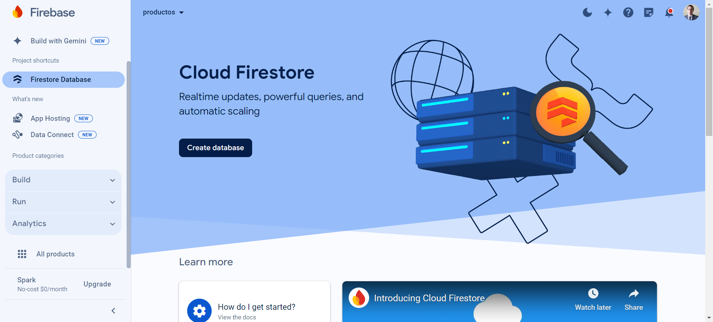

  + Durante el proceso de creación de la base de datos no relacional, habilite el _test mode_. 

  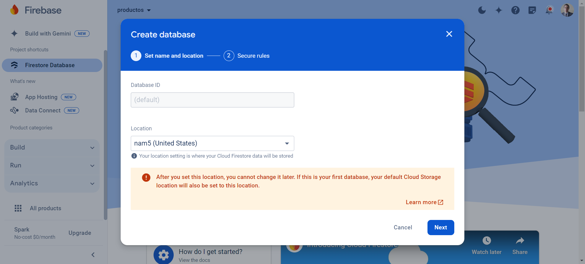
  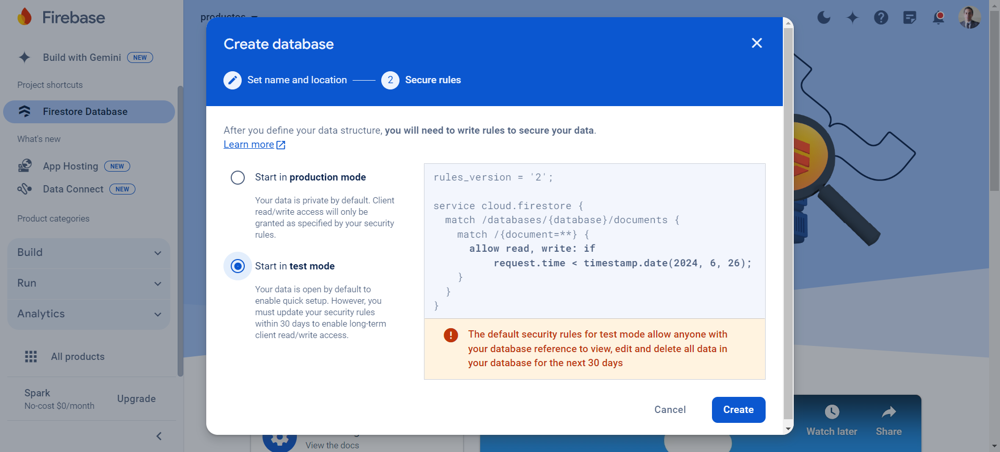

 

## Acceso mediante el SDK

* Desde la interfaz de Firebase, acceda a **Descripción general** > **Configuración del proyecto** 

  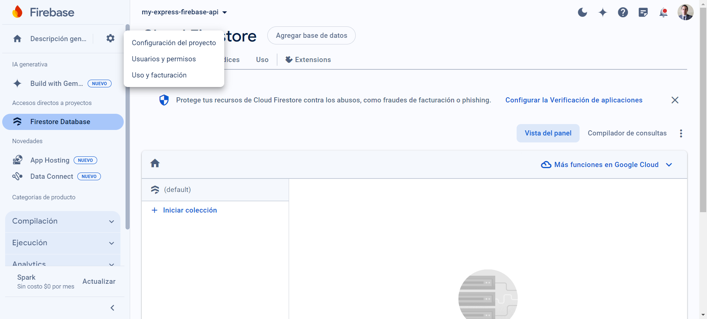

 

* Selecciona **General** y selecciona **Web App**. 

  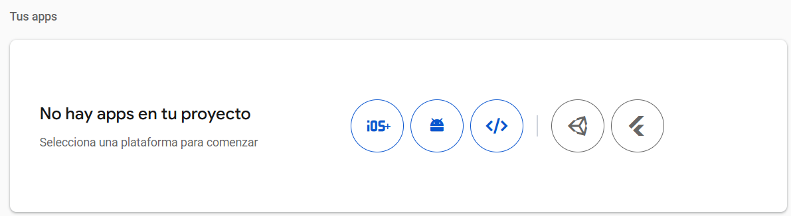

* Registra el nombre de la web app. 

  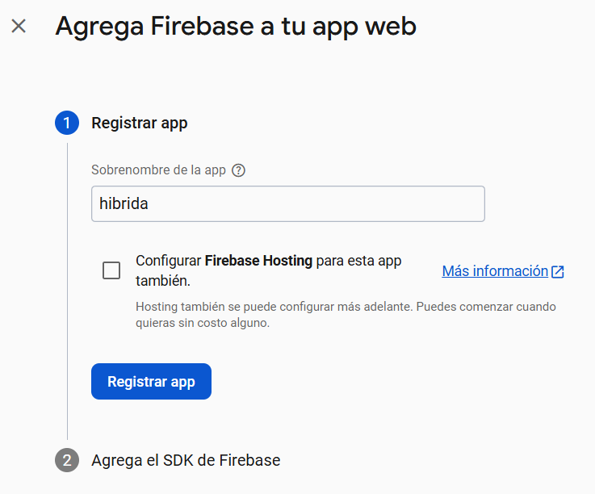

* Copie el JSON de configuración

  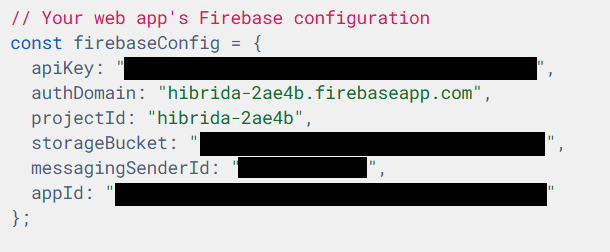

Referencias 
===========

* * *

* Mahata, A. (2024). Connect “Contact form” to firebase. Retrieved from https://akashdeepmahata.medium.com/connect-contact-form-to-firebase-7bb8ad6097d7