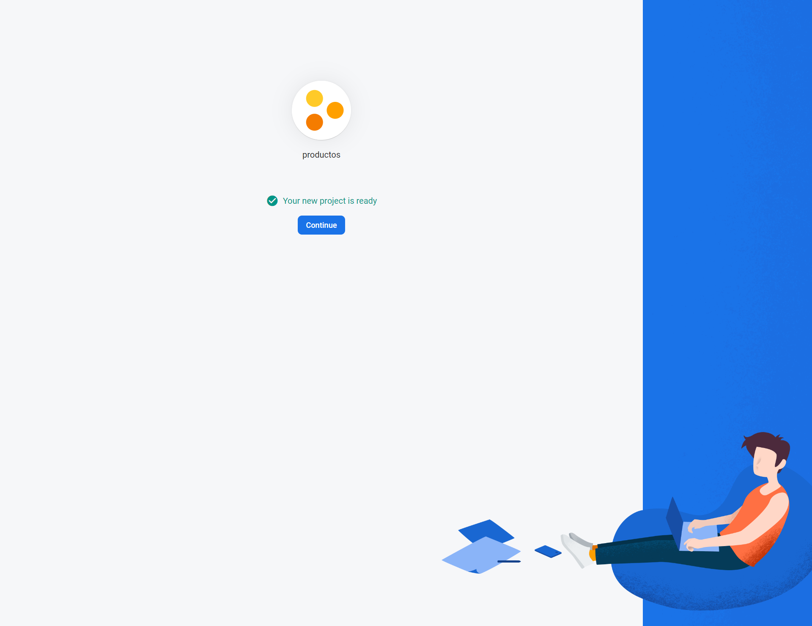
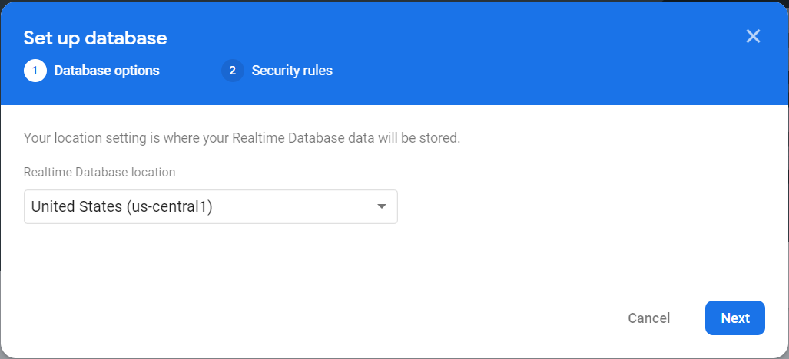
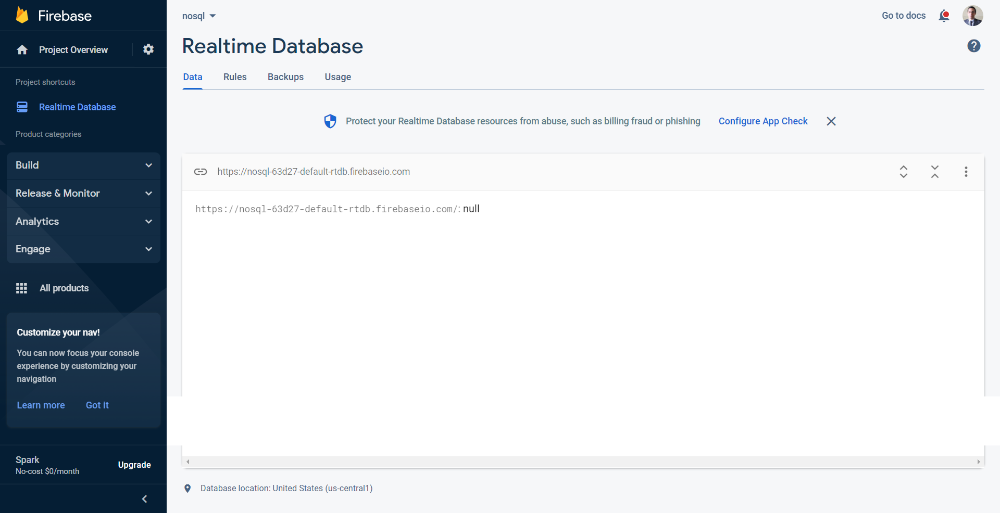
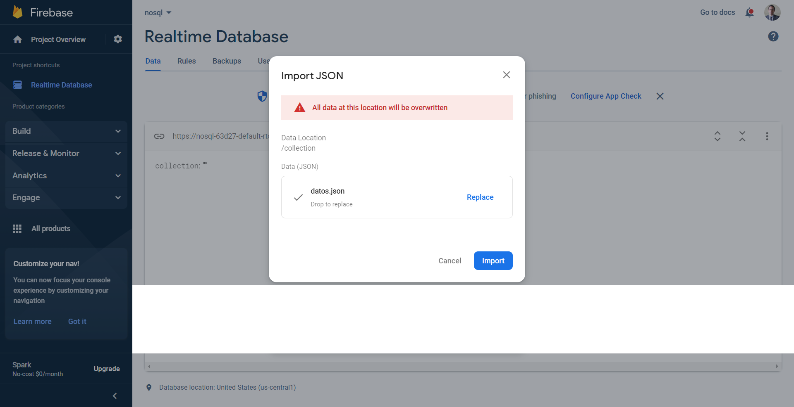
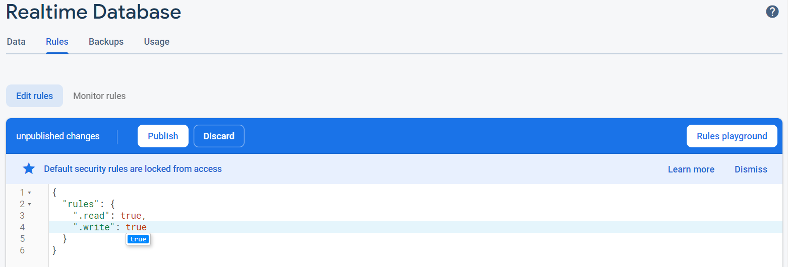

[Regresar](/DAWM/)

Firebase - Firestore
====================

* * *

* Obtenga una cuenta en la [consola de Firebase](https://console.firebase.google.com/)

  

* Cree un proyecto para Firebase

  
  
  

* Acceda a la opción **Realtime Database** a través de la opción **`Build > Realtime Database`** para **Create Database**

  

  + Durante el proceso de creación de la base de datos no relacional, habilite el _test mode_ para la edición por 30 días. 

  
  

 

* En la interfaz de **Realtime Database**

  

 

  + Agregue una clave llamada **collection**, sin valor

  
  

 

* Acceda a la clave **collection**

  

 
   
  + Importe los datos en formato JSON.

  

 

  

 

  + Cambie las reglas de acceso para que los datos puedan ser leídos y modificados desde una aplicación de terceros

  

Referencias 
===========

* * *

* Mahata, A. (2024). Connect “Contact form” to firebase. Retrieved from https://akashdeepmahata.medium.com/connect-contact-form-to-firebase-7bb8ad6097d7