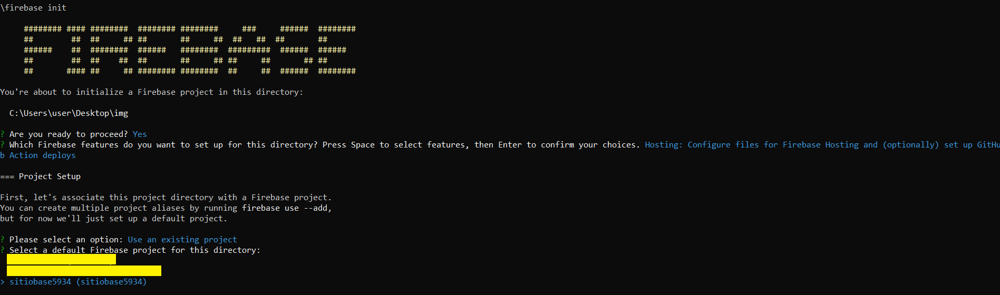

[Regresar](/DAWM/)

Firebase - Hosting / Sitio Estático
===================================

* * *

* Obtenga una cuenta en la [consola de Firebase](https://console.firebase.google.com/)

<p align="center">
  
</p>


* En la carpeta del proyecto estático

<p align="center">
  
</p>

* Desde la línea de comandos, en la carpeta del proyecto estático

  + Instale el `CLI` de Firebase, con: `npm install -g firebase-tools`
  + Inicie la sesión con su cuenta, con el comando: `firebase login`

<p align="center">
  
</p>

* En el navegador, acepte los permisos de acceso.

<p align="center">
  
  
</p> 

* Desde la línea de comandos, en la carpeta del proyecto estático

  + Cree un proyecto nuevo, con el comando: `firebase projects:create`. Utilice un **Project ID** y un **Project name** únicos.

<p align="center">
  
</p>


* En el navegador, puede reconocer el proyecto creado

<p align="center">
  
</p>

* Desde la línea de comandos, en la carpeta del proyecto estático

  + Inicialice el proyecto, con el comando: `firebase init`

<p align="center">
  
</p>

  + Escoja la opción de hosting: 

```
  >(*) Hosting: Configure files for Firebase Hosting and (optionally) set up GitHub Action deploys.
```

<p align="center">
  
</p>

  + Seleccione el proyecto recientemente creado.

<p align="center">
  
  
</p> 

  + Para la configuración del host, escoja:

    - El directorio actual como punto de despliegue, con: **`.`**
    - El archivo principal es el _index.html_, con: **`Yes`**
    - No existe despliegue automático desde Github, con: **`No`**

<p align="center">
  
</p>


  + Despliegue la aplicación, con: `firebase deploy`

    - Acceda a la URL de consola del proyecto que aparece en: `Project Console: https://console.firebase.google.com/project/<nombre_proyecto>/overview`
    - Acceda a la URL del sitio del proyecto que aparece en: `Hosting URL: https://<nombre_proyecto>.web.app`

<p align="center">
  
</p>


Referencias 
===========

* * *

* Deploy Firebase Hosting. (2022). Retrieved 18 October 2022, from https://codigofacilito.com/articulos/firebase-hosting