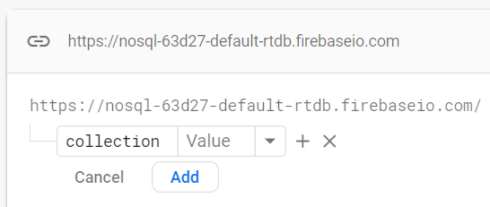

[Regresar](/DAWM/)

Firebase - Realtime Database
============================

* * *

* Obtenga una cuenta en la [consola de Firebase](https://console.firebase.google.com/)

<p align="center">
  
</p>

* Cree un proyecto para Firebase

<p align="center">
  
  
  
</p>

* Acceda a la opción **Realtime Database** a través de la opción **`Build > Realtime Database`** para **Create Database**

<p align="center">
  
</p>

  + Durante el proceso de creación de la base de datos no relacional, se establece que de manera predeterminada ningún cliente EXTERNO puede leer o escribir sobre los datos. 

<p align="center">
  
  
</p> 

* En la interfaz de **Realtime Database**

<p align="center">
  
</p> 

  + Agregue una _colección_

<p align="center">
  
  
</p> 

* En la _colección_

<p align="center">
  
</p> 
   
  + Descargue los **[datos](archivos/datos.json)** e importe los datos.

<p align="center">
  
</p> 

<p align="center">
  
</p> 

  + Cambie las reglas de acceso para que los datos puedan ser leídos y modificados desde una aplicación de terceros

<p align="center">
  
</p>

Petición
========

* Para realizar peticiones a la base de datos no relacional, 

  + Desde la línea de comandos, instale el módulo `jsontool` de manera global, con: `npm i -g jsontool`
  + Utilice la url que aparece en la interfaz. Por ejemplo:

  ```
  https://nosql-63d27-default-rtdb.firebaseio.com/collection.json
  ```

Petición - Todos
================

  + Realice una petición GET-All con cURL, con:

  `curl -X GET https://nosql-63d27-default-rtdb.firebaseio.com/collection.json | json`


Petición - Por índice
=====================

  + Realice una petición GET-One con cURL, con:

  `curl -X GET https://nosql-63d27-default-rtdb.firebaseio.com/collection/3.json | json`


Petición - Filtrado de datos
============================

* Para filtrar los datos desde el URL:
  + Modifique las reglas de acceso para indexar las claves. Para esto, debe indicar la ruta dentro de los objetos (`collection`) y los campos a indexar (`["productoNombre"]`)

<p align="center">
  
</p>

  + Realice una petición GET-One con cURL, con:

  `curl -X GET "https://nosql-63d27-default-rtdb.firebaseio.com/collection.json?orderBy=%22productoNombre%22&equalTo=%22Producto%205%22" | json`

  + O, desde el navegador, con: 

  `https://nosql-63d27-default-rtdb.firebaseio.com/collection.json?orderBy="productoNombre"&equalTo="Producto 5"`

<p align="center">
  
</p>


Referencias 
===========

* * *

* Angular: Sending a POST Request with Firebase. (2020). Retrieved 14 August 2022, from https://medium.com/@monalisorathiya8/angular-sending-a-post-request-with-firebase-820f4046c89
* Firebase, I., Williams, R., & singh, s. (2018). Iterate with ngFor on objects obtained from Firebase. Retrieved 14 August 2022, from https://stackoverflow.com/questions/48243273/iterate-with-ngfor-on-objects-obtained-from-firebase
* Recupera datos Firebase Realtime Database. (2022). Retrieved 15 August 2022, from https://firebase.google.com/docs/database/rest/retrieve-data?hl=es