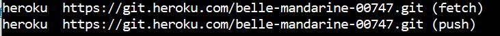

[Regresar](/DAWM/)

Heroku - Sitio Estático
=======================

  <p align="center">
    
  </p>

Heroku permite manejar las aplicaciones desde la línea de comando o desde la interfaz web.

Antes de transpilar
===================

* * *

En los **servicios** de la aplicación, cambie las rutas locales: `'http://localhost:3000...'` por las rutas remotas: `'https://backendXYZ.herokuapp.com/...'`


Ruta de la aplicación web
=========================

* * *

En adelante, se usará el término **ruta de la aplicación web** como la ubicación en su máquina local donde se encuentre el archivo `index.html` y los archivos necesario para la aplicación web (hojas de estilo, scripts, imágenes, svg, etc).

Esta ruta puede resultar de:

* Sitio web estático
* La transpilación de un proyecto en Angular, con: `ng build` 

Antes de desplegar en Heroku
============================

* * *

Para evitar conflictos de versionamiento del proyecto original de Angular: **mueva la carpeta dentro del dist a otra ubicación (por ejemplo a 'Mi Escritorio')**


Pasos iniciales
===============

* * *

* Obtén una cuentan en [Heroku](https://signup.heroku.com/login).
* Descargar e instalar el [heroku-cli](https://devcenter.heroku.com/articles/heroku-cli#download-and-install).
* Desde la línea de comandos en la **ruta de la aplicación web**, accede a Heroku, con: ```heroku login```

    Se le pedirá que presione cualquier tecla para ir a su navegador web y completar el inicio de sesión.
    

* Cree un proyecto, con: ```heroku create nombre-de-la-aplicación```

    

* Liste las rutas remotas. Verifique si aparece la ruta remota con heroku, use: ```git remote -v```

    

  + **Opcional:** En caso que no aparezca la ruta remota para heroku. Agregue manualmente tu ruta con: 
    
    ```
      git remote add heroku https://git.heroku.com/heroku-ruta.git
    ```


Buildpack
=========

* * *

Ahora, vamos a decirle a Heroku el ambiente de ejecución ([buildpacks](https://devcenter.heroku.com/articles/buildpacks)) de la aplicación. Heroku soporta ambientes de ejecución para Ruby, Python, Java, Clojure, Node.js, Scala, Go y PHP. 

* En la **ruta de la aplicación web**. 
  
  + Crea el archivo composer.json. Agregue como contenido al composer.json:

    ```
    {}
    ```
  
  + En este caso, el ambiente de ejecución será [PHP](https://devcenter.heroku.com/articles/buildpacks). Puede cambiar el paquete de compilación utilizado por una aplicación configurando el valor del paquete de compilación. La próxima vez que se envíe la aplicación, se usará el nuevo paquete de compilación.

    ```heroku buildpacks:set heroku/php```


Despliegue 
==========

* * *

* Desde la línea de comandos en la **ruta de la aplicación web**:

  + Agregue los cambios en `origin` y `heroku` con las instrucciones de *git*.

    <pre><code>
      git add .
      git commit -m "deploy"
      git push origin main <b style="color: red">Solo si versiona en un repositorio remoto etiquetado como origin</b>
      git push heroku main <b style="color: red">Antes de hacer push, verifique la rama que están utilizando</b>
    </code></pre>

    - Abra la aplicación, con: ```heroku open```


Referencias 
===========

* * *

* Deploying PHP Apps on Heroku  Heroku Dev Center. (2021). Retrieved 14 November 2021, from https://devcenter.heroku.com/articles/deploying-php 
* Buildpacks Heroku Dev Center. (2021). Retrieved 14 November 2021, from https://devcenter.heroku.com/articles/buildpacks
