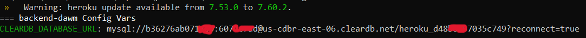

[Regresar](/DAWM-2022/)

Heroku - Express
================

  <p align="center">
    
  </p>

Ruta de la aplicación web
=========================

* * *

En adelante, se usará el término **ruta de la aplicación web** como la ruta del proyecto en Express.


Pasos iniciales
===============

* * *

* Obtén una cuentan en [Heroku](https://signup.heroku.com/login).
* Descargar e instalar el [heroku-cli](https://devcenter.heroku.com/articles/heroku-cli#download-and-install).
* Desde la línea de comandos en la **ruta de la aplicación web**, accede a Heroku, con: ```heroku login```

    Se le pedirá que presione cualquier tecla para ir a su navegador web y completar el inicio de sesión.
    

* Cree un proyecto, con: ```heroku create nombre-de-la-aplicación```

    

* Liste las rutas remotas. Verifique si aparece la ruta remota con heroku, use: ```git remote -v```

    

  + **Opcional:** En caso que no aparezca la ruta remota para heroku. Agregue manualmente tu ruta con: 
    
    ```
      git remote add heroku https://git.heroku.com/heroku-ruta.git
    ```


Add-ons
======

* * *

Heroku tiene ciertas [herramientas y servicios](https://elements.heroku.com/addons) para desarrollar, ampliar y operar su aplicación.

* En la **ruta de la aplicación web**. 
  
  + Agregue [ClearDB](https://elements.heroku.com/addons/cleardb) como add-on base de datos relacional, con:

    ```
    heroku addons:create cleardb:ignite -a backend-dawm
    ```
    
    En el sitio web de la administración de Heroku, el add-on se ve así

    <p align="center">
      
    </p>


Despliegue 
==========

* * *

* Desde la línea de comandos en la **ruta de la aplicación web**:

  + Muestre la cadena de conexión a la base de datos remota, con:
    
  ```
  heroku config 
  ```

  <p align="center">
    
  </p>

  + Agregue los cambios en `origin` y `heroku` con las instrucciones de *git*.

    <pre><code>
      git add .
      git commit -m "composer.json"
      git push origin main  <b style="color: red"># Este push es solo necesario cuando desea enviar la versión local a la versión remota</b>
      git push heroku main
    </code></pre>

    - Abra la aplicación, con: ```heroku open```


Referencias 
===========

* * *

* Add-ons - Heroku Elements. (2022). Retrieved 11 August 2022, from https://elements.heroku.com/addons