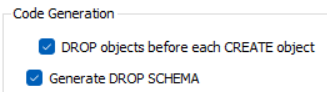

[Regresar](/DAWM/)

Modelo EER a SQL.
============================================

* * *

En este tutorial pasaremos de un Modelo Entidad Relación a SQL con MySQL Workbench.

Instrucciones
===============

* Utilice el MySQL Workbench

#### 1. Establezca una conexión local en MySQL Workbench

* Cree una conexión local.

* Coloque los datos de conexión. Guarde el usuario y contraseña en la configuración. 

* Verifique la conexión.

* Acceda con conexión local.

#### 2. Schema

* Cree un nuevo _schema_ con el nombre de su base de datos, p.e. `mydb`.

* Aplique los cambios.

#### 3. Modelo EER

* Seleccione el _schema_ de su base de datos.

* Escoja la opción `Database` > `Reverse Engineer`

* Establezca los parámetros de conexión. Seleccione el _schema_ recientemente creado. Al inicio, el `EER Diagram` debe aparecer vacío.

#### 4. Diseño de entidades y relaciones

Utilice la interfaz gráfica crear las entidades, agregar atritutos y las relaciones entre tablas.

* Crear las entidades (tablas)

* Seleccione tabla para agregar los atributos (columnas) con su tipo de datos.

* Utilice el selector adecuado para establecer la relación entre las entidades.

* Seleccione la entidad **destino** de las claves.

* Hasta la entidad **origen** de las clave.

* El resultado de la relación crea las claves foráneas en entidades intermedias.

* Modifique el nombre de las entidades intermedias.

#### 5. Forward Engineer

* Escoja la opción `Database` > `Forward Engineer`.

* En el paso **Set Options for Database to be Created**, marque las opciones: `DROP objects before each CREATE object`, y `GENERATE DROP SCHEMA`

* Revise el SQL generado y ejecute el script.

* Actualice el _schema_ de su base de datos.

Referencias 
===========

* * *

* Create ER Diagram of a Database in MySQL Workbench. (2018). Retrieved 2 August 2023, from https://medium.com/@tushar0618/how-to-create-er-diagram-of-a-database-in-mysql-workbench-209fbf63fd03