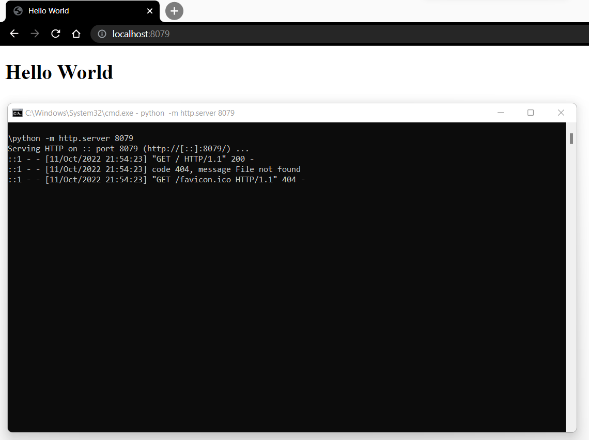

[Regresar](/DAWM/)

Nodejs
=======================

  <p align="center">
    
  </p>

Ruta de la aplicación web
=========================

* * *

En adelante, se usará el término **ruta de la aplicación web** como la ubicación en su máquina local donde se encuentre el archivo `index.html` y los archivos necesario para la aplicación web (hojas de estilo, scripts, imágenes, svg, etc).


Prerequisito
=============

* Instale (solo una vez) el módulo [http-server](https://www.npmjs.com/package/http-server) globalmente, con: `npm install -g http-server`

Instrucciones
=============

* Desde la **ruta de la aplicación web**, abra una la línea de comandos.
* Levante el servidor HTTTP, con: ```http-server -p 8082 -c-1 <ruta-de-la-aplicacion>```
* Abra el navegar en la ruta: ```http:\\localhost:8082```

Referencias 
===========

* * *

* http-server. (2022). Retrieved 26 November 2022, from https://www.npmjs.com/package/http-server
