[Regresar](/DAWM/)

Railway - MySQL
=======================

  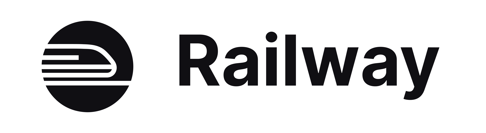

Railway permite alojar aplicaciones gratuitamente (por tiempo limitado) incluso con el servicio de MySQL.

Proyecto: MySQL
===============

* * *

* Desde la página principal [railway.app/dashboard](https://railway.app/dashboard).

  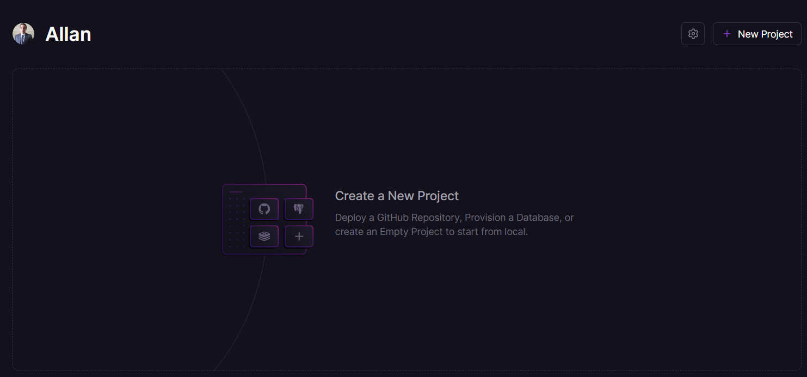

* Cree y configure un nuevo proyecto que supla con el servicio de MySQL

  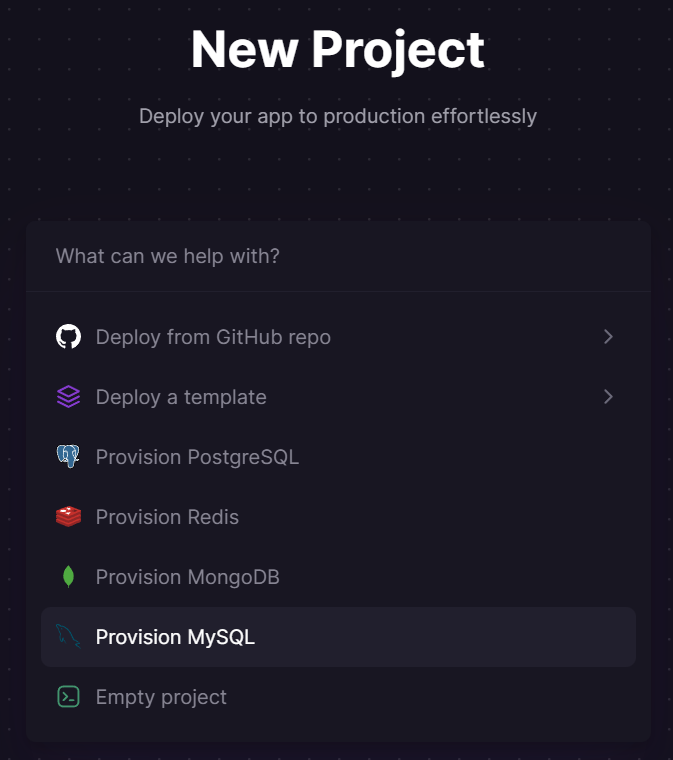

* Copie los datos para la conexión que se encuentran en la opción `Variables` 

  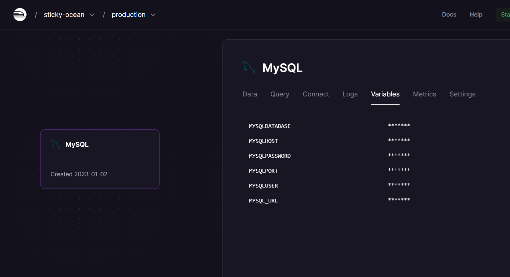

Repositorio: API
=================

* * *

* Cree un nuevo repositorio en Github: **api**
  + Copie y pegue el código de la aplicación [album/api](https://github.com/DAWFIEC/DAWM-apps), de la rama `hito7-api`, en su nuevo repositorio.
  + Modifique el archivo `config/config.json` en la clave **production** con los datos para la conexión. Agregue la clave **port** al objeto de configuración.

  <pre><code>
  ...
  "production": {
    "username": "root",
    "password": "Zrp...A29",
    "database": "railway",
    "host": "containers-us-west-XYZ.railway.app",
    "port": "7254",
    "dialect": "mysql"
  }
  ...
  </code></pre>

  + Modifique el archivo `package.json` en la clave **scripts** con los scripts a ejecutar con el despliegue (i) para la generación de la base de datos y (ii) iniciar la aplicación en el servidor

  <pre><code>
  ...
  "scripts": {
      "db:reset": "npm install sequelize pg && npm install --save-dev sequelize-cli && npx sequelize-cli db:drop && npx sequelize-cli db:create && npx sequelize-cli db:migrate && npx sequelize-cli db:seed:all",
      "start": "npm run db:reset && node ./bin/www",
      ...
  }
  ...
  </code></pre>

  + Guarde los cambios en el repositorio remoto.

Aplicación: API
===============

* * *

* Cree y configure un nuevo proyecto a partir de un repositorio de Github, de acuerdo con las instrucciones de [Railway - Sitio Estático](https://dawfiec.github.io/DAWM/tutoriales/railway_sitio_estatico.html).

  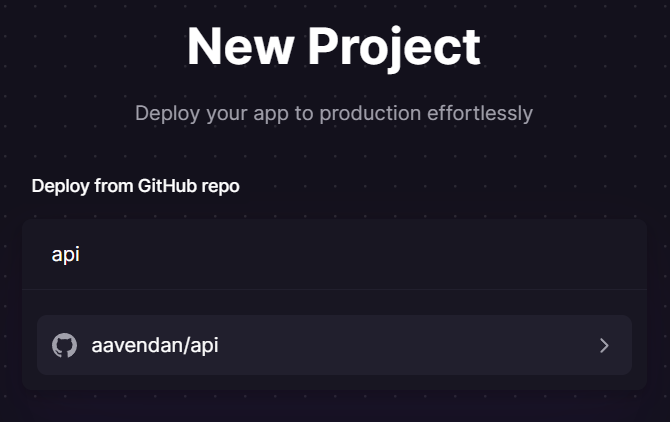

* En la opción `Variables` configure la variable de `NODE_ENV` con el valor `production`

  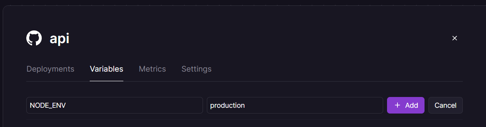

* Compruebe accediendo a las URLs disponibles en el API REST, por ejemplo: `https://api-production-2437.up.railway.app/rest/fotos/findAll/json`

  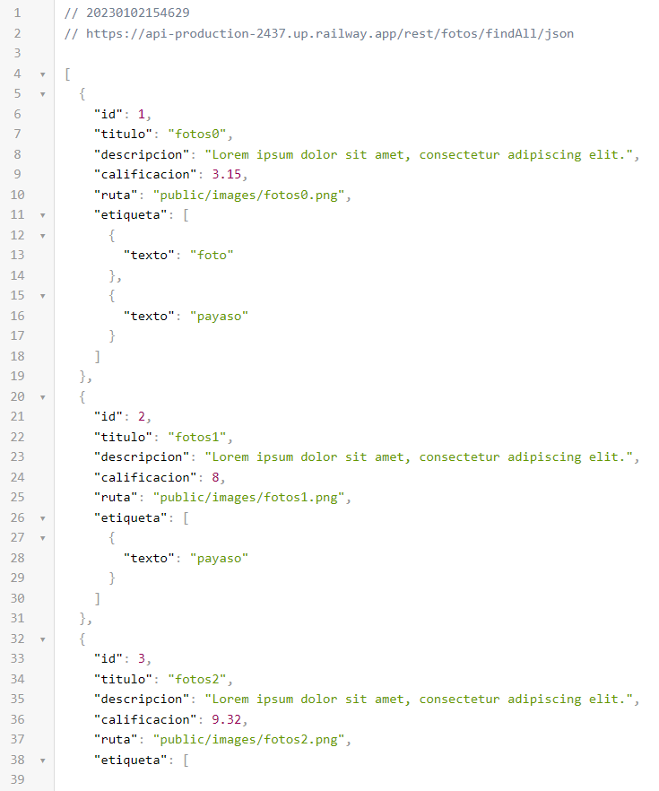

Logs
======

* * *

* Desde el panel central de la aplicación, acceda a la opción `View Logs > Deploy Logs` e identifique la ejecución del script: **db:reset**

  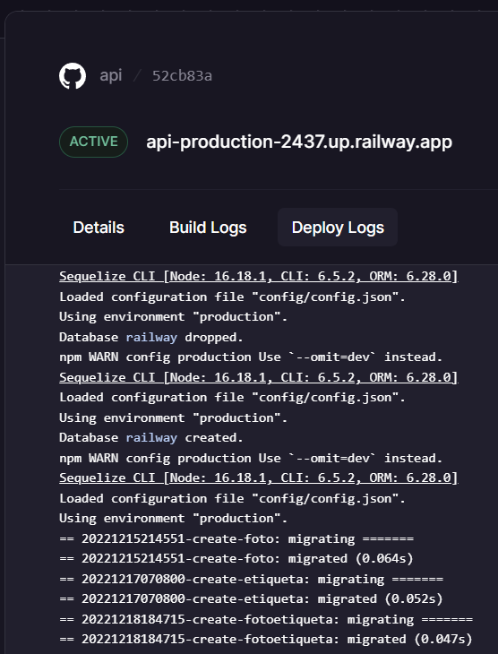

Comprobación de tablas y registros
==================================

* * *

* Desde la página principal [railway.app/dashboard](https://railway.app/dashboard).

  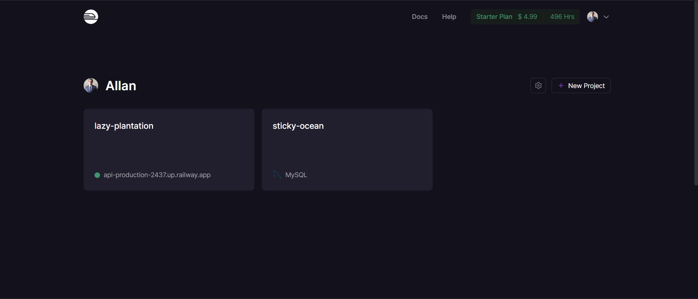

* Identifique las tablas migradas y los registros generados a partir del despliegue de la aplicación.

  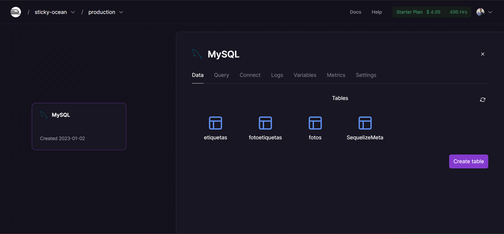
  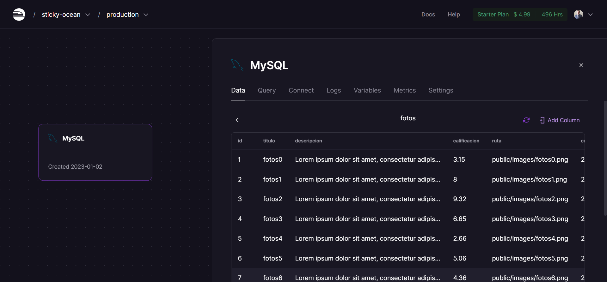

Referencias 
===========

* * *

* Express Tutorial Part 7: Deploying to production - Learn web development MDN. (2023). Retrieved 2 January 2023, from https://developer.mozilla.org/en-US/docs/Learn/Server-side/Express_Nodejs/deployment
