[Regresar](/DAWM/)

Railway - Sitio Estático
=======================

  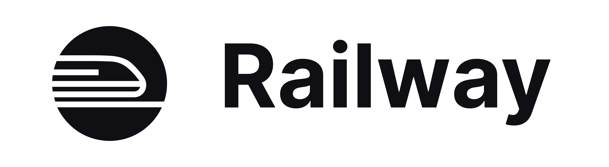

Railway permite alojar aplicaciones gratuitamente (por tiempo limitado).

Cuenta nueva
============

* * *

* Acceda al sitio [Railway.app](https://railway.app/)

  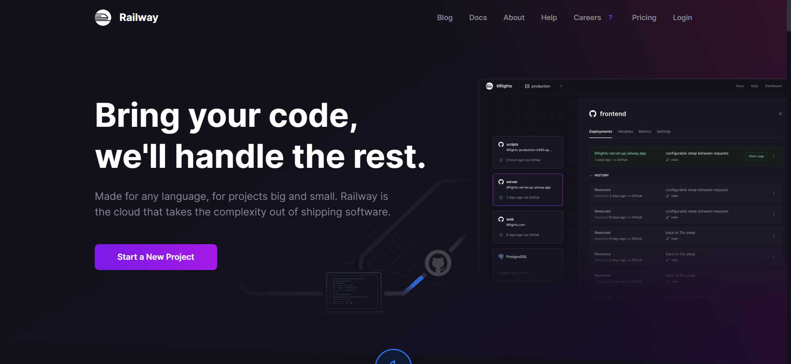

* Obtenga una cuenta asociada con Github.

  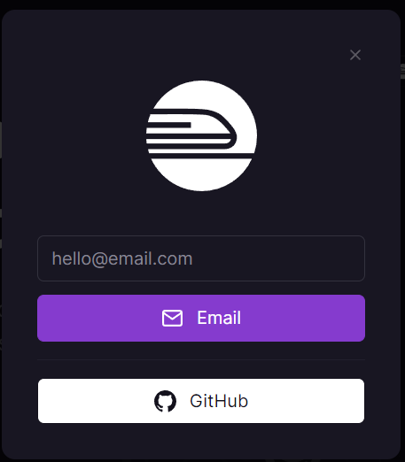

* Acepte los términos y condiciones

  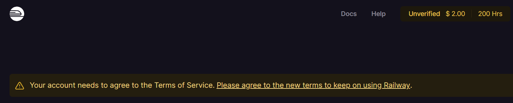
  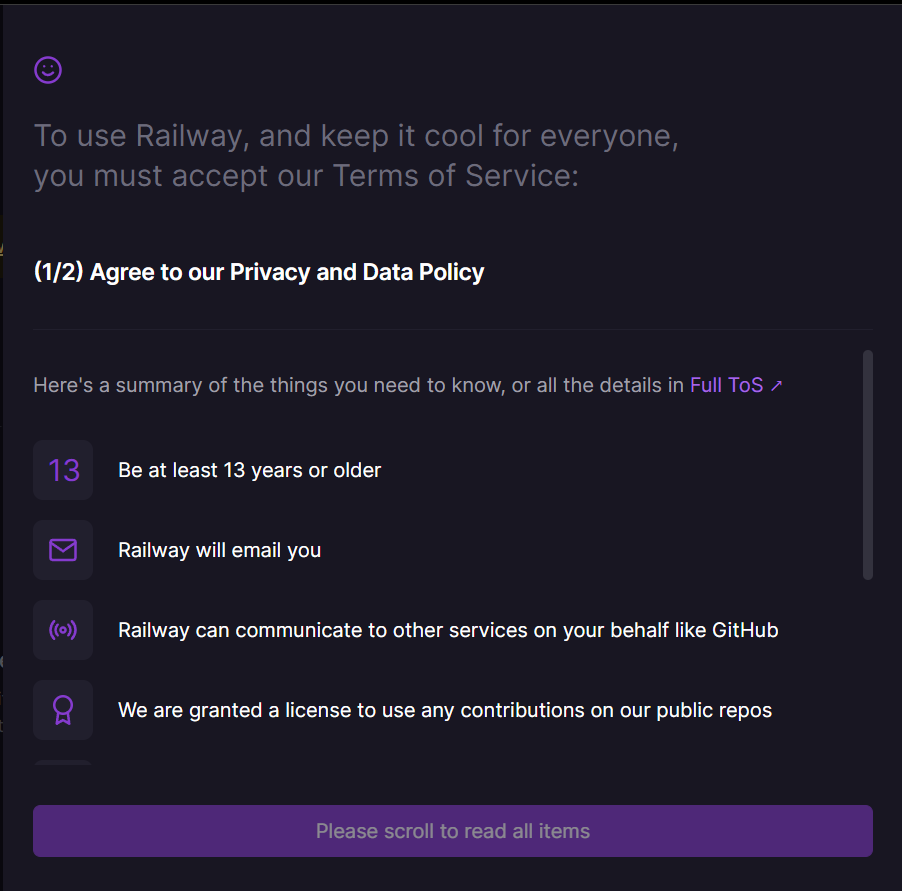

* Verifique su cuenta al dar clic en la descripción `Unverified`

  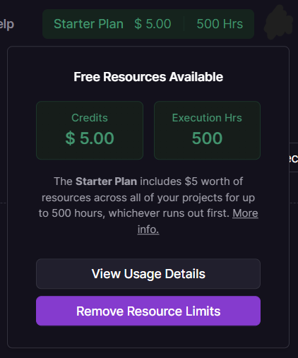

Repositorio: Admin
=================

* * *

* Cree un nuevo repositorio en Github: **admin**
  + Copie y pegue el código de la aplicación [album/admin](https://github.com/DAWFIEC/DAWM-apps), de la rama `hito2-admin`, en su nuevo repositorio.
  + Guarde los cambios en el repositorio remoto.

Proyecto: Github repo
=====================

* * *

* En la página principal [railway.app/dashboard](https://railway.app/dashboard).

  

* Cree y configure un nuevo proyecto a partir del repositorio de Github.

  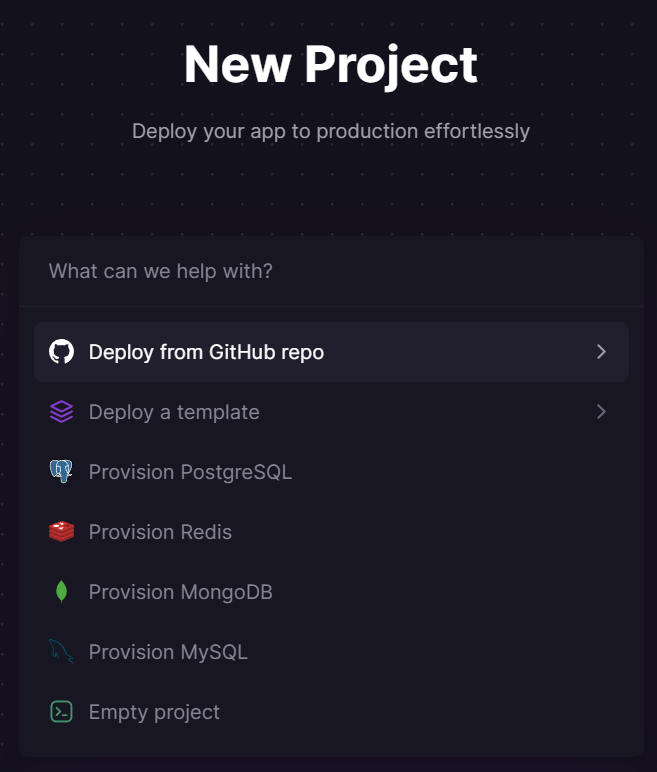
  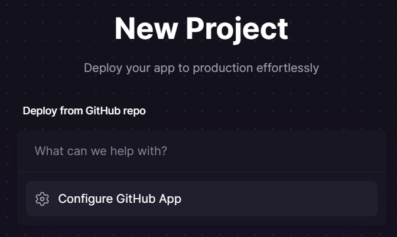

Aplicación: Admin
================

* * *

* Seleccione el nuevo repositorio **admin**.

  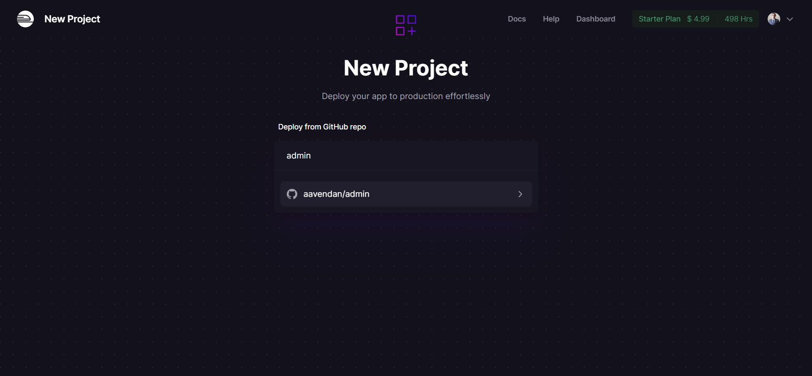

* Seleccione la opción `Deploy now`.

  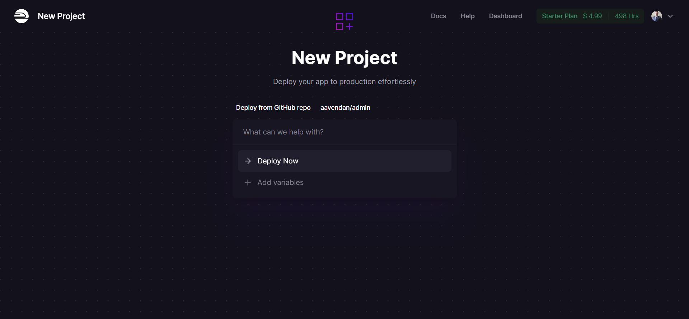

* En caso de éxito, aparecerá un registro de despliegue con el estado `Success`

  

* En la opción `Settings > Domains` genere un dominio aleatorio para la aplicación  

  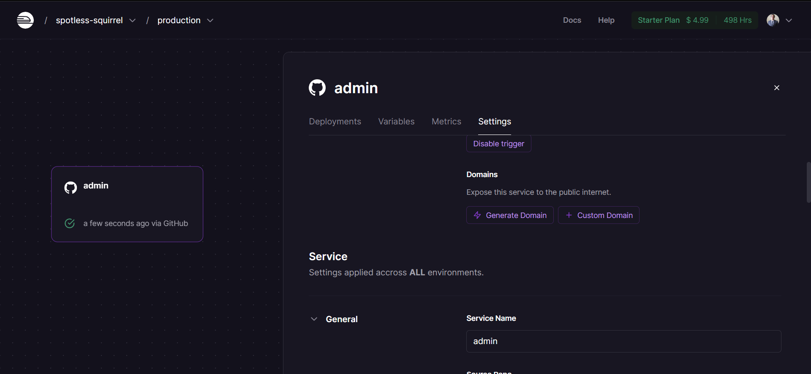
  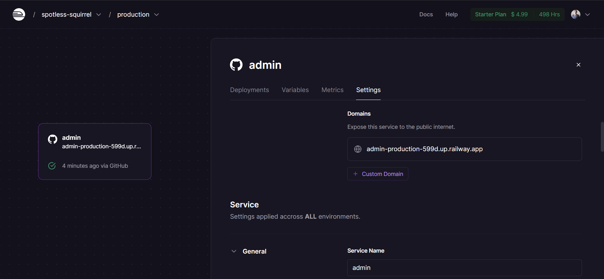

* Compruebe accediendo a la URL disponible, por ejemplo: `https://admin-production-599d.up.railway.app/`

  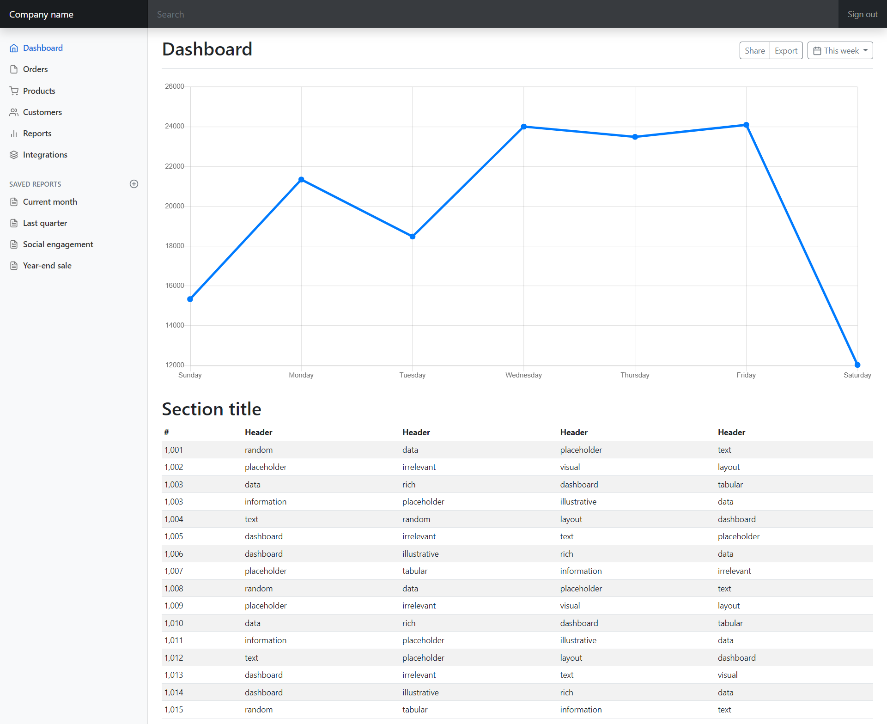

Logs
======

* * *

* Desde el panel central de la aplicación, acceda a la opción `View Logs` para ver los registros de la aplicación en producción en las opciones: `Details`, `Build Logs` y `Deploy Logs`.

  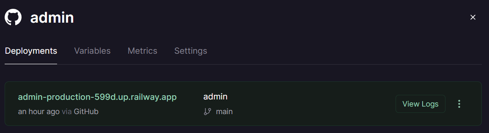
  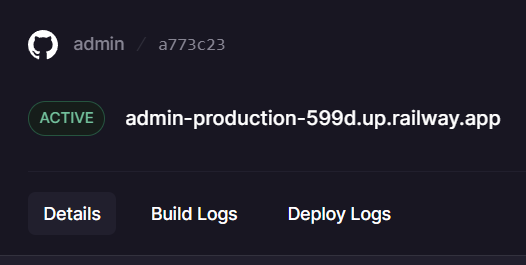

Referencias 
===========

* * *

* Express Tutorial Part 7: Deploying to production - Learn web development MDN. (2023). Retrieved 2 January 2023, from https://developer.mozilla.org/en-US/docs/Learn/Server-side/Express_Nodejs/deployment
