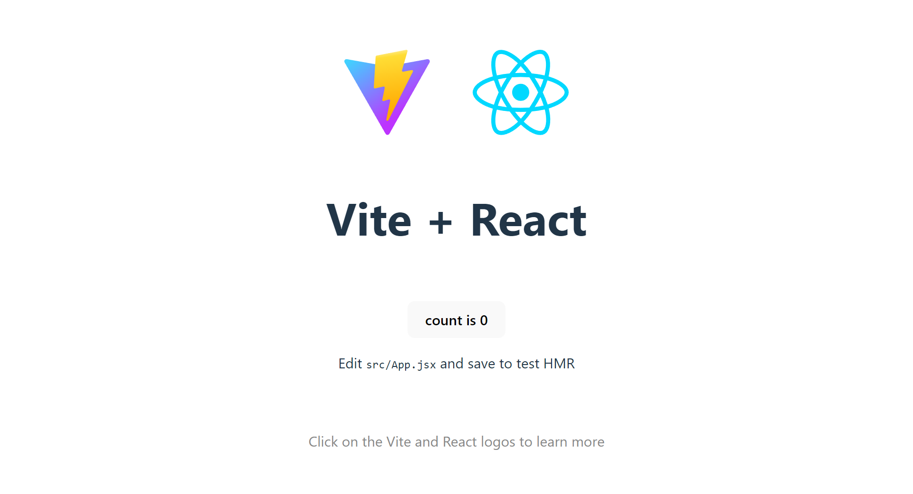

[Regresar](/DAWM/)

React - Bases
===============


Esqueleto de un sitio web
==========

* * *

Desde la línea de comandos, en la ruta donde desea crear el proyecto:

* Cree un nuevo sitio con: 
  ```
  npm create vite@latest reactui
  ```

   - Seleccione **React** como framework: `√ Select a framework: » React`
   - Seleccione **Javascript** como variante: `√ Select a variant: » Typescript`

* Ingrese a la carpeta del repositorio:

```prompt
    cd <NOMBRE_DEL_REPOSITORIO>
```

* Instale las dependencias

```prompt
    npm install
```

* Inicie el servidor.

```prompt
    npm run dev
```

* Revise el resultado en [http://localhost:5173/](http://localhost:5173/)

<div align="center">
    
</div>

Estructura
==========

* * *

Estructura de archivos del proyecto en Vite - React.

* Archivos de configuración
    + **./vite.config.js** contiene la información al ejecutar el servidor de Vite.
    + **./package.json** contiene la lista de los paquetes instalados

* Código fuente
    + **./index.html** página de inicio
    + **src/index.css** estilo global de la página
    + **src/main.jsx** punto de entrada de la página
    + **src/App.jsx** función componente principal
    + **src/App.css** estilo de la función componente principal

Referencias
=======

* Quick Start. (n.d.). Retrieved from https://react.dev/learn
* Vite. (n.d.). Retrieved from https://vitejs.dev/
* Cómo iniciar un proyecto React con Vite. (2022). Retrieved from https://carlosazaustre.es/react-vite
