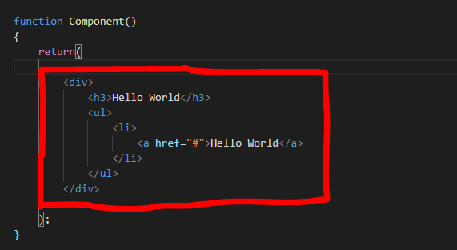

[Regresar](/DAWM/)

React - Componentes Integrados
===============


Componentes Integrados
==========

* * *

De manera predeterminada, React provee de algunos componentes integrados ([Built-in React Components](https://react.dev/reference/react/components)) que se pueden utilizar con JSX.

* `<Fragment>`, escrito alternativamente como `<>`...`</>`, le permite agrupar varios nodos JSX.
* `<Profiler>` le permite medir el rendimiento del renderizado del árbol de React.
* `<Suspense>` le permite mostrar un respaldo mientras se cargan los componentes secundarios.
* `<StrictMode>` permite comprobaciones adicionales solo de desarrollo que le ayudan a encontrar errores con antelación.

> JSX es una extensión de sintaxis para JavaScript que le permite escribir etiquetas similares a HTML dentro de un archivo JavaScript. Aunque existen otras formas de escribir componentes, la mayoría de los desarrolladores de React prefieren la concisión de JSX y la mayoría de las bases de código lo utilizan.

<div align="center">
    
    <p>Fuente: <a href="https://medium.com/nerd-for-tech/jsx-rules-in-react-a-javascript-framework-4b0ab66fdbf9">JSX Rules in React(A JavaScript Framework).</a> </p>
</div>

App.tsx
==========

* * *

* En el archivo `src/App.jsx`, modifique el JSX a renderizar por:

```jsx
...

function App() {
  return (
    <>
        ¡Hola mundo!
    </>
  )
}

export default App
```

Referencias
=======

* Quick Start. (n.d.). Retrieved from https://react.dev/learn
* Vite. (n.d.). Retrieved from https://vitejs.dev/
* Cómo iniciar un proyecto React con Vite. (2022). Retrieved from https://carlosazaustre.es/react-vite
