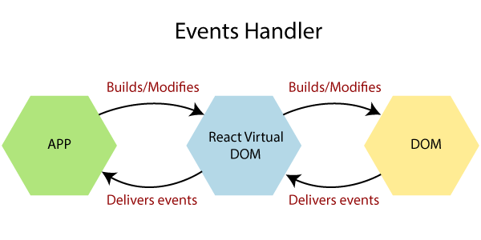
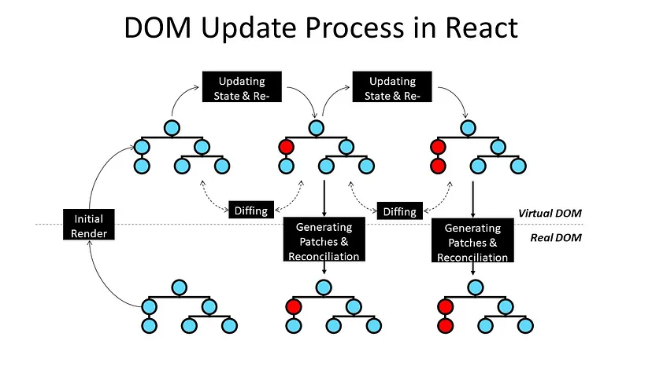
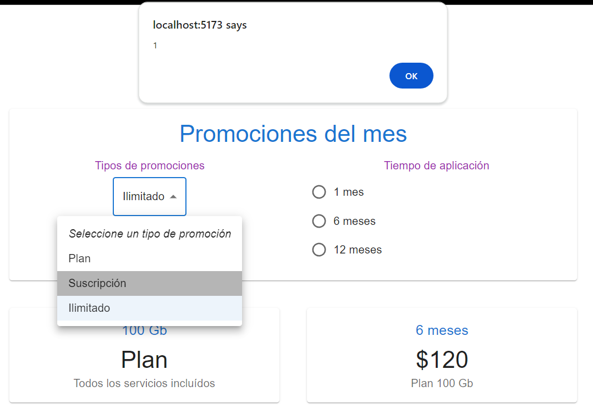

[Regresar](/DAWM/)

React - Virtual DOM y Eventos
===============


Al igual que los eventos HTML DOM, React puede realizar acciones basadas en eventos del usuario. React tiene los mismos eventos que HTML: hacer clic, cambiar, pasar el mouse, etc.

<div align="center">
	
	<p>Fuente: <a href="https://medium.com/@vitorbritto/react-an-overview-about-syntheticevent-d3a6d35295f1">React: An Overview about SyntheticEvent</a> </p>
</div>


El **Virtual DOM** es una representación del DOM guardada en memoria, que actúa de intermediario entre los estados de la aplicación y los estados del DOM (vistos por el usuario). Cuando ocurre un cambio en la aplicación web, el virtual DOM interpreta dichos cambios y calcula la manera más eficiente de actualizar el DOM para que renderice la menor cantidad de cambios posibles.

<div align="center">
	
	<p>Fuente: <a href="https://medium.com/@itsanuragjoshi/mastering-react-understanding-real-dom-vs-virtual-dom-and-the-dom-update-process-78a233454ff8">Mastering React: Understanding Real DOM vs Virtual DOM and the DOM Update Process</a> </p>
</div>


MUI: Referencia a los componentes
==========

* * *

* En el componente `Calculator.tsx`, agregue la referencia a los componentes:

	+ [Card](https://mui.com/material-ui/react-card/) y sus componentes asociados,
	+ [Grid v2](https://mui.com/material-ui/react-grid2/), 
	+ [Radio Group](https://mui.com/material-ui/react-radio-button/) y sus componentes asociados,
	+ [Select](https://mui.com/material-ui/react-select/) y sus componentes asociados.

```tsx
import * as React from 'react';

//Card
import Typography from '@mui/material/Typography';
import Card from '@mui/material/Card';
import CardContent from '@mui/material/CardContent';
import { CardActionArea } from '@mui/material';

//Grid v2
import Grid from '@mui/material/Unstable_Grid2'; // Grid version 2

//Radio Group
import Radio from '@mui/material/Radio';
import RadioGroup from '@mui/material/RadioGroup';
import FormControlLabel from '@mui/material/FormControlLabel';

//Select
import Select, { SelectChangeEvent } from '@mui/material/Select';
import MenuItem from '@mui/material/MenuItem';

...

export default function Calculator() { ... }
```

MUI Diseño
==========

* * *
 
* En el componente `Calculator.tsx`, agregue las etiquetas para los componentes Card y Grid.

```tsx
...
export default function Calculator() {

	{/* JSX */}

	return (
		<Card>
		      <CardContent>        
		        <Typography gutterBottom component="h2" variant="h4" color="primary">
		          Promociones del mes
		        </Typography>

		        <Grid container spacing={5}>

		            <Grid xs={12} xl={6} >
		              <Typography gutterBottom component="h4" color="secondary">
		                Tipos de promociones 
		              </Typography>

		              {/* Select */}

		            </Grid>

		            <Grid xs={12} xl={6}>
		              <Typography gutterBottom component="h4" color="secondary">
		                Tiempo de aplicación 
		              </Typography>

		              {/* Radio Group */}

		            </Grid>

	          	</Grid>
		      </CardContent>
	    	</Card>
	)
}
```

* Compruebe el funcionamiento del servidor, con: **npm run dev**
* Acceda al URL [http://localhost:5174/](http://localhost:5174/)

Componente MUI: Select y RadioGroup
==========

* * *

* En el componente `Calculator.tsx`, agregue las etiquetas para los componentes Select y Radio Group.

```tsx
...
	{/* Select */}

	<Select defaultValue='-1'>
        <MenuItem value="-1" disabled={true}>
          <em>Seleccione un tipo de promoción</em>
        </MenuItem>

        {/* Elementos renderizados */}

        <MenuItem key={0} value={0}>Plan</MenuItem>
        <MenuItem key={1} value={1}>Suscripción</MenuItem>
        <MenuItem key={2} value={2}>Ilimitado</MenuItem>
    </Select>
...
```

y 

```tsx
...	
	{/* Radio Group */}

	<RadioGroup
		name="radio-buttons-group"
		sx={{
		  marginLeft: '2%'
		}}
		>

		{/* Elementos renderizados */}

		<FormControlLabel key={0} value={0} control={<Radio />} label="1 mes" />
		<FormControlLabel key={1} value={1} control={<Radio />} label="6 meses" />
		<FormControlLabel key={2} value={2} control={<Radio />} label="12 meses" />
	</RadioGroup>
...
```

* Compruebe el funcionamiento del servidor, con: **npm run dev**
* Acceda al URL [http://localhost:5174/](http://localhost:5174/)

Datos y renderizado en los elementos
==========

* * *

* En el componente `Calculator.tsx`, agregue los datos para rellenar los elementos Select y Radio Groups.

```tsx
...
export default function Calculator() {

  {/* Datos */}

  let menuItems = [
    { title: "Plan", subtitle: "100 Gb", description: 'El tipo de promoción "Plan" ofrece una estructura de precios y beneficios definida que se adapta a las necesidades específicas del cliente. Generalmente, este tipo de promoción está diseñado para aquellos que buscan un equilibrio entre costo y servicios, permitiendo elegir entre diferentes niveles de beneficios según el precio. ' },
    { title: "Suscripción", subtitle: ">100 Gb", description: 'Las promociones tipo "Suscripción" están orientadas a ofrecer un acceso continuo a servicios o productos mediante el pago de una cuota recurrente, que puede ser mensual, trimestral o anual. Este tipo de promoción es común en servicios digitales como plataformas de streaming, software, y publicaciones, así como en clubes o programas de membresía.' },
    { title: "Ilimitado", subtitle: "<100 Gb", description: 'La promoción "Ilimitado" se caracteriza por ofrecer acceso sin restricciones a los servicios incluidos, como datos móviles, minutos de llamada, o acceso a plataformas de streaming. Este tipo de promoción está diseñada para usuarios que tienen un alto consumo y prefieren no preocuparse por los límites mensuales.' }
  ]

  let radioItems = [
     { title: "1 mes" },
     { title: "6 meses" },
     { title: "12 meses" }
  ]

  {/* Elementos renderizados */}

  let selectMenuItems = menuItems.map( (element, key) => <MenuItem key={key} value={key}>{element.title}</MenuItem> )

  let radioGroupItems = radioItems.map(function (element, key) {
    return (<FormControlLabel key={element.title} value={key} control={<Radio />} label={element.title} />)
  })

  {/* JSX */}

  return ( ... )
}
```

* En el componente `Calculator.tsx`, comente los elementos anteriores y agregue los elementos renderizados en el Select y en el Radio Group.

```tsx
...

	{/* Select */}

	<Select defaultValue='-1'>
        <MenuItem value="-1" disabled={true}>
          <em>Seleccione un tipo de promoción</em>
        </MenuItem>

        {/* Elementos renderizados */}

        {selectMenuItems}

        {/*<MenuItem key={0} value={0}>Plan</MenuItem>
        <MenuItem key={1} value={1}>Suscripción</MenuItem>
        <MenuItem key={2} value={2}>Ilimitado</MenuItem>*/}
    </Select>
...
```

y 

```tsx
...

	{/* Radio Group */}

	<RadioGroup
		name="radio-buttons-group"
		sx={{
		  marginLeft: '2%'
		}}
		>

		{/* Elementos renderizados */}

		{radioGroupItems}

		{/*<FormControlLabel key={0} value={0} control={<Radio />} label="1 mes" />
		<FormControlLabel key={1} value={1} control={<Radio />} label="6 meses" />
		<FormControlLabel key={2} value={2} control={<Radio />} label="12 meses" />*/}
	</RadioGroup>
...
```

* Compruebe el funcionamiento del servidor, con: **npm run dev**
* Acceda al URL [http://localhost:5174/](http://localhost:5174/)


Eventos: SelectChangeEvent y ChangeEvent
==========

* * *

* En el componente `Calculator.tsx`, agregue los [manejadores](https://react.dev/learn/responding-to-events) para los [evento en la interfaz](https://mui.com/material-ui/guides/typescript/#handling-value-and-event-handlers).

```tsx
...
export default function Calculator() {
	...

	{/* Manejadores de eventos */}
	  
	const handleChangeSelect = (event: SelectChangeEvent) => {
		alert(event.target.value)
	};

	const handleChangeRadio = (event: React.ChangeEvent<HTMLInputElement>) => {
		alert((event.target as HTMLInputElement).value)
	};

	{/* JSX */}

	return ( ... )
}
```

* En el componente `Calculator.tsx`, referencie los manejadores de eventos con los eventos [Select - onChange](https://mui.com/material-ui/api/select/#select-prop-onChange) y [RadioGroup - onChange](https://mui.com/material-ui/api/radio-group/#radio-group-prop-onChange).

```tsx
...
	{/* Select */}
    <Select
      onChange={handleChangeSelect}
    > 
    ...

    {/* Radio Group */}
    <RadioGroup
      name="radio-buttons-group"
	  sx={{
		  marginLeft: '2%'
		 }}
      onChange={handleChangeRadio}
    >

    ...
```

* Compruebe el funcionamiento del servidor, con: **npm run dev**
* Acceda al URL [http://localhost:5174/](http://localhost:5174/)



Referencias
=======

* Quick Start. (n.d.). Retrieved from https://react.dev/learn
* Vite. (n.d.). Retrieved from https://vitejs.dev/
* Cómo iniciar un proyecto React con Vite. (2022). Retrieved from https://carlosazaustre.es/react-vite
* Mastering React: Understanding Real DOM vs Virtual DOM and the DOM Update Process (2024) Retrieved from https://medium.com/@itsanuragjoshi/mastering-react-understanding-real-dom-vs-virtual-dom-and-the-dom-update-process-78a233454ff8